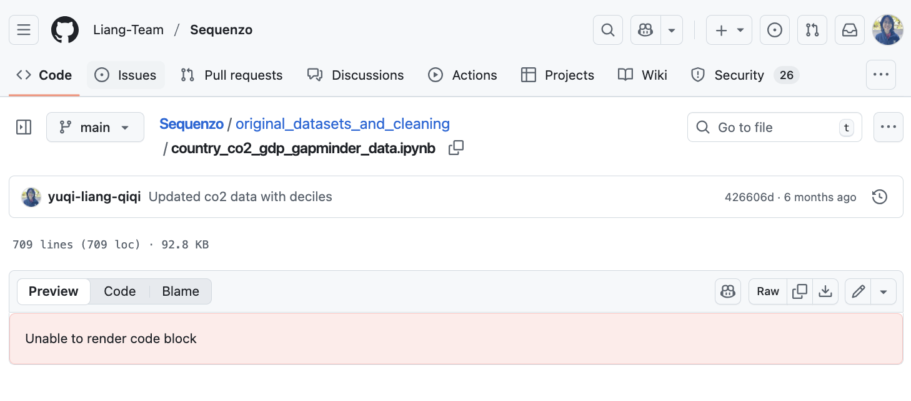
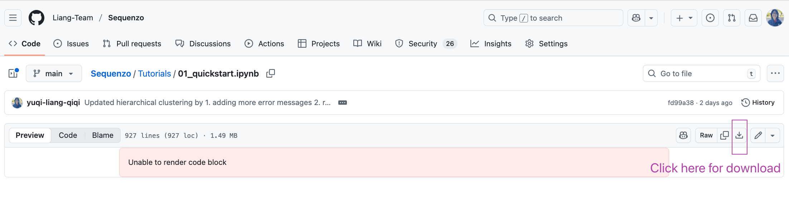

<!--
 * @Author: Yuqi Liang dawson1900@live.com
 * @Date: 2025-09-12 10:17:49
 * @LastEditors: Yuqi Liang dawson1900@live.com
 * @LastEditTime: 2025-09-16 15:11:08
 * @FilePath: /SequenzoWebsite/docs/en/basics/if_you_cannot_render_ipynb_on_github.md
 * @Description: 这是默认设置,请设置`customMade`, 打开koroFileHeader查看配置 进行设置: https://github.com/OBKoro1/koro1FileHeader/wiki/%E9%85%8D%E7%BD%AE
-->
# View Our Coding Tutorials Online

Many of our coding tutorials are available in [this repository](https://github.com/Liang-Team/Sequenzo/tree/main/Tutorials). For the quickest, zero-setup experience, open them in Google Colab using the “Open in Colab” links. 

Colab runs entirely in your browser, so you don’t need to install Python or an IDE (Integrated Development Environment). 

You can also view our tutorials on GitHub, but its preview sometimes fails for larger jupyter notebooks; examples of these rendering issues are shown at the end of this page. To download any tutorial, open it on GitHub and choose the down-arrow icon (top-right menu) to save the file locally.

> [!TIP] Recommended: Open in Colab
> Click the "Open" link in the "Open in Colab" column of the following tables to immediately run, edit, and save a copy to your Google Drive.

## Notebooks (open in Colab)

| Notebook | Description | Open in Colab | View on GitHub |
| --- | --- | --- | --- |
| Quickstart | Install, load data, and run your first analysis. | [Open](https://colab.research.google.com/github/Liang-Team/Sequenzo/blob/main/Tutorials/01_quickstart.ipynb) | [Source](https://github.com/Liang-Team/Sequenzo/blob/main/Tutorials/01_quickstart.ipynb) |
| Dissimilarity Measures | Compute and compare sequence dissimilarity metrics. | [Open](https://colab.research.google.com/github/Liang-Team/Sequenzo/blob/main/Tutorials/dissimilarity_measures/dissimilarity_measures.ipynb) | [Source](https://github.com/Liang-Team/Sequenzo/blob/main/Tutorials/dissimilarity_measures/dissimilarity_measures.ipynb) |
| Hierarchical Clustering | Cluster sequences hierarchically and visualize dendrograms. | [Open](https://colab.research.google.com/github/Liang-Team/Sequenzo/blob/main/Tutorials/hierarchical_clustering.ipynb) | [Source](https://github.com/Liang-Team/Sequenzo/blob/main/Tutorials/hierarchical_clustering.ipynb) |
| Local vs. Global Quintiles | Compare local vs global binning for value-to-state mapping. | [Open](https://colab.research.google.com/github/Liang-Team/Sequenzo/blob/main/Tutorials/local_global_quintiles/comparison_local_global_quintiles.ipynb) | [Source](https://github.com/Liang-Team/Sequenzo/blob/main/Tutorials/local_global_quintiles/comparison_local_global_quintiles.ipynb) |
| Multidomain Sequence Analysis: Main tutorial | End-to-end analysis across multiple domains per subject. | [Open](https://colab.research.google.com/github/Liang-Team/Sequenzo/blob/main/Tutorials/multidomain_sequence_analysis/main_tutorial.ipynb) | [Source](https://github.com/Liang-Team/Sequenzo/blob/main/Tutorials/multidomain_sequence_analysis/main_tutorial.ipynb) |
| Polyadic Sequence Analysis | Analyze polyadic sequences (multi-actor interactions). | [Open](https://colab.research.google.com/github/Liang-Team/Sequenzo/blob/main/Tutorials/multidomain_sequence_analysis/polyadic_tutorial.ipynb) | [Source](https://github.com/Liang-Team/Sequenzo/blob/main/Tutorials/multidomain_sequence_analysis/polyadic_tutorial.ipynb) |

## Python scripts

| Script | Description | Open in Colab | View on GitHub |
| --- | --- | --- | --- |
| Multidomain Sequence Analysis: CombT | CombT analysis workflow for multidomain sequences. | [Open](https://colab.research.google.com/github/Liang-Team/Sequenzo/blob/main/Tutorials/multidomain_sequence_analysis/CombT_analysis.py) | [Source](https://github.com/Liang-Team/Sequenzo/blob/main/Tutorials/multidomain_sequence_analysis/CombT_analysis.py) |
| Polyadic Sequence Analysis  | Script version of the polyadic analysis. | [Open](https://colab.research.google.com/github/Liang-Team/Sequenzo/blob/main/Tutorials/multidomain_sequence_analysis/polyadic.py) | [Source](https://github.com/Liang-Team/Sequenzo/blob/main/Tutorials/multidomain_sequence_analysis/polyadic.py) |


## Why GitHub preview may fail

Sometimes GitHub fails to render a notebook (`.ipynb`) and shows:

```
Unable to render code block
```

You might see a screen like this:



This is a known limitation of GitHub’s preview for large outputs or complex notebooks. 

To download the tutorial, click here:



*Author: Yuqi Liang*