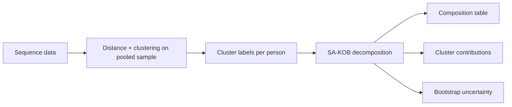

# Conceptual Guide: SA–KOB Decomposition

This guide explains how **sequence analysis (SA)** and **Kitagawa–Oaxaca–Blinder (KOB) decomposition** fit together in Sequenzo. It follows Rowold, Struffolino, and Fasang (2025) and maps each analytical choice to the parameters in [`get_sa_kob_decomposition()`](./get-sa-kob-decomposition).

SA–KOB is **descriptive**. It does not establish causality. It answers: *How much of a group gap is tied to different life-course patterns, and how much is tied to different returns to similar patterns?*

## The Core Question

Suppose you compare men and women on pension income. A large gender gap can arise because:

1. **Composition** — men and women follow different life-course patterns (different cluster shares).
2. **Returns** — men and women receive different outcomes even when they follow similar patterns (different coefficients).

KOB separates these mechanisms. SA supplies a life-course-sensitive covariate: a **cluster typology** instead of one-dimensional summary measures (e.g., total years employed).

## End-to-End Workflow



### Step 1: Build sequences and cluster on a pooled sample

Fit the typology on **both groups together**. Each group must be expressible with the **same** cluster dummy variables in KOB.

Practical checks:

- Compare pooled vs. group-specific solutions visually.
- Watch clusters dominated by one group (common-support risk).
- Use silhouette or related criteria when choosing `k` (Sequenzo can filter low-silhouette cases in SA–KOB).

### Step 2: Choose the outcome and grouping variable

- `y`: continuous outcome (pension, wage, health score, …).
- `group`: exactly two values (e.g., men / women).
- `group0_value` / `group1_value`: control which side is subtracted from which. Positive `total_gap` means `group0` is higher on average.

### Step 3: Inspect cluster-by-group composition

Before interpreting decomposition numbers, look at who occupies each cluster:

```python
from sequenzo.decomposition import cluster_group_composition_table

composition = cluster_group_composition_table(
    group=sex,
    cluster_labels=clusters,
    group0_value="men",
    group1_value="women",
)
```

`get_sa_kob_decomposition()` returns the same structure as `cluster_composition`. Row shares (`row_share_group0`, `row_share_group1`) drive the majority rule below.

### Step 4: Set the omitted baseline cluster

Regression uses `k-1` dummies. One cluster is the **reference category** (coefficient fixed at zero).

In Sequenzo:

- `reference_category_index` — position in `categories` (default: first cluster).
- `reference_cluster_label` — pick baseline by original label instead of index.

All `k` clusters still appear in `by_cluster` because SA–KOB always uses categorical normalization.

### Step 5: Choose reference coefficients

Rowold et al. systematically compare three reference-coefficient strategies. Sequenzo maps them as follows.

| Paper option | Meaning | Sequenzo mapping |
| --- | --- | --- |
| **Option I** | Use one group's coefficients as the reference structure | `cluster_coefficient_reference="group0"` or `"group1"`; set `fallback_reference` consistently for controls |
| **Option II** | Use pooled coefficients as the reference structure | `cluster_coefficient_reference="pooled"`; cluster owners are coded `-1` and `fallback_reference` is set to `"pooled"` automatically |
| **Option III** | Cluster-specific majority-group coefficients | `cluster_coefficient_reference="majority"` (default; practical majority-rule implementation) or manual `cluster_owner_overrides` |

**Option III** is the default because Rowold et al. argue that cluster-specific majority-group coefficients are especially suitable for SA–KOB: they account for the group composition of each cluster while remaining easier to interpret than pooled coefficients. Group-specific clusters receive the majority group's coefficient. **Group-neutral clusters** receive `neutral_cluster_owner` (default `0`, matching Rowold et al.'s use of men's coefficients for gender-neutral clusters when `group0` is men). Set `neutral_cluster_owner=None` to code neutral clusters as `-1` and route them through `fallback_reference` instead.

`fallback_reference` always applies to non-cluster controls and any coefficient owner coded as `-1`.

Detection logic for option III lives in `detect_cluster_coefficient_owners()`:

- Compute row share of each cluster in each group.
- If relative row gap exceeds `majority_gap_threshold` (default `50%`), assign owner `0` or `1`.
- Otherwise mark neutral and set owner to `neutral_cluster_owner` (or `-1` when `None`).
- Override any cluster with `cluster_owner_overrides`.

### Sensitivity analysis across options I–III

Rowold et al. report that their substantive conclusions are robust across reference choices, but recommend comparing specifications explicitly. In Sequenzo:

```python
for spec in ("majority", "group0", "group1", "pooled"):
    result = get_sa_kob_decomposition(
        y=y,
        group=sex,
        cluster_labels=clusters,
        k=8,
        cluster_coefficient_reference=spec,
        fallback_reference="group0" if spec != "pooled" else "pooled",
        group0_value="men",
        group1_value="women",
    )
    print(spec, result.explained, result.unexplained_returns)
```

When `cluster_coefficient_reference="pooled"`, Sequenzo overrides `fallback_reference` to `"pooled"` even if you pass another value.

### Step 6: Run decomposition and read results

```python
from sequenzo.decomposition import get_sa_kob_decomposition

result = get_sa_kob_decomposition(
    y=pension_income,
    group=sex,
    cluster_labels=clusters,
    k=8,
    cluster_coefficient_reference="majority",
    fallback_reference="group0",
    group0_value="men",
    group1_value="women",
)
```

| Output | What it tells you |
| --- | --- |
| `total_gap`, `explained`, `unexplained_returns` | Standard twofold KOB totals |
| `by_cluster` | Explained and returns **per life-course cluster** (all `k`) |
| `cluster_owners` | Which group supplied reference coefficients per cluster |
| `common_support_table` | Cells with very few men or women in a cluster |
| `explained_detailed` | Sum of Yun-normalized explained in `by_cluster` |

### Step 7 (optional): Bootstrap

```python
from sequenzo.decomposition import get_sa_kob_decomposition_bootstrap

boot = get_sa_kob_decomposition_bootstrap(
    y=pension_income,
    group=sex,
    cluster_labels=clusters,
    k=8,
    n_boot=500,
    random_state=42,
)
boot.by_cluster_confidence_intervals
```

By default each bootstrap draw **recomputes** cluster owners via the practical majority-rule implementation (`recompute_owners_each_draw=True`). Set it to `False` to freeze owners from the point estimate.

## Interpreting Explained vs. Returns

Using the twofold decomposition (Jann, 2008):

- **Explained (composition)** — differences in mean covariates, weighted by reference coefficients. In SA–KOB, this is mainly **different cluster shares** between groups.
- **Unexplained returns** — differences in coefficients relative to the reference structure, holding covariate means fixed. This captures **different payoffs to similar life-course patterns**.
- **Unexplained intercept** — level shift not tied to observed covariates; often reflects unobserved heterogeneity within clusters.

Policy intuition from Rowold et al.:

- Large **explained** shares point to differences in life-course pathways (early/mid-life interventions).
- Large **returns** shares point to institutional rules that reward the same pathway differently by group (pension regulation, wage setting).

## Within-Cluster Heterogeneity

Clusters summarize trajectories; individuals still differ inside a cluster. Within-cluster heterogeneity can show up in the coefficient and intercept components, so returns should not be read as pure discrimination or pure institutional reward without further assumptions. Rowold et al. recommend:

- Validate typologies (construct validity, sensitivity to `k` and distance).
- Check `common_support_table` and silhouette filtering.
- Treat intercept and returns components cautiously when clusters are broad.

## Single-Channel vs. Multichannel SA

Rowold et al. discuss three ways to bring SA into KOB:

1. **Single domain** — one typology (e.g., work only) as covariate. Simplest; matches default SA–KOB usage.
2. **Separate domain typologies** — work clusters and family clusters as separate covariates.
3. **Interactions** — cross-domain interaction dummies; many sparse cells.

Sequenzo's `get_sa_kob_decomposition()` implements the **single typology** path. For multiple typologies or controls, pass extra columns through `X_controls`.

## Adding Non-Sequence Controls

```python
result = get_sa_kob_decomposition(
    y=y,
    group=group,
    cluster_labels=clusters,
    X_controls=df[["birth_cohort", "education"]].to_numpy(),
    control_variable_names=["birth_cohort", "education"],
    k=8,
)
```

Control columns use `fallback_reference` for coefficient ownership (`-1` internally). Under option III, neutral clusters use `neutral_cluster_owner` by default; set `neutral_cluster_owner=None` to route them through `fallback_reference` instead.

## Practical Checklist

1. Cluster on pooled data; verify group-specific patterns are not hidden.
2. Report `cluster_composition` before decomposition.
3. State `reference_category_index` / baseline cluster.
4. State `cluster_coefficient_reference`, `neutral_cluster_owner`, and `fallback_reference` (for controls).
5. Flag low common-support clusters.
6. Report bootstrap intervals for `by_cluster` when publishing.
7. Keep scalar KOB totals and Yun-normalized cluster tables distinct in interpretation.

## Authors

Documentation: Yuqi Liang

## References

Rowold, C., Struffolino, E., & Fasang, A. E. (2025). Life-course-sensitive analysis of group inequalities: Combining sequence analysis with the Kitagawa–Oaxaca–Blinder decomposition. *Sociological Methods & Research*, 54(2), 646–705.

Jann, B. (2008). The Blinder–Oaxaca decomposition for linear regression models. *The Stata Journal*, 8(4), 453–479.

Fortin, N., Lemieux, T., & Firpo, S. (2011). Decomposition methods in economics. In *Handbook of Labor Economics* (Vol. 4, pp. 1–102). Elsevier.
