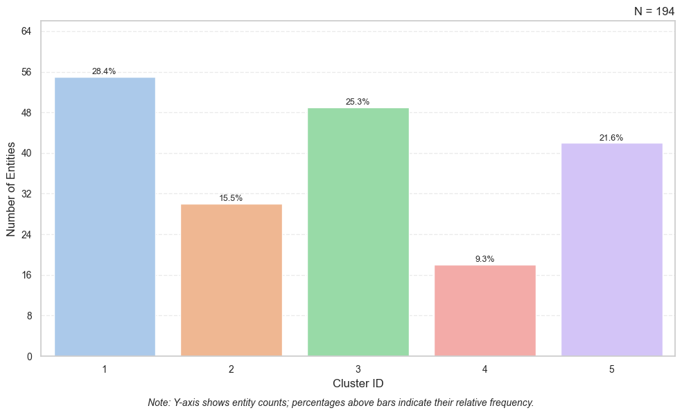

# `ClusterResults()`: Export, Summarize, and Visualize Cluster Memberships

Once you have fitted a hierarchical clustering model with `Cluster()` and decided on the optimal number of clusters with `ClusterQuality()`, the next step is to interpret and present the results. `ClusterResults()` is a small companion class that makes it easy to produce:

* **Cluster membership table (important):** Extract entities' cluster memberships for any number of clusters `k`.
* **Distribution table (nice to have):** Summarize how entities are distributed across clusters.
* **Bar chart (nice to have):** Visualize these distributions.

This ensures you can quickly link cluster labels back to your original dataset (e.g., if you have important variables such as gender and income), evaluate the balance of the cluster membership data, and prepare results for downstream analysis (e.g., index plot and state distribution plot for each cluster, and regressions).

## Function Usage

A minimal example with only the required parameter (sufficient for most use cases):

```python
cluster_results = ClusterResults(cluster)
```

A complete example with all available parameters (for advanced customization):

```python
# Fit a hierarchical cluster model first
cluster = Cluster(
  matrix=distance_matrix,      # square-form distance matrix (n×n)
  entity_ids=ids,              # unique IDs aligned with matrix rows
  clustering_method="average"  # linkage method
)

# Then wrap results
cluster_results = ClusterResults(
  cluster=cluster              # required: a fitted Cluster object
)

# Example usage
memberships = cluster_results.get_cluster_memberships(num_clusters=4)
distribution = cluster_results.get_cluster_distribution(num_clusters=4)
cluster_results.plot_cluster_distribution(
  num_clusters=4,
  save_as="distribution.png",
  style="whitegrid",
  figsize=(10, 6)
)
```

## Entry Parameters

| Parameter | Required | Type    | Description                                                             |
| --------- | -------- | ------- | ----------------------------------------------------------------------- |
| `cluster` | ✓        | Cluster | A fitted `Cluster` object containing `linkage_matrix` and `entity_ids`. |

## What It Does

* Validates that input is a `Cluster` object.
* Stores:

  * `linkage_matrix` (hierarchical tree of merges)
  * `entity_ids` (original identifiers of rows/entities)

From there, the class provides three methods to map the tree back to interpretable cluster results.

## Method 1: `get_cluster_memberships(num_clusters)`

Export a tidy table mapping each entity to its cluster.

### Usage

```python
df = cluster_results.get_cluster_memberships(num_clusters=4)
print(df.head())
```

### Returns

`pandas.DataFrame` with two columns:

| Column      | Meaning                     |
| ----------- | --------------------------- |
| `Entity ID` | Original entity identifiers |
| `Cluster`   | Assigned cluster ID (`1 … k`) |

This table is ideal for merging back into your original dataset.

## Method 2: `get_cluster_distribution(num_clusters)`

Summarize how entities are spread across clusters.

### Usage

```python
dist = cluster_results.get_cluster_distribution(num_clusters=4)
print(dist)
```

### Returns

`pandas.DataFrame` with:

| Column       | Meaning                                          |
| ------------ | ------------------------------------------------ |
| `Cluster`    | Cluster ID                                       |
| `Count`      | Number of entities in that cluster               |
| `Percentage` | Share of total entities, rounded to two decimals |

## Method 3: `plot_cluster_distribution(...)`

Visualize cluster sizes as a bar chart.

### Usage

```python
cluster_results.plot_cluster_distribution(
    num_clusters=4,
    save_as="distribution.png",
    style="whitegrid",
    figsize=(10, 6)
)
```

### Entry Parameters

| Parameter      | Required | Type               | Description                                                                 |
| -------------- | -------- | ------------------ | --------------------------------------------------------------------------- |
| `num_clusters` | ✓        | int                | Number of clusters `k`.                                                     |
| `save_as`      | ✗        | str or None        | File path to save the figure (e.g., `"clusters.png"`). If None, just shows. |
| `title`        | ✗        | str or None        | Custom figure title. Default = `"N = (number of entities)"`.                |
| `style`        | ✗        | str                | Seaborn style theme (e.g., `"whitegrid"`, `"darkgrid"`, `"ticks"`).         |
| `dpi`          | ✗        | int                | Resolution when saving. Default = `200`.                                    |
| `figsize`      | ✗        | tuple(float,float) | Figure size in inches. Default = `(10, 6)`.                                 |

### What It Does

* Creates a bar plot with cluster IDs on the x-axis and entity counts on the y-axis.
* Adds percentage labels above bars for easy interpretation.
* Uses light grid lines and pastel palette for readability.
* Saves the plot to your computer disk if `save_as` is provided.

### Returns

None. The figure is shown or saved to disk.

## Example

```python
# Fit model
cluster = Cluster(distance_matrix, ids, "average")

# Code for ClusterQuality() is omitted here,
# but it is important to include it in your analysis. 

cluster_results = ClusterResults(cluster)

# Export memberships
membership_table = cluster_results.get_cluster_memberships(num_clusters=5)
print(membership_table)

# Summarize balance
distribution = cluster_results.get_cluster_distribution(num_clusters=5)
print(distribution)

# Visualize
cluster_results.plot_cluster_distribution(num_clusters=5, save_as="distribution.png", title=None)
```

Output:

```text

       Entity ID  Cluster
0    Afghanistan        1
1        Albania        1
2        Algeria        1
3        Andorra        3
4         Angola        4
..           ...      ...
189    Venezuela        1
190      Vietnam        4
191        Yemen        2
192       Zambia        3
193     Zimbabwe        5

[194 rows x 2 columns]
   Cluster  Count  Percentage
0        1     55       28.35
1        2     30       15.46
2        3     49       25.26
3        4     18        9.28
4        5     42       21.65
```



## Notes and Warnings

* `num_clusters` in this class corresponds to SciPy’s `t` parameter in `fcluster()`.
  Don’t confuse this with `k` in k-means as here it simply means “number of clusters.”
* Always confirm that `linkage_matrix` is present in your `Cluster` object. Without it, membership extraction cannot proceed.
* Distribution plots are best used to check balance (e.g., if one cluster dominates). For deeper evaluation, pair this with `ClusterQuality()`.

## See Also

- [`Cluster()`](/en/function-library/hierarchical-clustering) and [`ClusterQuality()`](/en/function-library/cluster-quality) are the upstream steps.
- [Replace Cluster ID by Labels](/en/data-preprocessing/replace-cluster-id-by-labels) converts numeric IDs into readable labels.
- [Index Plot](/en/visualization/index-plot) and [State Distribution Plot](/en/visualization/state-distribution-plot) visualize each cluster.

## Authors

Code: Yuqi Liang

Documentation: Yuqi Liang

Edited by: Yuqi Liang, Sizhu Qu
