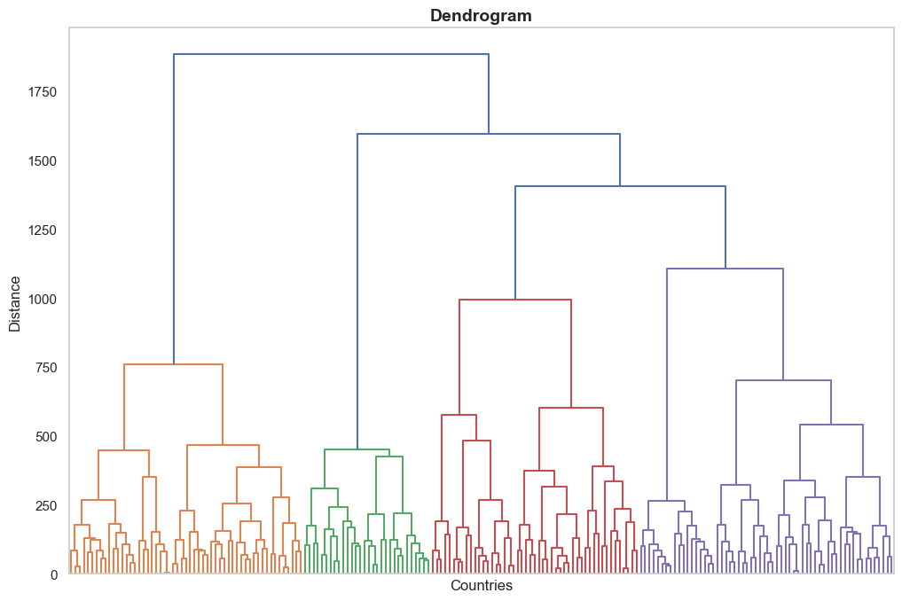

<!--
 * @Author: Yuqi Liang dawson1900@live.com
 * @Date: 2025-09-12 14:40:49
 * @LastEditors: Yuqi Liang dawson1900@live.com
 * @LastEditTime: 2025-09-15 10:45:07
 * @FilePath: /SequenzoWebsite/docs/en/function-library/hierarchical_clustering.md
 * @Description: 这是默认设置,请设置`customMade`, 打开koroFileHeader查看配置 进行设置: https://github.com/OBKoro1/koro1FileHeader/wiki/%E9%85%8D%E7%BD%AE
-->
# `Cluster()` : First Step of Hierarchical Clustering

Once you have built a precomputed distance matrix (`n×n`, square form) with `get_distance_matrix()`, you are ready to cluster if you follow one of the most common practices in sequence analysis. Hierarchical clustering is an unsupervised machine learning algorithm, and it is a straightforward way to uncover typical trajectory patterns 

## Typical workflow of hierarchical clustering

1. Prepare a square distance matrix `D` (shape `n×n`) from `get_distance_matrix()` and a list/array of `entity_ids` (length n, all unique).
2. Create a `Cluster()` and (optionally) plot a dendrogram.
3. Get cluster labels for a chosen `k` (number of clusters).
4. Use `ClusterQuality()` to compare different `k`s with cluster quality indicators (knownn as CQI).
5. Use `ClusterResults()` to export a membership table and a plot of the proportion of each cluster. 

The downstream analysis after this step would be (1) visualizing each cluster using the  [state distribution plots](https://sequenzo.yuqi-liang.tech/en/visualization/state-distribution-plot) or [index plots](https://sequenzo.yuqi-liang.tech/en/visualization/index-plot), and (2) fitting a regression model in which you use every individual's membership as either an explanatory variable, or an outcome variable. 

The following is an example of how to use `Cluster()`, `ClusterQuality()`, and `ClusterResults()` for hierarchical clustering.

```python
from sequenzo.clustering.hierarchical_clustering import Cluster, ClusterQuality, ClusterResults

# ---------------------
# distance_matrix: square distance matrix (n x n), 
# ids: list/array of length n (unique)
# "ward" is usually the recommended way
cluster = Cluster(
    matrix=distance_matrix, 
    entity_ids=ids, 
    clustering_method="ward"
)  

# Optional: dendrogram (for very large n, labels are hidden automatically)
# If you are a newbie, it would be good to try out this function 
# to see the hierarchical structure
cluster.plot_dendrogram(
    # If you don't want to save it, simply remove this paramter
    save_as="dendrogram.png",  
    # The title of the graph
    title="Dendrogram" 
)

# ---------------------
# Choose k (number of clusters) based on cluster quality indicators (CQI)
cluster_quality = ClusterQuality(cluster, max_clusters=20)
cluster_quality.compute_cluster_quality_scores()

# One-line summary of "best k" per indicator
print(cluster_quality.get_cqi_table())     

# Change the name of the saved figure if you want
cluster_quality.plot_cqi_scores(save_as="quality.png") 

# ---------------------
# Export results
cluster_results = ClusterResults(cluster)

# Let's say the CQI plot suggests that k=6 is the optimal number of clusters
# Then obtain the cluster membership table, with two columns: entity ID, and Cluster
members = cluster_results.get_cluster_memberships(num_clusters=6)     

# Check distribution (in counts and %) of entities for each cluster 
# (e.g., how many people in your data belong to each cluster)
distribution = cluster_results.get_cluster_distribution(num_clusters=6)   

cluster_results.plot_cluster_distribution(num_clusters=6, 
                                          save_as="cluster_sizes.png")
```

---
In this doc, we will go through `Cluster()`. Under the hood, this object uses a Python package called `fastcluster`, which is typically faster and more memory-efficient than the standard `SciPy` approach to conduct hierarchical clustering analysis. Such a design is especially helpful for large datasets.

## Function usage of `Cluster()`

```python
from sequenzo.clustering.hierarchical_clustering import Cluster

cluster = Cluster(
    matrix=distance_matrix,     # n×n square matrix, symmetric
    entity_ids=ids,             # length n (n is the number of entities you have in the data), all unique
    clustering_method="ward"    # "ward" | "single" | "complete" | "average" | "centroid" | "median"
)
```

## Entry Parameters

| Parameter           | Required | Type            | Description                                                                                                 |
| ------------------- | -------- | --------------- | ----------------------------------------------------------------------------------------------------------- |
| `matrix`            | ✓        | array/DataFrame | Precomputed full square-form distance matrix of shape n×n.                                                  |
| `entity_ids`        | ✓        | array-like      | Length n list/array of unique IDs in the same order as rows/cols of `matrix`.                               |
| `clustering_method` | ✗        | str             | Linkage method. Default `"ward"`. Options: `"single"`, `"complete"`, `"average"`, `"centroid"`, `"median"`. |

## What It Does

* Validates inputs: checks square shape, length match, and uniqueness of `entity_ids`.
* Handles oddities in the matrix:

  * If the matrix contains `NaN`/`Inf`, replaces them with the maximum finite value found.
  * If not perfectly symmetric within tolerance, symmetrizes it: `(D + D.T) / 2`.
* Converts the square matrix to condensed form and computes a linkage matrix via a fast hierarchical routine.
* Stores the resulting linkage for downstream tasks like dendrograms and tree cuts.

## Returned Object

A `Cluster` instance with these main attributes:

* `entity_ids`: `numpy array` of your IDs (length `n`).
* `full_matrix`: validated n×n distance matrix (`numpy array`).
* `condensed_matrix`: condensed vector used by the linkage function.
* `linkage_matrix`: the hierarchical linkage result.

And these main methods:

* `plot_dendrogram(...)`: render or save a dendrogram.
* `get_cluster_labels(num_clusters)`: return an array of cluster labels (length `n`).

## Function Method 1: `plot_dendrogram()`

Render or save a dendrogram of the fitted hierarchical clustering.

### Function usage

```python
cluster.plot_dendrogram(
    save_as=None,         # e.g., "dendrogram.png" to save; None to just show the figure
    style="whitegrid",    # Seaborn style
    title="Dendrogram",
    xlabel="Entities",    # You can rename this based on your data (e.g., Individuals, Countries).
    ylabel="Distance",
    grid=False,
    dpi=200,
    figsize=(12, 8)
)
```

### Entry parameters

| Parameter | Required | Type               | Description                                                                                    |
| --------- | -------- | ------------------ | ---------------------------------------------------------------------------------------------- |
| `save_as` | ✗        | str or None        | Path to save the figure (e.g., `"dendrogram.png"`). If `None`, the plot is shown instead of saved. |
| `style`   | ✗        | str                | Seaborn style name. Common options: `"whitegrid"`, `"darkgrid"`, `"white"`, `"dark"`, `"ticks"`.         |
| `title`   | ✗        | str                | Figure title. Default = `"Dendrogram"`.                                                          |
| `xlabel`  | ✗        | str                | X-axis label. Default = `"Entities"`.                                                            |
| `ylabel`  | ✗        | str                | Y-axis label. Default = `"Distance"`.                                                            |
| `grid`    | ✗        | bool               | Whether to show grid lines. `Default = False`.                                                   |
| `dpi`     | ✗        | int                | Resolution used when saving to file. `Default = 200`.                                            |
| `figsize` | ✗        | tuple(float,float) | Figure size in inches. `Default = (12, 8)`.                                                      |

> **Note on `style` vs `grid`**
>
> * The `style` parameter (e.g., `"whitegrid"`, `"darkgrid"`) sets the overall seaborn theme,  
> which may include background color, fonts, and whether grid lines are shown.  
> * The `grid` parameter in `plot_dendrogram()` is an **explicit override**:  
> if you set `grid=False`, it will turn off grid lines even if the seaborn style normally includes them.  
> * In other words, `grid` takes precedence over the style’s default grid behavior. In practice, you might want to try different options and then choose the one that you like. 

### What it does

* Uses the precomputed `linkage_matrix` to draw a dendrogram.
* Labels are intentionally hidden to avoid unreadable plots when the sample size n is large. If you need labeled leaves for small n, generate a custom dendrogram with `scipy.cluster.hierarchy.dendrogram` outside this helper.
* If you pass `save_as`, the figure is saved to that path; its resolution is controlled by `dpi` (default 200), and saving won’t block your program. If you don’t pass `save_as`, the plot is shown on screen instead.

### Returns

* None (renders and/or saves a figure)

Note: If your distance matrix had `NaN`/`Inf` or was slightly asymmetric, `Cluster()` already repaired it before computing linkage; a warning may have been printed then but it is not an error.


### Examples

```python
cluster.plot_dendrogram(xlabel="Countries", ylabel="Distance")
```

Output:



## Function Method 2: `get_cluster_labels(num_clusters)`

Cut the dendrogram at `k` clusters and return an integer label for each entity (aligned to `entity_ids`). It is not very frequently used as plotting the dendrogram is usually sufficient. 

### Function usage

```python
# Let's say you choose 6 clusters
labels = cluster.get_cluster_labels(num_clusters=6)
```

### Entry parameters

| Parameter      | Required | Type | Description                                                                                            |
| -------------- | -------- | ---- | ------------------------------------------------------------------------------------------------------ |
| `num_clusters` | ✓        | int  | Desired number of clusters k. Internally mapped to SciPy’s `fcluster(..., t=k, criterion="maxclust")`. |

### Returns

* `numpy.ndarray` of shape `(n,)` with integer cluster labels `(1...k)`.

### Notes

* **The analysis is deterministic, i.e., given the same distance matrix and method, results are reproducible.**

  In other words, there is no randomness involved in hierarchical clustering (unlike [K-Medoids](https://sequenzo.yuqi-liang.tech/en/function-library/k-medoids)).. As long as you keep the same input and method, you will always get the same clusters. The only exception is if two or more pairs of entities are at exactly the same distance. 
  
  In that case, different implementations or row/column orders may choose a different merge order, leading to slightly different dendrogram shapes, though the overall cluster quality remains the same.

* **For very large k (≥ n), expect many singletons; for k=1, all observations share the same label.**

  A “singleton” is a cluster containing only one entity. When k approaches n, most clusters will become singletons, which usually makes the results less interpretable. At the other extreme, if you set `k=1`, then all entities are placed into the same single cluster.

* **Label IDs are arbitrary numeric codes; they do not imply ordering or size.**

  For example, “Cluster 1” is not necessarily larger, smaller, or more important than “Cluster 2.” The numbers are just identifiers of clusters.

### Examples

```python
# Basic usage: Suppose k=6 (six clusters) is appropriate
labels_k6 = cluster.get_cluster_labels(num_clusters=6)

# Merge back to a tidy table
import pandas as pd
members = pd.DataFrame({
    "Entity ID": cluster.entity_ids,
    "Cluster": labels_k6
})

# Loop over several k for quick inspection
for k in [3, 4, 5, 6, 8]:
    labels = cluster.get_cluster_labels(num_clusters=k)
    print(k, pd.Series(labels).value_counts().sort_index().to_dict())
```

### Errors and warnings

* `ValueError: Linkage matrix is not computed.` if linkage was not created.
* If `num_clusters` is not a positive integer, SciPy’s `fcluster` may error; use integers ≥ 1.

## Examples

### 1) Basic: Fit, dendrogram, and labels

```python
cluster = Cluster(distance_matrix, ids, clustering_method="ward")
cluster.plot_dendrogram(save_as="dendrogram.png", title="My Dendrogram")
labels_k6 = cluster.get_cluster_labels(num_clusters=6)
```

### 2) Full mini-pipeline (with `ClusterQuality()` and `ClusterResult()`)

```python
from sequenzo.clustering.hierarchical_clustering import ClusterQuality, ClusterResults

cluster = Cluster(distance_matrix, ids, "ward")

# Compare k using CQI
cluster_quality = ClusterQuality(cluster, max_clusters=20)
cluster_quality.compute_cluster_quality_scores()
print(cluster_quality.get_cqi_table())
cluster_quality.plot_cqi_scores(save_as="quality.png")

# Export results for k=6 
cluster_result = ClusterResults(cluster)
members = cluster_result.get_cluster_memberships(num_clusters=6)      # "Entity ID" | "Cluster"
dist    = cluster_result.get_cluster_distribution(num_clusters=6)     # counts and proportions
cluster_result.plot_cluster_distribution(num_clusters=6, save_as="cluster_sizes.png")
```

### 3) Troubleshooting distance matrices

```python
# If your matrix has NaN/Inf or minor asymmetry, Cluster() will repair it.
# To be explicit:
D = np.asarray(distance_matrix)
D[~np.isfinite(D)] = np.nanmax(D[np.isfinite(D)])
D = (D + D.T) / 2
cluster = Cluster(D, ids, "average")
```

## Notes and Warnings

* Distance matrix must be `n×n` and correspond to `entity_ids` order. If you subset or reorder, keep them aligned.
* Ward requires dissimilarities that behave like squared Euclidean distances for strict theoretical guarantees. In practice, for many sequence distances, Ward still performs well, but always sanity-check results.
* Complexity: the complexity of computing linkage is roughly O(n²) in both memory and time.
  
  This means the cost grows quadratically with the number of entities `n` in your data. For example:

  * with 1,000 entities: about 1 million pairwise distances, which is easy to handle;
  * with 10,000 entities: about 100 million distances, which already requires several gigabytes of memory and can be relatively slow;
  * with 50,000 entities: about 2.5 billion distances, which is usually infeasible on a normal personal computer.

  In practice, if your dataset is very large (e.g., more than 50,000 entities), you would need to use one of the following common strategies:

  * **CLARA algoirthm for big datasets (recommended)**: Details are shown in [this function documentation](../big-data/clara.md). 
  * **Deduplication (recommended):** If many sequences are identical, keep only one copy (with a weight) to shrink the matrix.
  * **Sampling:** Randomly select a subset of entities.

## Typical Next Steps

1. Use `ClusterQuality()` to pick k with multiple CQIs.
2. Use `ClusterResults()` to export and visualize cluster sizes, then:

   * Show within-cluster [state distribution plots](https://sequenzo.yuqi-liang.tech/en/visualization/state-distribution-plot) or [index plots](https://sequenzo.yuqi-liang.tech/en/visualization/index-plot).
   * Merge labels back to your dataframe and run regressions, using cluster membership as an outcome or a predictor.
   
For further details of `ClusterQuality()` and `ClusterResults()`, please refer to the next two guides. 

## Authors

Code: Yuqi Liang

Documentation: Yuqi Liang

Edited by: Yuqi Liang