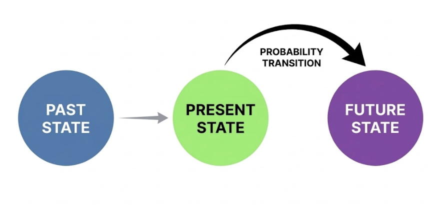

# Markov Chain

Before learning about Hidden Markov Models (HMM) and Mixture Hidden Markov Models (MHMM), we need to first understand their foundation: the **Markov Chain**. A Markov Chain is a mathematical tool that describes how states evolve over time, assuming that the future depends only on the present, not on the past. This seemingly simple assumption can help us understand many complex real-world problems.

Before you start wrestling with any complex formulas, you might be wondering: "Why is it called a Markov Chain? Is it referring to an actual metal chain?" We will address these specific questions one by one in the subsequent guide.

## 1. Introduction

### 1.1 Why is it called a "Markov Chain"? A History Born from a Debate

Let's travel back to the Russian Empire in 1906. At that time, there was an influential figure in the mathematics community named **Pavel Nekrasov**. Nekrasov was a scholar who attempted to merge mathematics with theology. He believed in a specific viewpoint:

> For the Law of Large Numbers (the cornerstone of statistics) to hold true, events must be independent of each other. This proves that God has granted humans free will; our choices are independent and unshackled by the past.

Markov heard this and was thoroughly unimpressed. As a staunch rationalist, he felt that forcing a connection between mathematics and free will was nonsense. He was determined to prove Nekrasov wrong. He wanted to demonstrate:

> Even if events are dependent (meaning the future relies on the present), the laws of statistics still apply.

To win this mathematical debate, Markov created a special model (Hayes, 2013). In this model, tomorrow is not completely independent, but it depends only on today, ignoring the distant yesterday.

### 1.2 Why "Chain"?

Markov used the word "Chain" because it perfectly captures the essence of the model. Imagine the structure of a real iron chain:



This is a perfect metaphor for the mathematical process: States evolve link by link. You only need to grasp the link closest to you (the **Present**) to predict the next link (the **Future**). For example, the 100th link is directly connected only to the 99th link; it is not hooked onto the 1st link.

## 2. What is a Markov Chain?

We have just used examples to show where Markov chains come from, and why they have a chain-like structure. Now we will give a formal definition of a Markov chain.

### 2.1 Formal Definition

A Markov Chain is a **stochastic process** that describes how a system transitions between different states. Its core idea can be summarized in one sentence: **"Where you go next depends only on where you are now, not on how you got here."**

**Why is a Markov Chain a Stochastic Process?**

Because transitions between states are determined by probabilities, not by deterministic rules. Given the current state, the next state is not fixed; instead, the system transitions to various possible states based on specific probabilities. For example:

```
Current State: "Single"
         ↓
Next State: "Single"    (Probability 0.7)
            "Married"   (Probability 0.25)
            "Divorced"  (Probability 0.05)
```

Every transition is a "random sample". This is exactly the meaning of a "Stochastic Process": the system evolves over time, but the outcome of every step contains uncertainty.

### 2.2 Why do we need Markov chains?

A Markov chain describes common sequential processes. In particular, what happens next depends only on the current state. It does not need the full earlier history. We will explain its usefulness in the following two parts:

- **Artificial Intelligence & Reinforcement Learning:** If you learn the transition probability from each state to the next, you can predict what is more likely to happen in the future. Then you can evaluate how much long-run reward a policy will produce. Finally, you can improve the policy by repeatedly updating these evaluations. Without this assumption, the system would need to store and process too much history. Learning and planning would become computationally hard.

- **Social Sciences:** Many of the questions we care about are, at their core, sequence questions: How does a person's career trajectory develop? How does family status change with age? How does a disease progress? The common thread among these questions is that the current state influences the future state. The Markov Chain provides a concise and powerful framework: it uses a **Transition Probability Matrix** to quantify the likelihood of moving from one state to another.

**Example:** Imagine you are observing the weather on a given day:

- If today is **sunny**, there is a 70% probability that tomorrow will also be sunny, and a 30% probability that it will become cloudy.
- If today is **cloudy**, there is a 40% probability that tomorrow will be sunny, and a 60% probability that it will remain cloudy.

> **Note:** We don't care what the weather was yesterday or the day before. Tomorrow's weather depends only on today.

### 2.3 Core Elements of a Markov Chain

A Markov Chain consists of three components:

| Component | Definition | Example |
|---|---|---|
| **State Space** | The set of all possible states the system can be in | $\{Sunny, Cloudy, Rainy\}$ |
| **Transition Probability** | The probability of moving from one state to another | $P(Cloudy \rightarrow Sunny) = 0.4$ |
| **Initial Probability** | The probability of being in each state at the starting point | $P(Sunny \text{ at } t=0) = 0.5$ |

We will explain each of these in turn:

**1. State Space**

In sequence analysis, it represents all possible states an individual can occupy at any given time point (e.g., within a year). These states are typically categorical variables, such as:

- Employment status: `{In school, Full-time work, Part-time work, Unemployed}`
- Marital status: `{Single, Married, Divorced}`
- Health status: `{Healthy, Sick}`

**2. Transition Probability**

Transition probability answers the question: "If I am currently in state A, what is the probability that I will be in state B at the next point?" When we organize all the transition probabilities between states, we get a **Transition Matrix**. This is an important tool for understanding Markov Chains.

**Example of a Transition Matrix:** Suppose we have three weather states: Sunny (S), Cloudy (C), and Rainy (R). The transition matrix can be written as:

|  | Sunny | Cloudy | Rainy |
|---|---|---|---|
| **Sunny** | 0.7 | 0.2 | 0.1 |
| **Cloudy** | 0.3 | 0.4 | 0.3 |
| **Rainy** | 0.2 | 0.3 | 0.5 |

How to read this matrix:

- **Row 1:** If today is sunny, tomorrow there is a 70% probability of being sunny, 20% probability of being cloudy, and 10% probability of rain.
- **Row 2:** If today is cloudy, tomorrow there is a 30% probability of being sunny, 40% probability of remaining cloudy, and 30% probability of rain.
- **Row 3:** If today is rainy, tomorrow there is a 20% probability of being sunny, 30% probability of being cloudy, and 50% probability of continued rain.

> **Important property:** The sum of probabilities in each row must equal 1 (because the system must transition to some state).

**3. Initial Probability**

Initial probability addresses: "At the time we begin observation (t=0), what is the probability of being in state A?"

## 3. The Relationship Between Markov Chains and Sequence Analysis

In sequence analysis, Markov Chains help us understand transition patterns between states.

### 3.1 Application in Sequence Analysis

Consider a person's career trajectory sequence (6 years):

```
`{Education, Education, Full-time, Full-time, Unemployed, Full-time}`
```

We can ask:

- What is the probability of transitioning from "Education" to "Full-time"?
- Once entering the "Unemployed" state, what is the probability of returning to "Full-time"?
- Overall, which transitions are most common?

### 3.2 Key Assumptions of Markov Chains in Sequence Analysis

**1. Memorylessness**

The future depends only on the present. This means it is reasonable when historical information is already "encoded" in the current state. For example, if you are currently a "Senior Engineer," this state itself contains information about your past career development.

However, when history truly affects the future — for example, a person who just became unemployed and a person who has been unemployed for two years may have different probabilities of finding work — the Markov Chain has limitations.

To address this potential limitation, we may need **higher-order Markov Chains**. Compared to first-order Markov Chains that depend only on the previous state, higher-order Markov Chains also consider earlier states. For example, in a second-order Markov Chain, today's state depends not only on yesterday's state but also on the state from the day before. (Due to weak relevance to seqHMM, this guide will not expand further on this topic here.)

**2. Time Homogeneity**

Transition probabilities do not change over time. Whether it is day 1 or day 100, the probability of transitioning from state A to state B is the same.

However, a key assumption of standard Markov Chains is that transition probabilities remain constant over time. In life course research, this assumption is often violated. For example, the probability of transitioning from "Single" to "Married" at age 20 is likely very different from that at age 40.

To address this limitation, Helske & Helske (2019) developed the **Mixture Hidden Markov Model (MHMM)** framework. Instead of forcing all individuals to follow the same transition dynamics, MHMM uses covariates (such as gender or birth cohort) to identify distinct subgroups, each with its own transition matrix. This allows researchers to capture heterogeneity in life course patterns across different populations.

**3. States are Observable**

In a standard Markov chain, we can directly observe the state of an individual, such as married or single. No inference is needed.

However, sometimes we can only observe indirect manifestations of the state, not the state itself. For example, we cannot see a person's "true health status," only their symptoms.

To address this potential issue, we will later introduce the **Hidden Markov Model (HMM)** to solve it, using a hidden Markov Chain to describe the transitions of true states.

## 4. Practice Exercises for Markov Chains

### 4.1 Fill in the Key Concepts

Based on the core idea of a Markov chain, fill in the blanks:

The key assumption of a Markov chain can be stated in one sentence: **①**. This means the next state of the system depends only on **②**, not on **③**.

A complete Markov chain has three core components:
- **④**: the set of all possible states of the system
- **⑤**: the transition probabilities from one state to another
- **⑥**: the initial state distribution at t = 0

::: details Answer
① Where you go next depends only on where you are now, not on how you got here.

② the current state

③ the past history

④ state space

⑤ transition probability

⑥ initial probability
:::

### 4.2 Judging the Markov Property

Determine whether the following scenarios are suitable for Markov Chain modeling, and explain your reasoning:

**Q1. Daily returns of stock prices**

::: details Answer
Not very suitable. Financial markets exhibit "volatility clustering," where high volatility tends to follow high volatility. Stock daily returns usually have almost no stable first-order memory (weak autocorrelation in rises and falls), and the significant dependency is mostly reflected in volatility clustering, so modeling stock prices with Markov Chains may miss the main dynamic structure.
:::

**Q2. A person's promotion sequence from joining a company to becoming an executive**

::: details Answer
Partially suitable. Current position is indeed the most important factor for predicting the next position, but time spent in the same position, age, and even gender may also affect promotion probability, which may violate memorylessness and time homogeneity.
:::

### 4.3 Limits of the Markov Chain Assumptions

A Markov chain has three key assumptions. Read the scenarios below. For each one, identify which assumption is violated. Then briefly state a method that can address it.

**(1) Scenario A**

The researcher finds that the chance of finding a new job differs between someone unemployed for 1 month and someone unemployed for 2 years. Knowing only that a person is currently unemployed is not enough to predict what will happen next.

::: details Answer
- **Violated assumption:** Memorylessness
- **Solution:** Higher-order Markov chain — let the next state depend on earlier states, not only the current one.
  :::

**(2) Scenario B**

The researcher wants to study mental health states, such as health, mild anxiety, and severe anxiety. But the survey can only measure observable symptoms, such as sleep quality and social frequency. The true mental state cannot be observed directly.

::: details Answer
- **Violated assumption:** States are observable
- **Solution:** Hidden Markov Model (HMM) — add latent states and infer them from observed indicators.
  :::

**(3) Scenario C**

The researcher studies a person's marriage trajectory from age 20 to 50. They find that the probability of moving from single to married is much higher at age 25 than at age 45.

::: details Answer
- **Violated assumption:** Time homogeneity
- **Solution:** Mixture Hidden Markov Model (MHMM) with covariates — let transition probabilities vary with age or time.
  :::

## 5. Summary

In this tutorial, we learned:

- **Basic concepts of Markov Chains:** State space, transition probability, initial distribution
- **Transition Matrix:** How to represent and use transition probabilities
- **Markov Property:** The memorylessness assumption and its implications
- **Limitations:** Why we need more complex models

Markov Chains are the foundation for understanding more advanced models (HMM, MHMM). After mastering the concepts of Markov Chains, we can move on to learn about **Hidden Markov Models (HMM)**, which directly address the problem of "states not being directly observable."

## 6. References

Hayes, B. (2013). First links in the Markov chain. *American Scientist*, 101(2), 92–97. [https://doi.org/10.1511/2013.101.92](https://doi.org/10.1511/2013.101.92)

Helske, S., & Helske, J. (2019). Mixture hidden Markov models for sequence data: The seqHMM package in R. *Journal of Statistical Software*, 88(3), 1–32. [https://doi.org/10.18637/jss.v088.i03](https://doi.org/10.18637/jss.v088.i03)

Sheskin, T. J. (2011). *Markov chains and decision processes for engineers and managers* (1st ed.). CRC Press. [https://doi.org/10.1201/b15998](https://doi.org/10.1201/b15998)

---
*Author: Yapeng Wei, Yuqi Liang*