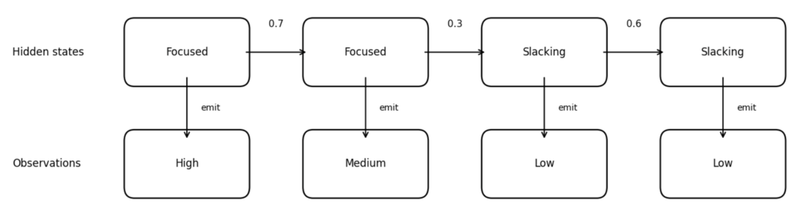

# Hidden Markov Model (HMM)

In the previous tutorial, we learned about Markov Chains. A Markov chain assumes the next state depends only on the current state. It fits settings where the state is directly recorded in the data, such as a logged employment status or a survey-reported marital status. When the state cannot be measured and must be inferred from observable indicators, we need to introduce a hidden state layer.

## 1. Introduction

Imagine you are a manager who permits working from home, and your employee Xiao Ming works from home every day. You cannot see Xiao Ming's actual work state (e.g., we have two states, **focused work** vs. **slacking off**), but you can observe the amount of code he submits each day. In this way, according to sequence analysis, the state space that we can observe in the data consists of three states: **high**, **medium**, or **low**.

However, code volume is only a proxy for effort, so we cannot infer his true work state with certainty from commits alone.

| **What you can observe** | **What you want to know** |
|---|---|
| Daily code submission volume (high/medium/low) | Is Xiao Ming focused on work today or slacking off? |

This is the core problem that HMM aims to solve: **inferring hidden states through observable data outputs**.

## 2. What is a Hidden Markov Model?

### 2.1 Formal Definition

A hidden Markov model uses a hidden state sequence that follows a Markov chain to explain and generate the observed sequence data. It has a **two-layer structure**:

- **Hidden Layer:** A Markov Chain where states cannot be directly observed.
- **Observation Layer:** The observation layer represents the data we can actually measure. At each time point, the system is in a hidden state you cannot see. That hidden state then produces the observation you do see, and the emission probabilities describe how likely each observation is under that state.

Expressed as a formula:

$$
\text{HMM} = \text{Hidden Markov Chain} + \text{Emission Probabilities}
$$

### 2.2 Diagram of HMM Structure

The figure below illustrates an HMM, linking observed code volume to an unobserved work state. The top row shows hidden states, following the transition rules of a Markov Chain. Each hidden state emits an observation value. The bottom row shows the outputs we actually observe.

**Why is it called "emit"?**

Emission is a vivid term for the movement from hidden to observed. In an HMM, think of the hidden state as a source behind the scenes. You cannot observe the source itself, but it produces the signals you do observe.

The numbers on the arrows are transition probabilities. For example, the value 0.7 on the arrow from "Focused" to "Focused" means that when someone is currently in the "Focused" state, there is a 70% probability they will remain focused in the next step.

## 3. HMM Parameters

We have just covered the definition and basic structure of HMMs. Now let's explain the main parameters that make up an HMM. A complete HMM is defined by **five components**, usually denoted as $S, O, A, B, \pi$:

| Element | Symbol | Definition | Example |
|---|---|---|---|
| **Hidden State Set** | $S$ | All possible hidden states | $\{Focused, Slacking\}$ |
| **Observation Symbol Set** | $O$ | All possible observation values | $\{High, Medium, Low\}$ |
| **Transition Probability Matrix** | $A$ | Transition probabilities between hidden states | $P(Slacking \rightarrow Focused) = 0.4$ |
| **Emission Probability Matrix** | $B$ | Probability of each observation given each hidden state | $P(Obs{=}High \mid Focused) = 0.6$ |
| **Initial State Distribution** | $\pi$ | Probability of being in each hidden state at the start | $P(Initial{=}Focused) = 0.8$ |

Next, we will explain each component:

### 3.1 Hidden State Set $S$

These are the states we want to infer but cannot directly see.

In social sciences, hidden states typically represent:

**1. Latent life stages:** Underlying phases of life that shape behavior but aren't directly observable.

For example, in a study of career development, hidden states might be:
- "exploration period" (trying different jobs, uncertain about direction)
- "establishment period" (building expertise in a chosen field)
- "maintenance period" (stable career with focus on preservation)

We cannot directly ask someone "which stage are you in?" but can infer it from observable indicators like job changes, salary trajectories, and skill acquisition patterns.

**2. Latent health states:** Underlying physiological or mental conditions that shape symptoms and behaviors but aren't directly observable.

For example, in a study of chronic disease progression, hidden states might be:
- "stable remission" (low disease activity, few symptoms, routine management)
- "subclinical deterioration" (biological worsening without clear symptoms, early warning phase)
- "acute flare" (high disease activity, strong symptoms, intensified treatment or care seeking)

We cannot directly observe the true health state at each time point, but can infer it from observable indicators like biomarker readings, symptom reports, medication changes, healthcare utilization, and wearable signals.

### 3.2 Observation Symbol Set $O$

These are the data we can actually record.

In sequence analysis, observation values might be:
- Specific employment status (e.g., full-time, part-time, unemployed)
- Specific behavioral records (e.g., purchase, browse, exit)
- Specific health indicators (e.g., normal, abnormal)

### 3.3 Transition Probability Matrix $A$

Once we define the mapping from hidden states to observations, we use the transition matrix $A$ to model how hidden states move between adjacent time points. The transition probability describes how hidden states transition between each other.

For example, the probability of transitioning from Focused to Focused is 0.7:

|  | Focused | Slacking |
|---|---|---|
| **Focused** | 0.7 | 0.3 |
| **Slacking** | 0.4 | 0.6 |

### 3.4 Emission Probability Matrix $B$ (The Unique Feature of HMM)

This is the key difference between HMM and ordinary Markov Chains.

Emission probability describes: when the system is in a certain hidden state, the probability of producing various observation values.

For example:

|  | Emit "High" | Emit "Medium" | Emit "Low" |
|---|-----------|--------------|---|
| **Focused** | 0.6       | 0.3          | 0.1 |
| **Slacking** | 0.1       | 0.3          | 0.6 |

Interpretation:
- When Xiao Ming is focused on work, there is a 60% probability of producing "high" output, and only a 10% probability of producing "low" output.
- When Xiao Ming is slacking, the situation is reversed: 60% probability of producing "low" output.

> **Note:** Emission probabilities are not deterministic. Even when Xiao Ming is focused on work, he might code less due to task difficulty or other reasons.

### 3.5 Initial State Distribution $\pi$

Describes the probability of being in each hidden state at the beginning of the sequence.

For example: $\pi = [0.8, 0.2]$ means there is an 80% probability of starting in the "Focused" state and a 20% probability of starting in the "Slacking" state.

## 4. Parameter Estimation and Interpretation

So far, we know that an HMM is defined by an initial distribution, transition probabilities, and observation probabilities. But naming these parameters is not enough. In real analysis, we often observe only the observed sequence, not the hidden states. This section focuses on one core question: **how to estimate the HMM parameters $(A, B, \pi)$ from the observed sequence**. We now introduce two main methods for parameter estimation.

### 4.1 Fitting Problem

Given observed sequences, how do we estimate the model parameters $(A, B, \pi)$?

**Application scenario:** Suppose we have daily code submission records for many employees. Here, the observations are code volume levels, such as high, medium, or low. The hidden states are true work modes, such as focused work versus slacking off. Given only the observation sequences, how can we estimate the transition and emission probabilities?

**Algorithm: Baum-Welch Algorithm**

Baum-Welch is not a different idea from EM. It is EM applied to HMMs, with HMM-specific computations.

EM is a general method for models with hidden variables. It alternates between estimating what the hidden states likely were under the current parameters and updating the parameters to better fit the data.

In an HMM, the hidden variables are the hidden state sequence. Baum-Welch uses the forward-backward algorithm to compute the needed posterior probabilities and expected transition and emission counts in the E-step. It then updates the initial distribution $\pi$, transition matrix $A$, and emission matrix $B$ by normalizing these expected counts in the M-step.

We first give the model parameters an initial value, then repeatedly perform two steps:

**(1) E-step (Expectation):**

Using the current parameters, compute the posterior probabilities of the hidden states given the observed sequence (e.g., the probability of being in each hidden state at each time point, and the expected number of transitions from state $i$ to state $j$).

Posterior probabilities are the model's best guess of the hidden state at each time point after it has seen the observed data. Using the current transition and emission probabilities, the model considers all hidden state paths that could explain the observations and assigns each path a probability. The best guess is the path or state assignment with the highest probability under the model, meaning it makes the observed sequence most likely given the current parameters.

**(2) M-step (Maximization):**

Treating these expected counts as data and update the parameters — updating the initial distribution $\pi$, the transition matrix $A$, and the emission matrix $B$ — to increase the likelihood of the observed data.

Repeat this cycle until parameters barely change or likelihood improvement becomes very small.

After estimating the parameters, we can utilise the following algorithm to interpret the fitted parameters.

### 4.2 Decoding Problem (After Fitting)

Given model parameters and observation sequence, infer the most likely hidden state sequence.

**Application scenario:** For example, we observe Xiao Ming's code volume for a week:

$$\text{high, medium, low, low, medium, low, low}$$

Given the fitted HMM and its parameters, what is the most likely hidden state sequence, focused or slacking, over the week?

**Algorithm: Viterbi Algorithm**

As a commonly used algorithm in HMM, the Viterbi Algorithm solves the decoding problem. In an HMM, decoding means recovering the hidden state sequence from what you can observe.

In the example, you only see Xiao Ming's code volume each day. You do not see whether he was focused or slacking. After we fit the HMM, we already have the transition and emission probabilities. Decoding uses these fitted probabilities plus the observed sequence to infer the most likely hidden state at each day, and the most likely overall hidden state path across the whole week.

## 5. Application of HMM in Sequence Analysis

### 5.1 Differences from Dissimilarity-based Clustering Approach

On the surface, both HMM and dissimilarity-based clustering sequence analysis deal with "states changing over time" data. But their research questions, assumptions, and outputs have fundamental differences:

| Dimension | Dissimilarity-based Clustering | HMM |
|---|---|---|
| **Core Question** | What typical patterns exist in observed trajectories? | What latent process lies behind the observations? |
| **Understanding of Observed States** | Observed states are treated as the states of interest, directly observed in the data (e.g., single or married) | Observed states are merely manifestations of latent states |
| **Main Output** | Distance matrix, clustering results, and summary measures of sequences (e.g., number of transitions, state durations) | Hidden state sequences, transition/emission probabilities |
| **Handling Individual Differences** | Discovers different groups through clustering | Basic HMM assumes all individuals share parameters |
| **Use of Temporal Information** | Focus on timing, duration, order | Mainly focuses on the probability of moving from one state to another |
| **Typical Application Scenarios** | Describing and classifying trajectories of known states | Inferring latent processes that cannot be directly observed |

### 5.2 A Comparative Example

Suppose we have 10-year employment records for 1,000 individuals, with one state recorded each year: `{Full-time, Part-time, Unemployed, In School}`.

**Dissimilarity-based clustering approach would ask:**
- How many typical patterns can these 1,000 trajectories be divided into?
- What differences do the clusters show, for example, in the average number of job changes, time spent unemployed, or age at first stable job? We can then use regression to test how covariates (e.g., age) predict cluster membership or these trajectory summaries.

**HMM would ask:**
- Is there an underlying life stage behind these observed employment states? For example, are there latent states like "career rising period," "stable period," "difficult period"?
- What is the most likely latent stage sequence behind a person's observation sequence?

### 5.3 Advantages of HMM

1. **Dimensionality reduction and abstraction:** Compresses multiple observed states (e.g., 8 combinations of marriage, parenthood, and residence) into a smaller number of hidden states (e.g., 5 latent stages), reducing model complexity.
2. **Discovering latent patterns:** Different people may have similar "latent trajectories," even if their observation sequences appear different on the surface.
3. **Handling imperfect observations:** The same latent state may produce different observed values because the state-to-observation link is probabilistic.

### 5.4 Potential Limitations of HMM

HMM still assumes all individuals share the same model: everyone uses the same transition matrix and emission matrix, ignoring individual differences.

Therefore, in the next section we will introduce the **Mixture Hidden Markov Model (MHMM)**, which assumes the existence of multiple "subpopulations," each with its own HMM parameters (initial probability $\pi$, transition probability $A$, emission matrix $B$), to solve this problem.

## 6. HMM Practice Exercises

### 6.1 Fill in the Key Concepts

Based on the core idea of a hidden Markov model, fill in the blanks:

A hidden Markov model (HMM) addresses one core problem: infer **②** from **①**.

An HMM has a two-layer structure: **③**, **④**.

A complete HMM is defined by five elements: **⑤**, **⑥**, **⑦**, **⑧**, **⑨**.

::: details Answer
① observable outputs, the observation sequence

② hidden states, the hidden state sequence

③ hidden layer

④ observation layer

⑤ hidden state set $S$

⑥ observation symbol set $O$

⑦ transition probability matrix $A$

⑧ emission probability matrix $B$

⑨ initial state distribution $\pi$
:::

### 6.2 Emission Matrix and State Inference

A researcher wants to understand young people's true life stage `{exploration period, transition period, stable period}`. The stage cannot be observed directly, so the researcher infers it from housing status `{living with parents, renting independently, owning one's own home}`. The following emission probability matrix is given:

|  | Living with Parents | Renting Independently | Owning a Home |
|---|---|---|---|
| **Exploration Period** | 0.70 | **①** | 0.02 |
| **Transition Period** | 0.20 | 0.60 | **②** |
| **Stable Period** | 0.05 | 0.30 | **③** |

**Question 6.2.**

**(a)** Fill in ① ② ③ in the table. *Hint: the probabilities in each row must sum to 1.*

**(b)** If the observed housing status is owning a home, based on emission probabilities alone, which life stage is most likely? Why?

**(c)** A 25-year-old has a three-year housing record: living with parents, then renting independently, then renting independently. By intuition alone, what life stage change is most likely? Which core HMM problem does this reasoning correspond to?

::: details Answer
**(a)**
- ① = 1 − 0.70 − 0.02 = **0.28**
- ② = 1 − 0.20 − 0.60 = **0.20**
- ③ = 1 − 0.05 − 0.30 = **0.65**

**(b)** Most likely stage: **Stable Period**.

Reason:

- $P(\text{owning a home} \mid \text{stable period}) = 0.65$
- $P(\text{owning a home} \mid \text{transition period}) = 0.20$
- $P(\text{owning a home} \mid \text{exploration period}) = 0.02$

**(c)** Most likely stage path: **exploration period → transition period → transition period**.

Reasoning:
- Living with parents is most likely under exploration period, $P = 0.70$.
- The first renting independently is most likely under transition period, $P = 0.60$.
- Renting independently again suggests staying in transition period, $P = 0.60$.

This corresponds to the **HMM decoding problem**. In practice, the Viterbi algorithm is used to find the most likely hidden state path.
:::

### 6.3 Limits of HMMs

An HMM assumes that all individuals share the same set of model parameters. Answer briefly:

**(a)** When does this assumption fail? Give one example.

**(b)** What model can address this issue? What is its basic idea?

::: details Answer
**(a)** This assumption fails when the population is heterogeneous. For example, in career trajectories, men and women may have very different transition patterns, such as career breaks linked to childbirth. A standard HMM forces everyone to share the same transition matrix, so it cannot capture this difference.

**(b)** A **Mixture Hidden Markov Model (MHMM)** can address this. The basic idea is that there are multiple subgroups, such as different genders or birth cohorts. Each subgroup has its own HMM parameters ($\pi$, $A$, $B$). The model learns both the HMM parameters for each subgroup and the probability that each individual belongs to each subgroup.
:::

## 7. Summary

In this tutorial, we learned:

- **Core concepts of HMM:** Hidden states, observations, transition probabilities, emission probabilities
- **Structure of HMM:** Hidden Markov Chain + observation emission
- **Applications of HMM:** Inferring latent life stages or behavioral patterns
- **Differences between HMM and classical sequence analysis:** Core questions, main outputs, and interpretation of observed states
- **Advantages and limitations of HMM:** An HMM can extract latent patterns from complex observation sequences, but it assumes all individuals share the same parameters and cannot capture population heterogeneity

HMM solves the problem of states not being observable, but it still assumes all individuals share the same set of parameters. In the next tutorial, we will learn about the **Mixture Hidden Markov Model (MHMM)**, which allows different individuals to belong to different subgroups, each with its own behavioral patterns.

## 8. References

Helske, S., & Helske, J. (2019). Mixture hidden Markov models for sequence data: The seqHMM package in R. *Journal of Statistical Software*, 88(3), 1–32. [https://doi.org/10.18637/jss.v088.i03](https://doi.org/10.18637/jss.v088.i03)