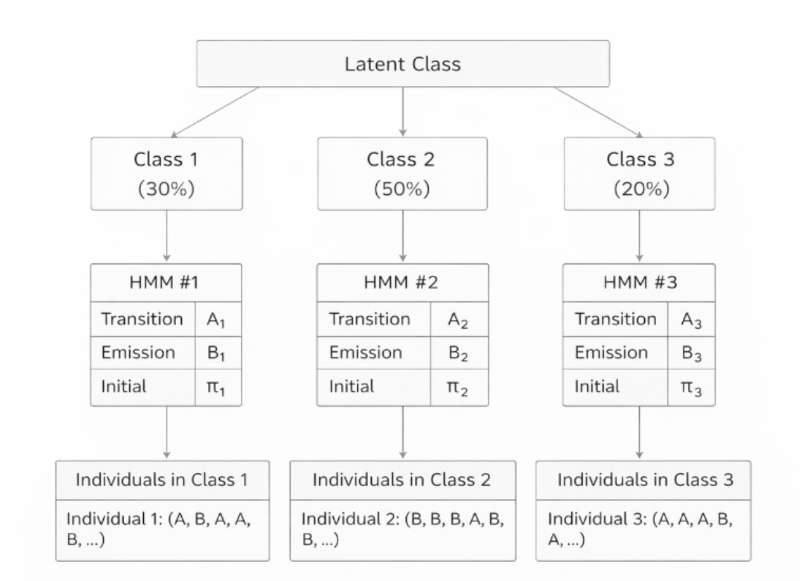

# Mixed Hidden Markov Model (MHMM)

In the previous two tutorials, we studied Markov chains and Hidden Markov Models (HMMs). HMMs resolve the issue that Markov chains cannot handle states that are not directly observable.

However, they rely on the critical assumption that all individuals share the same set of model parameters (initial probability $\pi$, transition probability $A$, emission probability $B$). In real-world scenarios, you may encounter issues that violate the above assumptions. For instance:

- Would a recent graduate and a middle-aged professional have exactly the same career transition patterns?
- Would a conservative investor and an aggressive investor follow the same trading behavior rules?

Therefore, this assumption is often oversimplified in reality. The **Mixture Hidden Markov Model (MHMM)** was created to solve this problem. Specifically, it allows different individuals to belong to different types, with each type having its own unique behavioral pattern. Like the dissimilarity-based clustering workflow, MHMM identifies distinct trajectory types and links type membership to covariates.

## 1. Introduction

### 1.1 Starting from a Real-World Problem

Suppose you are a data analyst for an e-commerce platform. You observe a user's sequence of daily purchasing behaviour for one week:

```
User A: (Browse, Browse, Browse, Browse, Browse, Purchase, Browse)
User B: (Purchase, Purchase, Browse, Purchase, Purchase, Purchase, Purchase)
```

If we use HMM, we would assume that these users' behaviors are all driven by the same hidden process. But intuition may tell us:

- **User A** might be a *rational purchaser*, i.e., who buys only after substantial browsing
- **User B** might be a *direct purchaser*, i.e., who buys quickly with minimal browsing

These users may belong to different types, with each type having different latent state transition patterns. MHMM is the appropriate model designed to capture this population heterogeneity.

### 1.2 Formal Definition

The core idea of MHMM can be summarized in one sentence:

> **MHMM = A mixture of multiple HMMs, where each individual belongs to one of the HMMs**

More formally, MHMM assumes:

1. The population consists of $K$ latent classes
2. Each latent class has its own independent HMM parameters (initial distribution $\pi$, transition matrix $A$, emission matrix $B$)
3. Each individual belongs to one latent class (the probability of belonging to a certain cluster is determined through covariates)
4. Given the class an individual belongs to, their behavior follows that class's HMM

**Class in MHMM versus States/Stages in HMM**

In an MHMM, classes are **between-person groups**. Each individual belongs to one latent class, and different classes have different HMM parameters, such as different transition and emission matrices.

HMM states are **within-person time-varying stages**. A person moves between hidden states over time, and the state sequence describes their dynamics within a class.

### 1.3 Diagram of MHMM Structure

In the diagram below, the top layer shows latent classes representing different types of individuals, where each class corresponds to an independent HMM. Individual class membership is unknown and needs to be inferred from covariates, and each individual belongs to only one class.



### 1.4 Comparison with HMM Components

From the discussion above, you can view a standard HMM as a single-class model, where all individuals share one set of parameters. In contrast, an MHMM extends this by allowing $K$ latent classes, each with its own parameters.

The table below summarizes this difference by showing how a standard HMM uses one set of parameters, while an MHMM uses $K$ class-specific parameter sets.

| Component | HMM | MHMM |
|---|---|---|
| **Initial Distribution** | One $\pi$ shared by all | Each class $k$ has its own $\pi_k$ |
| **Transition Matrix** | One $A$ shared by all | Each class $k$ has its own $A_k$ |
| **Emission Matrix** | One $B$ shared by all | Each class $k$ has its own $B_k$ |
| **Number of Classes** | 1 (all individuals share one model) | $K$ (each class has its own model) |

**Why is the probability represented as a matrix?** A probability (initial, transition or emission) becomes a matrix when we need to describe transitions between multiple states. Consider a simple example with 2 hidden states (Focused and Slacking). The transition probability "from state $i$ to state $j$" must cover all possible combinations:

|  | Focused | Slacking |
|---|---|---|
| **Focused** | $P(F \rightarrow F)$ | $P(F \rightarrow S)$ |
| **Slacking** | $P(S \rightarrow F)$ | $P(S \rightarrow S)$ |

## 2. The Two-Layer Hidden Structure of MHMM in Sequence Analysis

MHMM has two layers of hidden variables that need to be inferred. The first layer is unique to MHMM; the second layer involves the same operations as HMM performed on each cluster after classification.

### 2.1 First Layer: Latent Class

**What "type" does this person belong to?**

- Once a person belongs to a certain class, they remain in that class throughout the entire observation period.

### 2.2 Second Layer: Hidden State

**At each time point, what hidden state is this person in?**

- Same as hidden states in standard HMM.

### 2.3 A Concrete Example

Consider career trajectory analysis. For a specific individual, MHMM first infers:

**Which class are they most likely to belong to?** (e.g., Exploratory type, i.e., a cohort of recent graduates)

After obtaining the specific cluster membership, MHMM then infers:

**At each time point, what hidden state are they most likely in?** (e.g., "Rising period → Stable period → Difficult period → ...")

## 3. Cluster Membership in MHMM

### 3.1 How Cluster Membership is Calculated

Like HMM, MHMM also infers the most likely hidden state at each time point. The difference is that MHMM first uses covariates to calculate the probability of each individual belonging to different clusters. Specifically, if the model includes covariates, it uses **multinomial logistic regression** to calculate each individual's prior probability of belonging to each class. Then, the model calculates the likelihood of the individual's actual observation sequence under each class's HMM, and updates the membership probability using **Bayes' formula**.

### 3.2 MHMM Clustering vs Classical Sequence Analysis Clustering

What is the difference between "latent classes" in MHMM and "clusters" in traditional sequence analysis (such as Optimal Matching + hierarchical clustering)? Although both divide individuals into different groups, their basic principles, classification methods, and the role of covariates are fundamentally different.

| Dimension | MHMM Latent Classes | Dissimilarity-based Clustering |
|---|---|---|
| **Classification Basis** | Probabilistic model: individuals are assigned to the class whose HMM best explains their observed sequence | Distance-based: individuals are grouped by pairwise sequence dissimilarity |
| **Role of Covariates** | Covariates directly influence class membership probabilities via multinomial logistic regression | Covariates are typically used after clustering (e.g., as predictors of cluster membership in a separate regression) |
| **Latent States** | Each class has its own hidden states and transition dynamics | No hidden state layer; clustering operates on observed sequences directly |
| **Output** | Class-specific HMM parameters ($\pi_k$, $A_k$, $B_k$) and individual membership probabilities | Cluster labels and sequence-level summary measures |

## 4. Applications of MHMM in Social Sciences

### 4.1 Life Course Trajectory Typology

**Research question:** What typical types of transition trajectories exist from school to work for young people?

**Setup:**
- **Observations:** Annual activity status (in school, full-time, part-time, unemployed)
- **Hidden states:** Latent "life stages" (preparation period, transition period, stable period, difficult period)
- **Latent classes:** Different transition patterns ("rapid stabilization type," "delayed entry type," "repeated fluctuation type")

### 4.2 Consumer Behavior Analysis

**Research question:** Can users' purchase behavior trajectories reveal different consumer types?

**Setup:**
- **Observations:** Weekly purchase behavior (no purchase, small purchase, large purchase)
- **Hidden states:** Purchase intent states (low intent, medium intent, high intent)
- **Latent classes:** Consumer types ("loyal type," "occasional type," "churning type")

### 4.3 Health Trajectory Research

**Research question:** What patterns exist in chronic disease patients' health trajectories?

**Setup:**
- **Observations:** Categorized health indicators from regular check-ups
- **Hidden states:** Latent disease stages
- **Latent classes:** Different disease progression patterns ("rapid deterioration," "slow progression," "stable control")

For each application, MHMM can answer:

- How many typical transition patterns exist?
- What are the characteristics of each pattern (initial distribution $\pi$, transition probability $A$, emission probability $B$)?
- Which pattern does a specific young person belong to?
- What factors (covariates) predict which pattern a person belongs to?

## 5. Practice Exercises

### 5.1 Fill in the Key Concepts

Based on the core idea of a mixture hidden Markov model, fill in the blanks:

A key limitation of an HMM is that it assumes all individuals share **①**. But in reality, different groups often follow different behavior patterns. The core idea of an MHMM can be summarized in one sentence: **②**. More specifically, an MHMM assumes:

- The population consists of **③** latent classes.
- Each latent class has its own HMM parameters: **④**, **⑤**, **⑥**.

The probability that an individual belongs to each class is determined by **⑦**. Compared with an HMM, an MHMM has a two-level latent variable structure:

- Level 1, individual level: infer which **⑧** the individual belongs to.
- Level 2, time step level: infer the **⑨** at each time point, as in standard HMM.

::: details Answer
① one shared set of model parameters ($\pi$, $A$, $B$)

② an MHMM is a mixture of multiple HMMs, and each individual belongs to one of them

③ $K$

④ initial distribution $\pi$

⑤ transition matrix $A$

⑥ emission matrix $B$

⑦ covariates

⑧ cluster membership

⑨ hidden state
:::

### 5.2 Application Scenario Selection

Which research question below is more suitable for an MHMM? Choose one and explain why.

**Scenario A:** The researcher wants to compare the concrete shapes of career trajectories between frequent job hoppers and stable workers, such as the average number of transitions and the duration spent in specific states.

**Scenario B:** The researcher wants to explore whether there are different career development mechanisms. For example, some people may follow a rapid rise pattern, while others follow a slow exploration pattern. The researcher also wants to know how gender and education affect the probability that an individual belongs to each pattern.

::: details Answer
**Scenario B** is more suitable for an MHMM.

Reasons:
- Scenario B focuses on **latent mechanisms**, not just surface observations.
- Scenario B explicitly needs **covariates**, such as gender and education, to predict cluster membership.
- Scenario B aims to identify **distinct transition dynamics**, such as rapid rise versus slow exploration, which is exactly what an MHMM captures through class-specific transition matrices.

Scenario A is better suited to the **dissimilarity-based clustering approach**, because it focuses on trajectory shape features, such as the number of transitions and state durations, which can be computed directly from the observed sequences.
:::

## 6. Summary

In this tutorial, we learned:

- **Core idea of MHMM:** Allows different "types" of individuals in the population, each type with its own HMM
- **Two-layer hidden structure:** Latent class (individual level) + hidden state (time point level)
- **Comparison with related methods:** HMM, two-step clustering
- **Practical applications:** Life course research, health trajectories

MHMM is a powerful tool for handling population heterogeneity in longitudinal sequence data. It combines HMM's ability to capture dynamic processes with mixture models' ability to identify latent types, making it suitable for "trajectory typology" research questions in social sciences.

## 7. References

Helske, S., & Helske, J. (2019). Mixture hidden Markov models for sequence data: The seqHMM package in R. *Journal of Statistical Software*, 88(3), 1–32. [https://doi.org/10.18637/jss.v088.i03](https://doi.org/10.18637/jss.v088.i03)