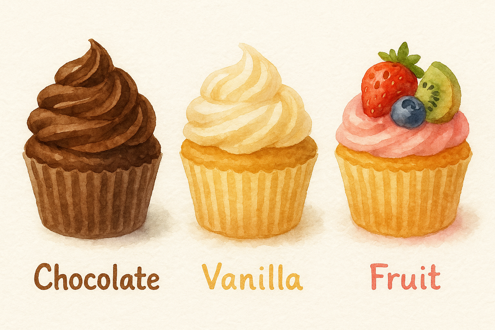

# Understanding Differences between Sequence Analysis, Latent Class Analysis, and Hidden Markov Models

When studying individuals’ life courses, e.g., how people move from school to work to family life, we often ask: **Are there typical patterns?** 

Several methods can be used to answer this classification question. Researchers in life course studies have compared Sequence Analysis (SA) with other approaches that also aim to uncover typical patterns, particularly Latent Class Analysis (LCA) (e.g., Han et al., 2017; Barban & Billari, 2012).

Identifying typical trajectory patterns is undoubtedly one of the most common uses of sequence analysis, particularly when combined with cluster analysis. However, this practice is sometimes treated as the defining feature of the method. In fact, many studies that refer to “sequence analysis” are more precisely **performing dissimilarity-based clustering in sequence analysis**, which is a term used by Henning and Liao (2018) that we recommend adopting for clarity.

In this tutorial, we focus on clarifying how dissimilarity-based clustering in sequence analysis differs from other methods that similarly reveal typical patterns, especially latent class analysis and hidden markov models (Helske et al., 2018).

Other conceptual tutorials will cover what else sequence analysis can do, such as polyadic sequence analysis, sequence history analysis, and sequence analysis multi-state models.

## 1. Why do we compare them?

Some individuals may follow a “traditional” path (school → job → marriage → children), while others may delay marriage, cohabit, or remain single.

When thinking this way, what has been frequently neglected is that we are already making an implicit assumption: that thousands of individuals in our data can be grouped into a few typical patterns or life course types (often called "typologies" in the sequence analysis community).

To identify these types of trajectories, researchers have developed several approaches: Dissimilarity-based clustering in Sequence Analysis (SA), Latent Class Analysis (LCA), and Hidden Markov Models (HMMs). 

At first glance, all three methods seem to aim for the same goal as they group/classify individuals with similar life courses. But under the surface, they rely on very different logics:

* **Dissimilarity-based clustering in Sequence Analysis (SA)** identifies groups by *observed resemblance*. 

It computes pairwise dissimilarities between sequences (e.g., via Optimal Matching or Hamming distance) and then applies cluster analysis to those distances. 

This is a **data-driven, non-parametric approach** that captures *empirical similarity in timing and order*, without assuming any underlying statistical model.  

* **Latent Class Analysis (LCA)** instead assumes that the observed sequences are generated by a few *unobserved population types*. 

Each latent class defines a probability distribution of states over time, and the model estimates class proportions and conditional probabilities that best reproduce the observed data. 

LCA is a **model-based, parametric approach**, allowing formal model fit evaluation using criteria such as **BIC**, **AIC**, or **entropy**, and it can incorporate covariates directly into the estimation. 

* **Hidden Markov Models (HMMs)** extend the logic of LCA by explicitly modeling *transitions between hidden life stages over time*. 

Instead of assuming that each person belongs to one fixed latent type, HMMs allow individuals to move between hidden states according to estimated transition probabilities. 

Like LCA, they are **statistical, likelihood-based models**, but with a **dynamic component** that captures temporal dependence in the latent process.

In other words:

* Latent Class Analysis (LCA) and Hidden Markov Models (HMMs) are model-based approaches: 
  * they specify a stochastic data-generating model with parameters (e.g., class probabilities, transition probabilities, conditional distributions). 
  * These models imply particular probability distributions over observed sequences.

* Dissimilarity-based clustering in sequence analysis, by contrast, is a non-parametric, algorithmic approach. 
  * It measures how far observed sequences are from one another using dissimilarity metrics (like Optimal Matching) and then groups them via clustering. 
  * There’s no likelihood function or assumed data-generating process behind those distances.

Understanding these differences helps clarify what each method can (and cannot) reveal about trajectories.

## 2. The basic intuition

Imagine you have the 10-year health histories of 100 older adults, represented by a sequence of letters:

```
HHHMMLLLDDDD
```

H = healthy, M = mild symptoms, L = limited mobility, D = dependent.

Now, how do you find typical health trajectories among these individuals?

### Dissimilarity-based clustering in sequence analysis: Comparing life stories directly

Dissimilarity-based clustering in sequence analysis treats each person’s life as a string of letters and simply asks:

> “How different is person A’s life from person B’s?”

In order to calculate, we need to use [dissimilarity measures](../function-library/get-distance-matrix.md), one of the most important components of sequence analysis. If we use optimal matching (OM), one of the most commonly used dissimilarity measures, it will calculate how many small changes (insertions, deletions, substitutions) are needed to turn one sequence into another. It is a bit like measuring how many edits it takes to make two words look the same, which is why such a dissimilarty measure falls under the category of "edit distance". 

For instance, if two women's lives differ only by a few edits, they are close/similar. If they need many edits, they are dissimilar (far apart).

After calculating these distances for everyone in the data, we use **cluster analysis** to group people whose lives look alike. Commonly, we use hierarchical clustering, particularly the Ward D2 or Ward D methods. 

This approach of combining sequence analysis and cluster analysis is visual and intuitive. You can literally see the sequences and compare them.

### Latent Class Analysis: Modeling hidden life types

Latent class analysis (LCA) takes a very different perspective.

It assumes that everyone’s observed health history is generated by a few **unseen population groups**, or **latent classes**. 

Imagine you’re running a bakery that sells cupcakes, and you have the following flavors: 

<div align="center">
  
</div>


You notice that your customers tend to like very different combinations of flavors, but you don’t know how many *types* of customers there are, or what each type likes.

You record what everyone buys over a week:
some people mostly get chocolate, some mix chocolate and vanilla, others buy fruit flavors.
Now you want to find the hidden “taste types.”

### Step 1: The guess

At first, you **don’t know** what those taste types are.

So you make a few guesses: 

> Maybe there are 3 kinds of customers, who are 
> 
> “chocolate lovers,” “balanced tasters,” and “fruit lovers.”

You also make an initial guess for what each group might prefer, and you make the following table:

| Type             | Chocolate | Vanilla | Fruit |
| ---------------- | --------- | ------- | ----- |
| Chocolate lovers | 0.8       | 0.15    | 0.05  |
| Balanced tasters | 0.4       | 0.4     | 0.2   |
| Fruit lovers     | 0.1       | 0.2     | 0.7   |

These numbers are just your *starting assumptions* as they not based directly on the empirical data yet.

### Step 2: Compare guesses to reality

Next, you check: 

> Given what each “type” is supposed to like,
> 
> how likely is it that each real customer’s purchases came from that type?

For example:

* someone who bought chocolate every time probably fits “chocolate lovers” best;
* someone who mixed fruit and vanilla might fit “balanced tasters” a bit better.

You keep track of those likelihoods for everyone.

### Step 3: Refine your table

Now you use those likelihoods to update your guesses in the table:

> If some customers you thought were “chocolate lovers” actually bought more vanilla than expected,
> 
> you slightly reduce the chocolate probability for that group and increase vanilla a bit.
>
> At the same time, you adjust how many customers you think belong to each type (class proportions).

Then you check again:

> Given these new recipes, who fits where?”

and refine again.

### Step 4: Converge on the best-fitting model

After several rounds, the “taste profiles” (your class-specific distributions) settle down so that:

* each type’s flavor preferences match what its customers usually buy, and

* the mix of types explains the overall pattern of sales as well as possible.

At this point, you’ve discovered the **latent classes** of your bakery:

not because you saw them directly in the data, but because you found the combination of **class proportions** and **within-class preferences** that best *reproduces* the messy purchase records you observed.

In LCA terms:

* **Class proportions** tell you how large each hidden group is (your broad latent classes). For example, maybe 50% of your customers are “chocolate lovers,” 30% are “balanced tasters,” and 20% are “fruit lovers.”

* **Within-class preferences** describe what members of each group typically do. The probability of buying chocolate, vanilla, or fruit if someone belongs to that group (the table that you have). 

> Together, these **two sets of parameters** define the mixture model: 
> 
> the proportions explain how often each type appears in the population, and 
> 
> the within-class probabilities explain how each type behaves.

That’s exactly what **LCA** does statistically:

it keeps adjusting the hidden groups and their internal probability tables until the synthetic data they would generate looks as close as possible to the real data.

### You might feel that cluster analysis and LCA seem to be very similar

At first glance, both cluster analysis (as used in sequence analysis) and latent class analysis (LCA) seem to do the same thing: they both turn a lot of individual life histories into a few meaningful types.
However, they rest on very different assumptions about *what* those types represent and *how* they are identified.

Using a weather analogy makes the contrast clear:

### Dissimilarity-based clustering in sequence analysis

Imagine a climatologist collects the daily temperature curves of hundreds of cities.

Without assuming anything about the underlying climate systems, she simply **compares the shapes of these curves**. Cities whose temperature patterns look more similar are grouped together.

This is a purely **appearance-based classification** as it relies on measuring how close or distant two observed sequences are.

There is no assumption that these cities share an underlying “generating mechanism.”
The method only says: *these trajectories look alike*, not *these trajectories come from the same process*.
Hence, it provides an **purely empirical grouping**, based on observed similarity in shape or timing.

### Latent Class Analysis (Model-based)

Now imagine that instead of comparing curves directly, we assume that there are only a few **hidden climate systems**, say, Tropical, Continental, and Polar.

Each system generates temperature patterns according to its own probabilistic rules.
A tropical city is likely warm most of the year; a polar city cold; a continental city variable.

LCA estimates:

1. the parameters of these hidden systems (the within-class probability distributions), and
2. the probability that each city belongs to each system.

In this sense, LCA is not grouping by visual similarity, but by **shared data-generating mechanism**.
It finds the model that best explains how the observed data could have been produced.

In short: 

| Aspect                | Dissimilarity-based Clustering in SA              | Latent Class Analysis (LCA)                                        |
| --------------------- | --------------------------------------------- | ------------------------------------------------------------------ |
| **Underlying logic**  | Similarity of observed trajectories           | Probabilistic data-generating model                                |
| **Assumption**        | No hidden structure assumed                   | Each sequence arises from one of a few latent classes              |
| **Basis of grouping** | Distance between sequences                    | Likelihood under class-specific probabilities                      |
| **Output**            | Mostly hard partitions (each sequence → one cluster) | Soft probabilities (each sequence has membership likelihoods)      |
| **Interpretation**    | “These trajectories look similar.”            | “These trajectories are likely generated by the same hidden rule.” |

### Clustering is non-parametric; LCA is parametric

In the previous subsection, we have learned that

* **Cluster analysis groups what looks similar.**
* **LCA infers what is generated by the same hidden process.**

Both reveal structure in messy data, but they describe fundamentally different kinds of structure as one is descriptive, and the other one is generative.

Now, we need to understand it further from the perspective of statistics. 

* **Cluster analysis is non-parametric**:

  It doesn’t assume any specific functional form or probability distribution that generated the data.
  It works directly on the observed sequences and their pairwise similarities.

  You can think of it as *pattern recognition*: the method groups trajectories that *look* similar, without assuming any underlying model.

* **Latent Class Analysis (LCA) is parametric**:

  It assumes the data were generated from a **finite mixture model**, i.e. that each observed sequence comes from one of a limited number of latent probability distributions.

  Those distributions are parameterized by probabilities (for each state at each time) and estimated by maximizing a likelihood, just like in regression or other model-based approaches.

  We will cover what mixture models are in another tutorial.

We can also summarize it into a table:

| Aspect             | Dissimilarity-based clustering                       | Latent Class Analysis                                                                   |
| ------------------ | ---------------------------------------------------- | --------------------------------------------------------------------------------------- |
| **Type**           | Non-parametric (algorithmic)                         | Parametric (model-based)                                                                |
| **Assumption**     | No assumed distribution; only distance or similarity | Data are generated by a mixture of latent distributions                                 |
| **Estimation**     | No parameters; no likelihood                         | Maximum-likelihood estimation of parameters (class sizes and conditional probabilities) |
| **Interpretation** | Groups that look similar                             | Groups defined by model-based probabilities                                             |
| **Analogy**        | Like k-means or hierarchical clustering              | Like a regression model for categorical longitudinal data                               |

### Hidden Markov Models: Capturing dynamic life stages

Hidden Markov Models (HMMs) take yet another perspective. 

Unlike LCA, which assumes that time points are independent given the latent class, HMMs explicitly model the temporal dependence between states. In other words, HMMs are dynamic models that pay close attention to the timing and sequencing of transitions, much like sequence analysis does.

Specifically, instead of assuming that each person belongs to a fixed group (as in LCA), HMMs assume that **everyone moves through a series of hidden life stages over time** and these stages cannot be observed directly (it is the reason why the model is called "hidden").

Perfect — you’ve already built a clear conceptual foundation for HMMs, and now you want to make it *come alive* with a simple, intuitive story like your bakery analogy for LCA.

Here’s how we can do that. I’ll keep your current scientific explanation (which is already solid) but interweave it with an everyday example that shows how the *hidden process* in HMMs works — in the same spirit as your “bakery” story for LCA.

---

### Hidden Markov Models: Capturing dynamic life stages

Hidden Markov Models (HMMs) take yet another perspective.

Unlike LCA, which assumes that time points are independent given the latent class, HMMs explicitly model the temporal dependence between states. In other words, HMMs are **dynamic models** that pay close attention to the *timing* and *sequencing* of transitions — much like sequence analysis does.

Specifically, instead of assuming that each person belongs to a single, fixed group (as in LCA), HMMs assume that **everyone moves through a series of hidden life stages over time**.
These stages themselves cannot be directly observed — that’s why the model is called *hidden*.

#### The coffee shop analogy

Imagine you’re running a coffee shop, and you record what each customer orders every morning: *espresso (E)*, *latte (L)*, or *tea (T)*.

<div align="center">
  
</div>

At first glance, the orders seem random: one day a person buys espresso, the next day tea, then back to espresso. But you suspect there’s something deeper going on: maybe their choice depends on **their hidden morning mood**, which changes over time.

Thus, you hypothesize three hidden moods:

1. **Sleepy**,
2. **Focused**,
3. **Relaxed**.

Each mood *emits* certain drink orders with different probabilities:

| Hidden mood (state) | Espresso | Latte | Tea |
| ------------------- | -------- | ----- | --- |
| Sleepy              | 0.8      | 0.2   | 0.0 |
| Focused             | 0.6      | 0.3   | 0.1 |
| Relaxed             | 0.1      | 0.3   | 0.6 |

When someone is sleepy, they almost always choose espresso.
When they’re relaxed, they often choose herbal tea.

> Note: “Emits” is a technical term from probabilistic modeling. 
> 
> It means that a hidden state produces or generates an observable outcome according to some probability distribution.

But these moods don’t stay fixed. Instead, they **evolve over time**, following transition probabilities:

| From → To | Sleepy | Focused | Relaxed |
| --------- | ------ | ------- | ------- |
| Sleepy    | 0.6    | 0.3     | 0.1     |
| Focused   | 0.2    | 0.6     | 0.2     |
| Relaxed   | 0.1    | 0.4     | 0.5     |

So, a person who is “sleepy” today has a 60% chance of staying sleepy tomorrow, a 30% chance of becoming focused, and a 10% chance of becoming relaxed.

Now, even though you only see what customers order, the HMM tries to reconstruct:

* What sequence of hidden moods (the hidden states) best explains their observed orders in the data, and
* What the transition and emission probabilities must be to make the observed data most likely?

#### Translating back to life-course research

In life-course analysis, the “hidden moods” are the **unobservable life stages**. For example, “robust health,” “early decline,” or “chronic frailty.”

The “orders” (espresso, tea, latte) are the **observable states**, such as *healthy (H)*, *mild symptoms (M)*, *limited mobility (L)*, *dependent (D)*.

HMMs estimate:

* **Emission probabilities:** how likely each hidden life stage is to produce each observed health state (like the mood → drink probabilities), and
* **Transition probabilities:** how people move from one hidden stage to another over time (like the mood transitions).

By combining these two pieces, the model reconstructs the **invisible life-course process** behind what we observe.

This makes HMMs particularly powerful for studying **transitions and uncertainty**. For examples, we can use HMMs to answer the following research questions:

* When do people move from robust health to decline?
* How long do they typically stay in each hidden stage?
* How much noise or measurement error is there in observed states?

In short:

> While dissimilarity-based clustering in sequence analysis compares observed paths, and LCA groups people by overall patterns, **HMMs reveal the invisible process that generates the sequence step by step.**

### How Latent Class Analysis and Hidden Markov Models differ

Both LCA and HMMs deal with things we cannot directly observe, which are *latent structures* hidden behind the data.

But they represent two very different ideas about what those hidden structures mean.

**1. Latent Class Analysis: Static types/classes/groups**

In LCA, the latent variable is a **fixed group membership**. Each person belongs to one unobserved class for the entire period. For example,

* Class 1: mostly healthy, 
* Class 2: gradual decline, or 
* Class 3: early health problems.

These classes differ in their *overall probabilities* of being in each health state (H, M, L, D) at different ages.

Once you’re in a class, you stay there; the class doesn’t change over time.

LCA therefore explains long-term **differences between people**: who tends to follow which general pattern.

**2. Hidden Markov Models: Dynamic stages**

In HMMs, the latent variable is a **hidden state that can change over time**.

Instead of assigning each person to one fixed class, HMMs assume that everyone moves through several invisible *phases* during life. For example, “beginning to slow down,” or “chronic limitation.”

At each time point, the model estimates the probability of switching from one hidden state to another (the **transition probability**) and the probability of observing a certain health condition (the **emission probability**) while in that state.

HMMs therefore focus on **transitions within people**, e.g., how health stages evolve year by year.

In short:

| Feature          | Latent Class Analysis (LCA)                    | Hidden Markov Model (HMM)                          |
| ---------------- | ---------------------------------------------- | -------------------------------------------------- |
| Latent meaning   | Unobserved *group* of individuals              | Unobserved *state* that changes over time          |
| Time dynamics    | Fixed for each person                          | Can change at every time point                     |
| Focus            | Differences *between* people                   | Changes *within* people                            |
| Typical question | “What kinds of overall health patterns exist?” | “How do people move between hidden health stages?” |

To sum up, **LCA groups people**, while **HMMs track phases**:

* LCA sees the life course as belonging to one of a few hidden types;
* HMMs see it as a journey through hidden stages that unfold over time.

## 3. Other important things

### How do we decide the number of types or states?

When we use these methods to describe life trajectories, we always face a practical question:
**How many types (or states) should we identify?**

Overall, the number of groups is largely a **researcher’s choice**, guided by both data and theory. For these three methods, we highly recommend you to use both statistical indicators, which differ across methods, and substantive interpretations with thoery. 

**1. Dissimilarity-based clustering in sequence analysis: Deciding by clustering and interpretation**

After computing pairwise distances between sequences, SA usually applies **hierarchical clustering** (often Ward’s method) to group similar trajectories.

However, the algorithm itself does *not* tell you how many clusters to keep. Researchers have to decide this number by combining:

* **Statistical indicators**, e.g., Average Silhouette Width (AWS), Hubert’s C index (HC), or Point Biserial Correlation (PBC), and

* **Substantive interpretation**, e.g., whether the clusters make sense theoretically.

> Note: 
> We don't recommend to have too many clusters (e.g., more than 10) as it might be difficult to interprete. 

**2. Latent Class Analysis (LCA): Choosing statistically optimal classes**

In LCA, the number of latent classes is selected by comparing how well models with different class numbers fit the data.

Each model estimates its own likelihood, and we use **information criteria** such as the *Bayesian Information Criterion (BIC)* or *Akaike Information Criterion (AIC)* to decide which one balances fit and simplicity.

Typically, the model with the **lowest BIC** is preferred, as it captures the structure of the data without overfitting. Moreover, substantive interpretation is also very important as you need to assess whether the resulting classes are meaningful, theoretically plausible, and substantively distinct.

**3. Hidden Markov Models (HMMs): Estimating the number of hidden states**

HMMs require a similar decision about how many hidden states to include.

Because the model allows transitions over time, too few states may oversimplify real dynamics, while too many may create artificial complexity.

Researchers again rely on **information criteria** such as BIC, AIC, or cross-validation, combined with whether the resulting states are **interpretable** as meaningful life stages.

In practice, one often compares several models (e.g., 4–8 states) and chooses the smallest one that still provides clear, distinct phases.

### Takeaways in one table

| Aspect              | Dissimilarity-based clustering in SA                                                 | Latent Class Analysis (LCA)                                              | Hidden Markov Models (HMMs)                                                               |
| ------------------- | ---------------------------------------------------------------------- | ------------------------------------------------------------------------ | ----------------------------------------------------------------------------------------- |
| **Philosophy**      | Data-driven: focuses on *how similar* life stories appear              | Model-based: assumes a few hidden group types generate observed sequences | Dynamic model: assumes a hidden process *evolves over time* and generates observed states |
| **Core idea**       | “How far apart are these sequences?”                                   | “Which latent type is each individual most likely from?”                     | “What unobserved life stages generate these observed transitions over time?”              |
| **Main tool**       | Distance matrix + cluster analysis (e.g. Ward D2)                         | Likelihood model + estimated class membership probabilities              | Markov chain with emission and transition matrices estimated via EM algorithm             |
| **Output**          | Clusters based on dissimilarity                                        | Probabilistic latent classes                                             | Hidden states (life stages) and transition probabilities among them                       |
| **Temporal logic**  | Considers sequence order but not an explicit time process              | Ignores time dependence between waves                                    | Explicitly models transitions and temporal dependence between latent states               |
| **Model selection** | Number of clusters chosen by researcher (fit indices + interpretation) | Number of classes chosen by BIC/AIC + interpretability                   | Number of hidden states chosen by BIC/AIC + interpretability of life stages               |
| **Typical use**     | To describe and visualize typical life trajectories                    | To uncover unobserved population types shaping observed patterns         | To model dynamic latent stages and transitions within or across trajectories              |

*Note:*

In the context of HMMs, **“hidden process”** and **“hidden states”** refer to related but slightly different levels of description:

* The **hidden process** is 
  * the *entire underlying stochastic mechanism* that evolves over time according to Markovian rules.
  * In other words, in an HMM, the hidden process is like an underlying storyline that unfolds over time. For example, people move through unobserved life stages such as “career building,” “family formation,” or “retirement preparation.”

* The **hidden states** are the *discrete realizations* (values) that this hidden process takes at each time point.
  * In other words, the hidden states are the specific stages or conditions that the hidden process occupies at each time point. 
  * They are called “discrete realizations” because the model assumes a limited number of possible states (e.g., 4, 6, or 8 stages), and at every time point, the process is in one of them.

Here’s a revised and expanded version of your section **“4. What each method is good (and bad) at”**, where I’ve addressed all your TODOs and made the tone consistent, concise, and balanced — suitable for teaching or documentation.

## 4. What each method is good (and bad) at

Ultimately, the right method depends on your **research question and theoretical focus**.
If your goal is to understand *when* and *in what order* events unfold, sequence analysis (SA) or hidden Markov models (HMMs) are more appropriate.
If your goal is to identify *underlying population types* and relate them to covariates, latent class analysis (LCA) may be a better fit.

Below are the key trade-offs.

### Dissimilarity-based clustering in sequence analysis

* **Strengths**

  * Intuitive and transparent: clusters are based on actual similarity in timing and order of events.
  * Easy to visualize using sequence index plots or medoid plots (we highly recommend visualizing LCA results using the visualization tools in sequence analysis as well).
  * Flexible choice of distance metrics (Optimal Matching, Hamming, LCS, etc.) lets you emphasize timing, duration, or sequencing.

* **Limitations**

  * Requires choosing and justifying “costs” (e.g., how much one substitution counts), which can influence results.
  * Clustering is *descriptive*: there is no likelihood, no built-in model fit index, and statistical inference (e.g., p-values) is limited.
  * Including covariates or testing effects requires *post hoc* modeling (e.g., multinomial regression on cluster membership), rather than being integrated into the model.

### Latent Class Analysis (LCA)

* **Strengths**

  * Model-based: provides estimated probabilities, fit indices (AIC, BIC, entropy), and uncertainty of classification.
  * Can directly include covariates (e.g., education, cohort, gender) to explain class membership within the same model.
  * Produces “soft” class memberships, acknowledging uncertainty rather than forcing hard boundaries.

* **Limitations**

  * Assumes **local independence**: once you know a person’s latent class, states at different ages are treated as independent. This assumption simplifies the model but is often unrealistic for life courses, where what happens at age 20 clearly affects age 21.
  * Focuses on **state distributions at each time point**, not on the **order** of transitions.
    Therefore, two sequences with the same set of states in different orders could be treated as equivalent.

### Hidden Markov Models (HMMs)

* **Strengths**

  * A dynamic extension of LCA that explicitly models **transitions over time**.
  * Each latent state represents an unobserved “phase” of life (e.g., stable employment, instability, out of labor), and the model estimates **transition probabilities** between them.
  * Captures both **hidden structure** and **temporal dependence** without collapsing time or ignoring order.
  * Can incorporate covariates and provide model-based fit measures.

* **Limitations**

  * Computationally more demanding and sensitive to model specification (number of states, starting values, etc.).
  * Interpretation can be less intuitive, since latent states are not fixed “types” but dynamic regimes people move between.

We can summarize these into a table as well:

| Focus                                             | Best method           | Why                                               |
| ------------------------------------------------- | --------------------- | ------------------------------------------------- |
| Describing and visualizing real-life trajectories | Dissimilarity-based Clustering in Sequence Analysis | Directly captures observed timing and order       |
| Modeling unobserved population types              | LCA              | Groups individuals by shared probability profiles |
| Modeling unobserved dynamic states               | HMMs             | Captures latent states and their transitions    |

## 5. Existing literature about the differences between dissimilarity-based clustering in sequence analysis and latent class analysis

**Empirical overlap.**

Both dissimilarity-based clustering in SA and LCA methods tend to identify the same *major* life-course types, such as “traditional marriage,” “late marriage,” and “singlehood.”

However, they differ in granularity:

* Dissimilarity-based clustering in SA often merges nearby subpatterns (e.g., all cohabiting paths together),
* whereas LCA tends to split them (e.g., cohabiters with vs. without children).
  
Across studies of Barban & Billari (2012) and Han et al. (2017), the statistical agreement between classifications is moderate to high (adjusted Rand index ≈ 0.6–0.7).

**Predictive validity.**

When the resulting typologies were used to predict external variables such as education, religiosity, or country, LCA slightly outperformed SA.

Han et al. (2017) explain this by noting that LCA, being model-based, directly estimates probabilities and allows covariates to be integrated into the same framework, while SA requires a post-hoc modeling step.

**Simulation robustness.**

Barban & Billari (2012) also conducted simulation tests, varying timing and sequencing noise.

They used the Adjusted Rand Index (ARI), which is a standard measure of agreement between the true and recovered classifications (1 = perfect match, 0 = random).

They found that both methods are fairly robust when sequences are clearly distinct, but LCA performs better when within-group randomness is large or when measurement error is present. 

In other words, LCA was more robust to “messy” data, because it models probabilities and can tolerate random deviations around a latent pattern. SA, relying purely on exact sequence dissimilarities, became less stable as noise grew.

**Important caveat.**

As both Barban & Billari (2012) and Han et al. (2017) acknowledge, these findings are based on only a few empirical datasets (U.S. Add Health for the former; European Family and Fertility Survey for the latter).

Different life domains or cultural contexts may produce less agreement.

Therefore, the apparent consistency between SA and LCA should be interpreted **with caution** as it cannot be assumed to generalize beyond the specific samples or model settings used.

## References

Han, Y., Liefbroer, A. C., & Elzinga, C. H. (2017). Comparing methods of classifying life courses: sequence analysis and latent class analysis. Longitudinal and Life Course Studies, 8(4), 319-341.

Barban, N., & Billari, F. C. (2012). Classifying life course trajectories: a comparison of latent class and sequence analysis. Journal of the Royal Statistical Society Series C: Applied Statistics, 61(5), 765-784.

Hennig, C., & Liao, T. F. (2010). Comparing latent class and dissimilarity based clustering for mixed type variables with application to social stratification. Technical report.

Helske, S., Helske, J., & Eerola, M. (2018). Combining sequence analysis and hidden Markov models in the analysis of complex life sequence data. In Sequence analysis and related approaches: Innovative methods and applications (pp. 185-200). Cham: Springer International Publishing.

---
*We thank [Heyi Zhang](https://profiles.ucl.ac.uk/100967-heyi-zhang) for suggesting us to explain the differences between related methods in life course studies.*

*Author: Yuqi Liang*

