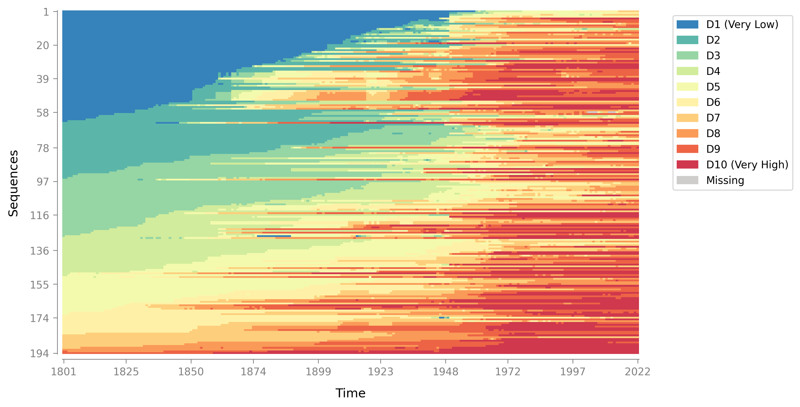
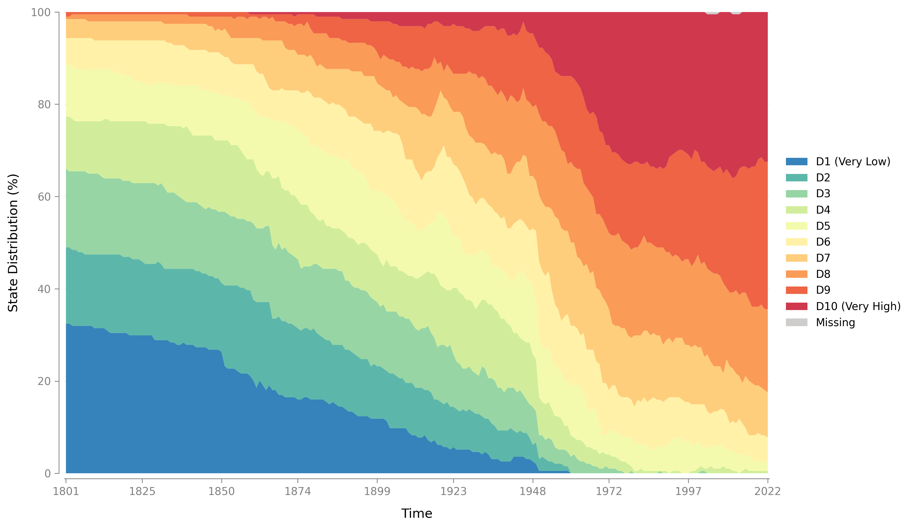
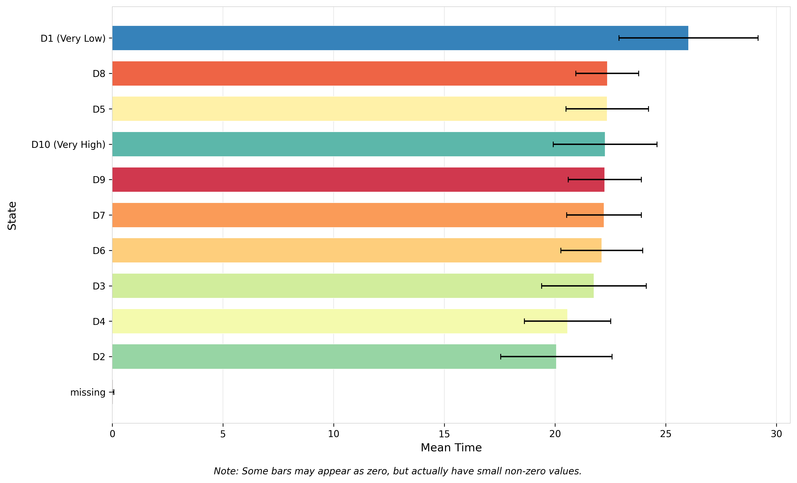
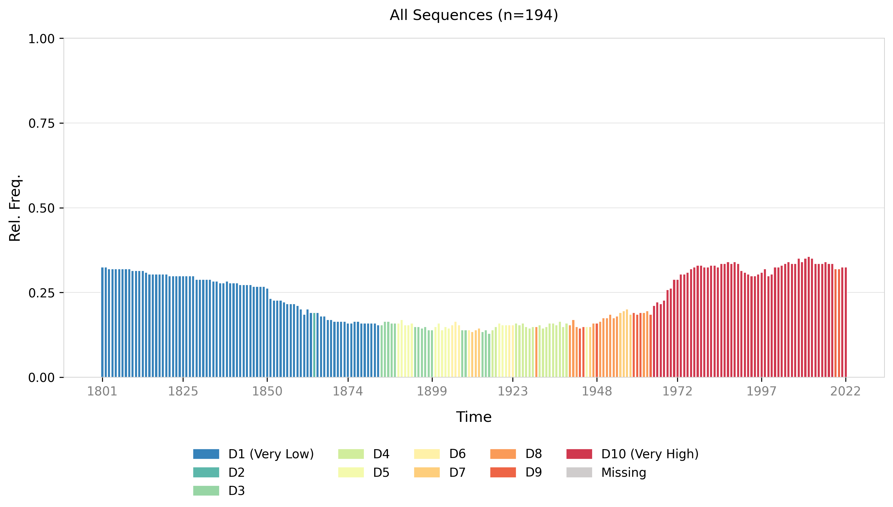
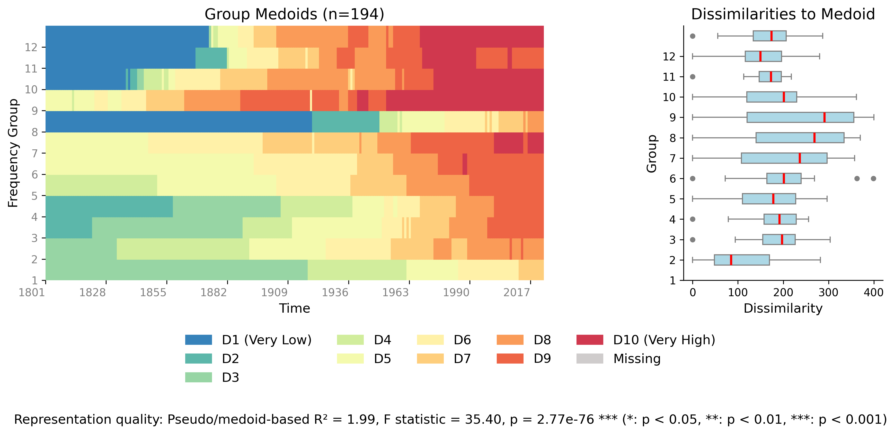
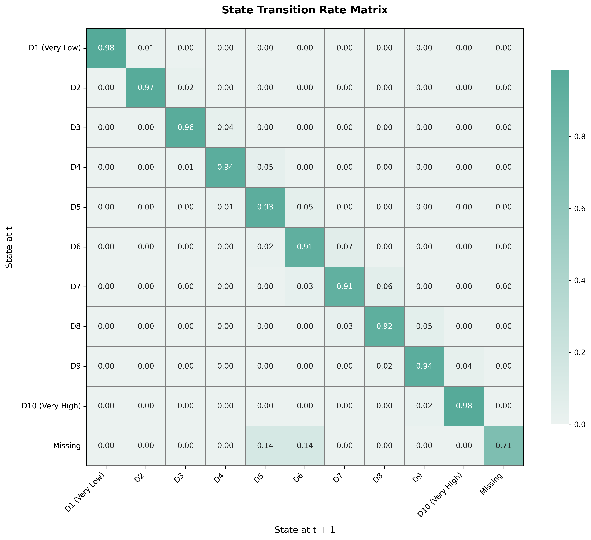

# Visualization Gallery

Welcome to the Sequenzo visualization gallery. This page showcases the various types of plots and visualizations available in Sequenzo, providing a comprehensive overview of the visualization capabilities.

The gallery below displays examples of different visualization types, each designed to reveal different aspects of sequence data. **Click on any image to view it in full size** and explore the details.

## Core Visualizations

  
  

    <h3 class="visualization-card-title">Index Plot</h3>
    

      A "barcode-like" visualization where each row is one sequence and each column is a time point. Reveals when sequences switch states, how stable they are, and how they differ across groups. Supports multiple sorting methods (lexicographic, MDS, distance-based) and flexible grouping options. <a href="./index-plot">Learn more →</a>
    

  

  
  

    <h3 class="visualization-card-title">State Distribution Plot</h3>
    

      Shows how the share of entities in each state changes over time. Each time point displays the percentage of sequences in each state. Supports both stacked area plots and line plots, with flexible grouping for cross-group comparisons. <a href="./state-distribution-plot">Learn more →</a>
    

  

  
  

    <h3 class="visualization-card-title">Mean Time Plot</h3>
    

      A horizontal bar chart showing the average amount of time spent in each state across all sequences. Optionally includes standard error bars to assess uncertainty. States are automatically sorted by mean time for easy interpretation. <a href="./plot_mean_time">Learn more →</a>
    

  

  
  

    <h3 class="visualization-card-title">Modal State Plot</h3>
    

      Shows the most common state (modal state) at each time point, along with its relative frequency (percentage). Highlights dominant patterns across sequences and supports grouping to compare modal trends across different categories. <a href="./plot_modal_state">Learn more →</a>
    

  

  
  

    <h3 class="visualization-card-title">Most Frequent Sequences</h3>
    

      Displays the Top-N most common full sequences in your data. Each horizontal bar represents one sequence pattern across time, with height showing that sequence's percentage in the dataset. Colors automatically match your SequenceData state color map. <a href="./plot_most_frequent_sequences">Learn more →</a>
    

  

  
  

    <h3 class="visualization-card-title">Relative Frequency Plot</h3>
    

      A two-panel figure summarizing sequence "typicality" by frequency groups. Left panel shows the medoid (most central) sequence for each group; right panel shows box plots of dissimilarities to the medoid. Reports pseudo R², F-statistic, and p-value for group separation quality. <a href="./plot_relative_frequency">Learn more →</a>
    

  

  
  

    <h3 class="visualization-card-title">Transition Matrix</h3>
    

      A heatmap showing state-to-state transition rates. Rows represent the state at time t, columns represent the state at time t+1, and cell values show transition probabilities (0-1). The diagonal shows stay-in-the-same-state probabilities. Row-normalized so each row sums to 1.0. <a href="./plot_transition_matrix">Learn more →</a>
    

  

## Customization Examples

  
  

    <h3 class="visualization-card-title">Customized Index Plot</h3>
    

      Sequenzo allows you to customize colors to match your preferences or publication requirements. This example shows an index plot with a custom color palette.
    

  

  
  

    <h3 class="visualization-card-title">Customized Legend</h3>
    

      Customize legend appearance and colors to create publication-ready visualizations that match your style guide or branding requirements.
    

  

### Tips for Using These Visualizations

<table class="tips-table">
<thead>
<tr>
<th style="width: 20%;">Visualization</th>
<th style="width: 80%;">Best Use Cases & Key Features</th>
</tr>
</thead>
<tbody>
<tr>
<td><strong>Index Plot</strong></td>
<td>Best for exploring individual sequence patterns, identifying when sequences switch states, assessing sequence stability, and comparing sequences across groups. Supports multiple sorting methods (lexicographic, MDS, distance-based) to reveal structure. Use sequence selection for large datasets.</td>
</tr>
<tr>
<td><strong>Mean Time Plot</strong></td>
<td>Provides an intuitive "how long in each state?" summary. Shows the average time spent in each state across all sequences with optional standard error bars for uncertainty assessment. Automatically sorts states by mean time for easy interpretation.</td>
</tr>
<tr>
<td><strong>Modal State Plot</strong></td>
<td>Highlights the dominant state at each time point along with its relative frequency. Ideal for identifying prevalent patterns over time. Supports grouping to compare modal trends across different categories (e.g., by gender, region, country type).</td>
</tr>
<tr>
<td><strong>Most Frequent Sequences</strong></td>
<td>Displays the Top-N most common full sequences, showing each as a stacked horizontal bar with percentage labels. Great for discovering typical trajectories and understanding what sequence patterns are most prevalent in your dataset. Similar to TraMineR's seqfplot.</td>
</tr>
<tr>
<td><strong>Relative Frequency Plot</strong></td>
<td>Summarizes sequence "typicality" by frequency groups using a two-panel layout: medoid sequences (left) and dissimilarity distributions (right). Reports statistical measures (pseudo R², F-statistic, p-value) for group separation quality. Requires a distance matrix.</td>
</tr>
<tr>
<td><strong>State Distribution Plot</strong></td>
<td>Shows how the percentage of sequences in each state changes over time. Supports both stacked area plots (showing composition) and line plots (comparing individual state trends). Excellent for understanding overall state composition and comparing distributions across groups.</td>
</tr>
<tr>
<td><strong>Transition Matrix</strong></td>
<td>A heatmap of state-to-state transition probabilities from time t to t+1. Dark cells indicate common transitions; light cells indicate rare transitions. The diagonal shows stay probabilities. Essential for understanding sequence evolution dynamics and transition patterns.</td>
</tr>
</tbody>
</table>

For detailed information about each visualization type and how to use them, please refer to the individual documentation pages for each plot function.
