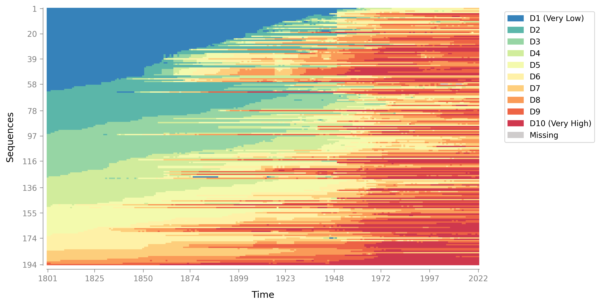
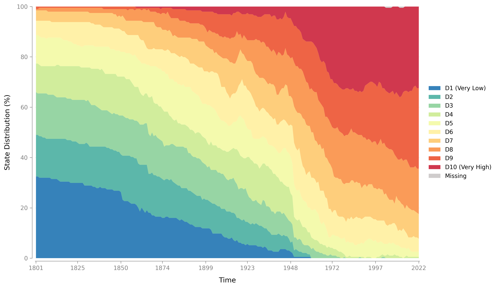
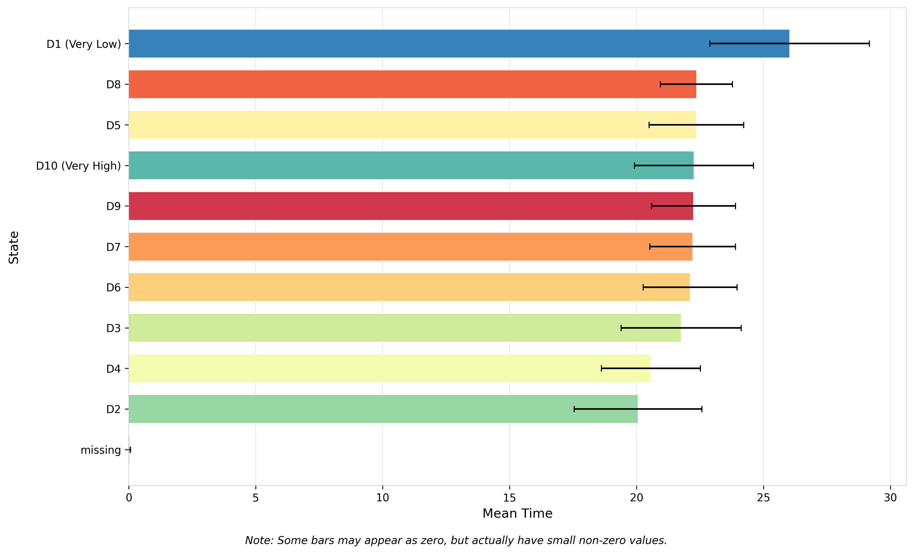
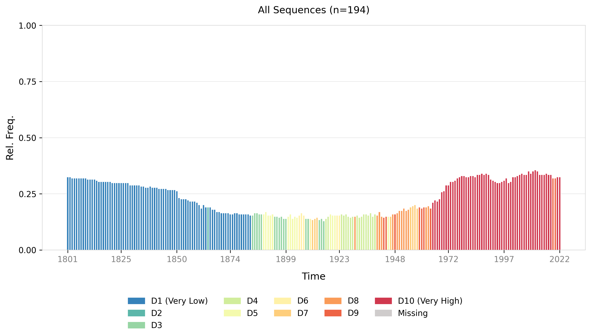
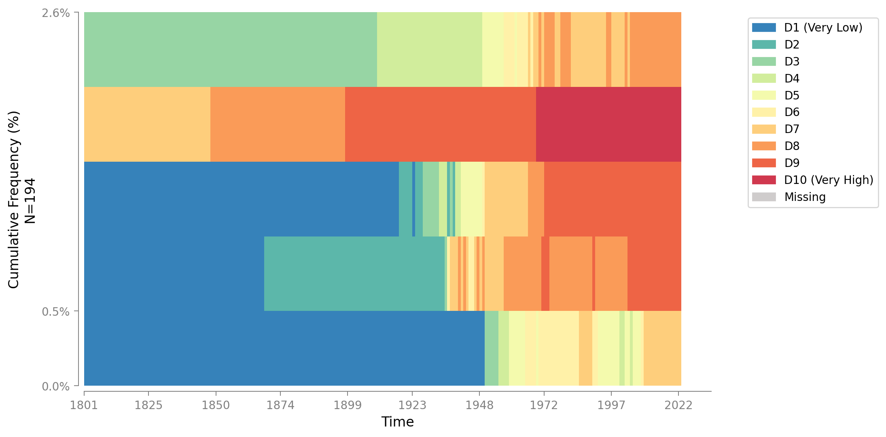
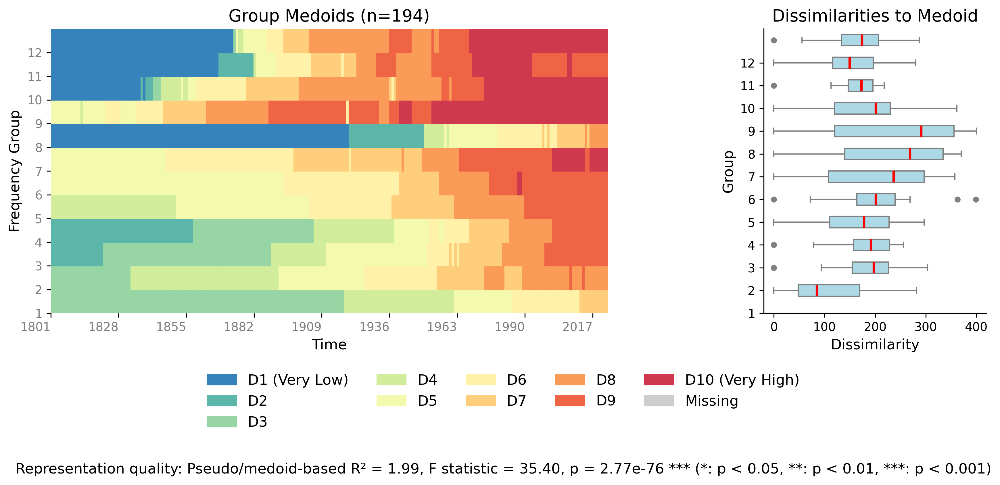
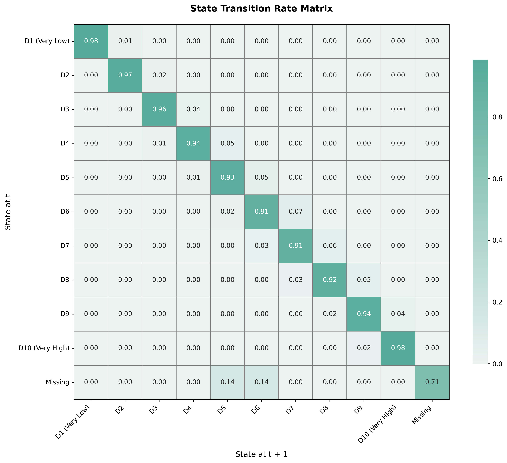
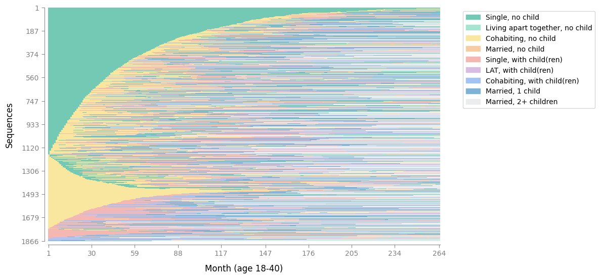
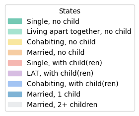

# Visualization Gallery

Browse the main Sequenzo plots and the question each plot helps answer. Click any image to view it in full size.

## Core Visualizations

In the sidebar these plots are grouped into longitudinal views (one element per trajectory) and cross-sectional views (summaries per time point); [How to Read Sequence Plots](/en/tutorials/reading-sequence-plots) explains how to choose between them.

  
  

    <h3 class="visualization-card-title">Index Plot</h3>
    

      Shows one sequence per row across time. Best for inspecting individual trajectories, state changes, and group differences. <a href="./index-plot">Learn more →</a>
    

  

  
  

    <h3 class="visualization-card-title">State Distribution Plot</h3>
    

      Shows how state shares change over time. Use it to compare overall composition or group-level trends. <a href="./state-distribution-plot">Learn more →</a>
    

  

  
  

    <h3 class="visualization-card-title">Mean Time Plot</h3>
    

      Summarizes average time spent in each state. Optional error bars help show uncertainty. <a href="./plot-mean-time">Learn more →</a>
    

  

  
  

    <h3 class="visualization-card-title">Modal State Plot</h3>
    

      Shows the most common state at each time point and how dominant it is. Useful for reading the main trajectory pattern. <a href="./plot-modal-state">Learn more →</a>
    

  

  
  

    <h3 class="visualization-card-title">Most Frequent Sequences</h3>
    

      Displays the most common full trajectories. Use it to see which exact paths appear most often. <a href="./plot-most-frequent-sequences">Learn more →</a>
    

  

  
  

    <h3 class="visualization-card-title">Relative Frequency Plot</h3>
    

      Groups sequences by typicality and shows central patterns plus distance spread. Requires a distance matrix. <a href="./plot-relative-frequency">Learn more →</a>
    

  

  
  

    <h3 class="visualization-card-title">Transition Matrix</h3>
    

      Shows state-to-state transition probabilities. Darker cells mark more common moves, including staying in the same state. <a href="./plot-transition-matrix">Learn more →</a>
    

  

## Customization Examples

  
  

    <h3 class="visualization-card-title">Customized Index Plot</h3>
    

      Example of an index plot using a custom state palette.
    

  

  
  

    <h3 class="visualization-card-title">Customized Legend</h3>
    

      Example of a customized legend for publication-ready plots.
    

  

### Tips for Using These Visualizations

<table class="tips-table">
<thead>
<tr>
<th style="width: 20%;">Visualization</th>
<th style="width: 80%;">Best use</th>
</tr>
</thead>
<tbody>
<tr>
<td><strong>Index Plot</strong></td>
<td>Inspect individual trajectories, switches, and within-group variation. Sort rows when you need structure to emerge.</td>
</tr>
<tr>
<td><strong>Mean Time Plot</strong></td>
<td>Answer "how long in each state?" at a glance. Add error bars when uncertainty matters.</td>
</tr>
<tr>
<td><strong>Modal State Plot</strong></td>
<td>Find the dominant state at each time point. Group it to compare modal patterns across categories.</td>
</tr>
<tr>
<td><strong>Most Frequent Sequences</strong></td>
<td>Identify exact trajectories that appear most often. Helpful before choosing a clustering strategy.</td>
</tr>
<tr>
<td><strong>Relative Frequency Plot</strong></td>
<td>Compare central patterns and distance spread across typicality groups. Requires a distance matrix.</td>
</tr>
<tr>
<td><strong>State Distribution Plot</strong></td>
<td>Read state composition over time. Use grouped versions to compare population-level trends.</td>
</tr>
<tr>
<td><strong>Transition Matrix</strong></td>
<td>Read transition dynamics. The diagonal shows persistence; off-diagonal cells show movement between states.</td>
</tr>
</tbody>
</table>

See each plot page for parameters and examples.
