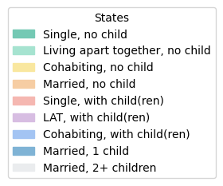
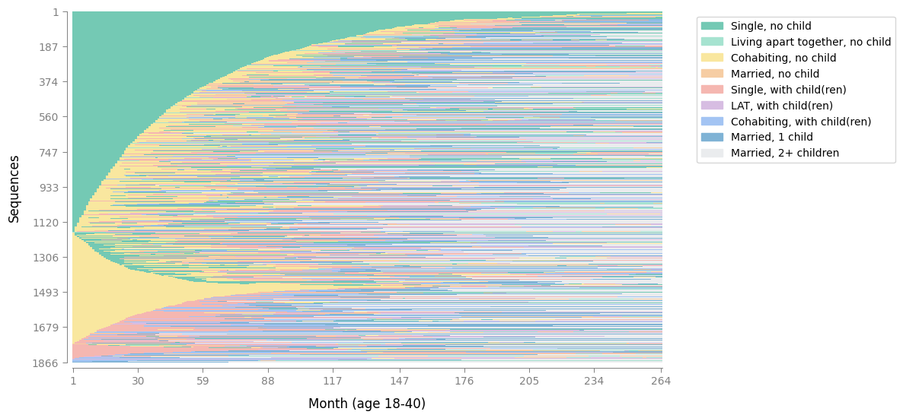

# Recommended color schemes and how to customize them

When working with sequence data, clear and consistent colors are essential: they help readers quickly distinguish states and make comparisons across figures. In Sequenzo, this logic is built directly into the `SequenceData` class. Instead of scattering color choices across different visualization functions, we centralize the control at the very beginning of your workflow.

Concretely, each state is assigned a unique color the moment you create a `SequenceData` object. This means you don’t need to adjust individual plotting functions; once the mapping is set, every figure will automatically inherit it. To customize the scheme, simply define your `states`, their human-readable `labels`, and, if you prefer, a list of `custom_colors`. In this way, `SequenceData` acts as the single source for color handling, ensuring consistency across all analyses.

This design has two advantages:

* It keeps your code clean: you declare your states and their colors only once.
* It guarantees reproducibility: the same state will always appear in the same color across visualizations, no matter which visualization you produce. 

As a result, your sequence plots remain both intuitive and coherent, even in complex projects.

## Default colors

When you don't specify `custom_colors`, Sequenzo automatically assigns colors based on the number of states in your data:

- **≤20 states**: Uses the **Spectral** palette (reversed for better readability)
- **21-40 states**: Uses the **viridis** palette (colorful and perceptually uniform)
- **>40 states**: Uses a **combined palette** (viridis + Set3 + tab20 for maximum variety)

The palette is applied to **all states at once**, not in segments. For example, if you have 30 states, all 30 will use the viridis palette, not the first 20 with Spectral and the remaining 10 with viridis.

**⚠️ Practical recommendation**: We strongly advise against using more than 15 states, as 10 states already make visualizations quite crowded and a little bit difficult to interpret. With too many states, even the best color palettes cannot ensure clear visual distinction between different sequence patterns.

Here's what the default palettes look like, and they (Spectral, viridis, combined) are color-blind friendly:

### Spectral palette (≤20 states, reversed)

<div style="display: flex; gap: 8px; margin: 10px 0; flex-wrap: wrap;">
  <div style="width: 40px; height: 40px; background-color: #9e0142; border: 1px solid #ccc; border-radius: 4px;" title="#9e0142"></div>
  <div style="width: 40px; height: 40px; background-color: #d53e4f; border: 1px solid #ccc; border-radius: 4px;" title="#d53e4f"></div>
  <div style="width: 40px; height: 40px; background-color: #f46d43; border: 1px solid #ccc; border-radius: 4px;" title="#f46d43"></div>
  <div style="width: 40px; height: 40px; background-color: #fdae61; border: 1px solid #ccc; border-radius: 4px;" title="#fdae61"></div>
  <div style="width: 40px; height: 40px; background-color: #fee08b; border: 1px solid #ccc; border-radius: 4px;" title="#fee08b"></div>
  <div style="width: 40px; height: 40px; background-color: #ffffbf; border: 1px solid #ccc; border-radius: 4px;" title="#ffffbf"></div>
  <div style="width: 40px; height: 40px; background-color: #e6f598; border: 1px solid #ccc; border-radius: 4px;" title="#e6f598"></div>
  <div style="width: 40px; height: 40px; background-color: #abdda4; border: 1px solid #ccc; border-radius: 4px;" title="#abdda4"></div>
  <div style="width: 40px; height: 40px; background-color: #66c2a5; border: 1px solid #ccc; border-radius: 4px;" title="#66c2a5"></div>
  <div style="width: 40px; height: 40px; background-color: #3288bd; border: 1px solid #ccc; border-radius: 4px;" title="#3288bd"></div>
  <div style="width: 40px; height: 40px; background-color: #5e4fa2; border: 1px solid #ccc; border-radius: 4px;" title="#5e4fa2"></div>
</div>

### Viridis palette (21-40 states)

<div style="display: flex; gap: 8px; margin: 10px 0; flex-wrap: wrap;">
  <div style="width: 40px; height: 40px; background-color: #440154; border: 1px solid #ccc; border-radius: 4px;" title="#440154"></div>
  <div style="width: 40px; height: 40px; background-color: #482777; border: 1px solid #ccc; border-radius: 4px;" title="#482777"></div>
  <div style="width: 40px; height: 40px; background-color: #3f4a8a; border: 1px solid #ccc; border-radius: 4px;" title="#3f4a8a"></div>
  <div style="width: 40px; height: 40px; background-color: #31678e; border: 1px solid #ccc; border-radius: 4px;" title="#31678e"></div>
  <div style="width: 40px; height: 40px; background-color: #26838f; border: 1px solid #ccc; border-radius: 4px;" title="#26838f"></div>
  <div style="width: 40px; height: 40px; background-color: #1f9d8a; border: 1px solid #ccc; border-radius: 4px;" title="#1f9d8a"></div>
  <div style="width: 40px; height: 40px; background-color: #6cce5a; border: 1px solid #ccc; border-radius: 4px;" title="#6cce5a"></div>
  <div style="width: 40px; height: 40px; background-color: #b6de2b; border: 1px solid #ccc; border-radius: 4px;" title="#b6de2b"></div>
  <div style="width: 40px; height: 40px; background-color: #fee825; border: 1px solid #ccc; border-radius: 4px;" title="#fee825"></div>
  <div style="width: 40px; height: 40px; background-color: #f0f921; border: 1px solid #ccc; border-radius: 4px;" title="#f0f921"></div>
  <div style="width: 40px; height: 40px; background-color: #f7f7f7; border: 1px solid #ccc; border-radius: 4px;" title="#f7f7f7"></div>
</div>

### Combined palette (>40 states)

<div style="display: flex; gap: 8px; margin: 10px 0; flex-wrap: wrap;">
  <div style="width: 40px; height: 40px; background-color: #440154; border: 1px solid #ccc; border-radius: 4px;" title="#440154 (viridis)"></div>
  <div style="width: 40px; height: 40px; background-color: #31678e; border: 1px solid #ccc; border-radius: 4px;" title="#31678e (viridis)"></div>
  <div style="width: 40px; height: 40px; background-color: #1f9d8a; border: 1px solid #ccc; border-radius: 4px;" title="#1f9d8a (viridis)"></div>
  <div style="width: 40px; height: 40px; background-color: #6cce5a; border: 1px solid #ccc; border-radius: 4px;" title="#6cce5a (viridis)"></div>
  <div style="width: 40px; height: 40px; background-color: #fee825; border: 1px solid #ccc; border-radius: 4px;" title="#fee825 (viridis)"></div>
  <div style="width: 40px; height: 40px; background-color: #8dd3c7; border: 1px solid #ccc; border-radius: 4px;" title="#8dd3c7 (Set3)"></div>
  <div style="width: 40px; height: 40px; background-color: #ffffb3; border: 1px solid #ccc; border-radius: 4px;" title="#ffffb3 (Set3)"></div>
  <div style="width: 40px; height: 40px; background-color: #bebada; border: 1px solid #ccc; border-radius: 4px;" title="#bebada (Set3)"></div>
  <div style="width: 40px; height: 40px; background-color: #fb8072; border: 1px solid #ccc; border-radius: 4px;" title="#fb8072 (Set3)"></div>
  <div style="width: 40px; height: 40px; background-color: #80b1d3; border: 1px solid #ccc; border-radius: 4px;" title="#80b1d3 (Set3)"></div>
  <div style="width: 40px; height: 40px; background-color: #fdb462; border: 1px solid #ccc; border-radius: 4px;" title="#fdb462 (Set3)"></div>
  <div style="width: 40px; height: 40px; background-color: #b3de69; border: 1px solid #ccc; border-radius: 4px;" title="#b3de69 (Set3)"></div>
  <div style="width: 40px; height: 40px; background-color: #fccde5; border: 1px solid #ccc; border-radius: 4px;" title="#fccde5 (Set3)"></div>
  <div style="width: 40px; height: 40px; background-color: #d9d9d9; border: 1px solid #ccc; border-radius: 4px;" title="#d9d9d9 (Set3)"></div>
  <div style="width: 40px; height: 40px; background-color: #bc80bd; border: 1px solid #ccc; border-radius: 4px;" title="#bc80bd (Set3)"></div>
  <div style="width: 40px; height: 40px; background-color: #ccebc5; border: 1px solid #ccc; border-radius: 4px;" title="#ccebc5 (Set3)"></div>
  <div style="width: 40px; height: 40px; background-color: #ffed6f; border: 1px solid #ccc; border-radius: 4px;" title="#ffed6f (Set3)"></div>
  <div style="width: 40px; height: 40px; background-color: #1f77b4; border: 1px solid #ccc; border-radius: 4px;" title="#1f77b4 (tab20)"></div>
  <div style="width: 40px; height: 40px; background-color: #ff7f0e; border: 1px solid #ccc; border-radius: 4px;" title="#ff7f0e (tab20)"></div>
  <div style="width: 40px; height: 40px; background-color: #2ca02c; border: 1px solid #ccc; border-radius: 4px;" title="#2ca02c (tab20)"></div>
  <div style="width: 40px; height: 40px; background-color: #d62728; border: 1px solid #ccc; border-radius: 4px;" title="#d62728 (tab20)"></div>
  <div style="width: 40px; height: 40px; background-color: #9467bd; border: 1px solid #ccc; border-radius: 4px;" title="#9467bd (tab20)"></div>
  <div style="width: 40px; height: 40px; background-color: #8c564b; border: 1px solid #ccc; border-radius: 4px;" title="#8c564b (tab20)"></div>
  <div style="width: 40px; height: 40px; background-color: #e377c2; border: 1px solid #ccc; border-radius: 4px;" title="#e377c2 (tab20)"></div>
  <div style="width: 40px; height: 40px; background-color: #7f7f7f; border: 1px solid #ccc; border-radius: 4px;" title="#7f7f7f (tab20)"></div>
  <div style="width: 40px; height: 40px; background-color: #bcbd22; border: 1px solid #ccc; border-radius: 4px;" title="#bcbd22 (tab20)"></div>
  <div style="width: 40px; height: 40px; background-color: #17becf; border: 1px solid #ccc; border-radius: 4px;" title="#17becf (tab20)"></div>
</div>

### Missing values

Missing values always get a fixed light gray color automatically:

<div style="display: flex; gap: 8px; margin: 10px 0; flex-wrap: wrap;">
  <div style="width: 40px; height: 40px; background-color: #cfcccc; border: 1px solid #ccc; border-radius: 4px;" title="#cfcccc"></div>
</div>

Generally speaking, you can define states without explicitly considering "Missing" when creating the `SequenceData()` object. 

This is because if missing cells are detected, Sequenzo's `SequenceData()` will append a Missing state and add gray. For instance, your default colors or `custom_colors` have length 9 for non-missing states, then `SequenceData()` will append gray for Missing automatically.

If you would like to customize the color for the state "Missing", please refer to [this section of the tutorial](#how-to-include-a-custom-missing-color).

## A minimal, working example with custom colors

We use the built-in [pairfam-family dataset](../datasets/pairfam-family.md) with a gentle and fresh palette.

```python

# Import necessary libraries
# Your calling code (e.g., in a script or notebook)

from sequenzo import * # Import the package, give it a short alias
import pandas as pd # Data manipulation

df = load_dataset("pairfam_family")

# 1) Define time and states (order matters!)
time_list = [f"{i}" for i in range(1, 265)]  # 264 months
states = list(range(1, 10))                  # 1..9

# 2) Human-readable labels (strings)
labels = [
    "Single, no child",
    "LAT, no child",
    "Cohabiting, no child",
    "Married, no child",
    "Single, with child(ren)",
    "LAT, with child(ren)",
    "Cohabiting, with child(ren)",
    "Married, 1 child",
    "Married, 2+ children"
]

# 3) A fresh palette (9 colors, same order as 'states')
colors_list = [
    "#74C9B4",  # fresh green
    "#A6E3D0",  # water mint
    "#F9E79F",  # pale apricot
    "#F6CDA3",  # warm light orange
    "#F5B7B1",  # soft rose
    "#D7BDE2",  # light lavender
    "#A3C4F3",  # porcelain blue
    "#7FB3D5",  # lake blue
    "#EAECEE"   # cloud white
]

sequence_data = SequenceData(
    df,
    time=time_list,
    id_col="id",
    states=states,
    labels=labels,
    # If your data do not contain weight, then no need to include the following parameter
    weights=df["weight40"].values, 
    custom_colors=colors_list
)

# Optional: preview the legend that uses these colors
sequence_data.plot_legend()
```

Output:

```python
[>] SequenceData initialized successfully! Here's a summary:
[>] Number of sequences: 1866
[>] Number of time points: 264
[>] Min/Max sequence length: 264 / 264
[>] States: [1, 2, 3, 4, 5, 6, 7, 8, 9]
[>] Labels: ['Single, no child', 'Living apart together, no child', 'Cohabiting, no child', 'Married, no child', 'Single, with child(ren)', 'LAT, with child(ren)', 'Cohabiting, with child(ren)', 'Married, 1 child', 'Married, 2+ children']
[>] Weights: Provided (total weight=2346.268, mean=1.257, std=1.046)
```



With the colors defined in `SequenceData`, you can go ahead and generate your visualizations and your plots will now appear with the customized palette you chose:

```python
plot_sequence_index(sequence_data, 
                    xlabel="Month (age 18-40)")
```



## Ready-to-use palettes

Below are curated palettes you can copy directly into `custom_colors`. The little squares show the actual colors. The custom palettes below are designed to be soft and visually appealing for general use.

In the examples we provide nine colors, because our demo dataset has nine states, which is already quite a lot. Your own dataset may have fewer or more states, and that’s perfectly fine. If you have fewer states, simply pick a subset of the palette and test how it looks in your visualizations (e.g., by calling `plot_sequence_index(sequence_data)`). 

If you have more states, you can extend the palette in two ways:

1. Use a color picker tool (e.g., [htmlcolorcodes.com](https://htmlcolorcodes.com/)) to select additional shades from an image you like.

2. Ask an AI to generate complementary colors that harmonize with the ones you already chose.

In practice, defining the palette that you like is often an iterative process: try a set of colors, visualize your sequences, and adjust until the result feels both clear and aesthetically consistent.

A note on format: all colors are specified in **hexadecimal (hex) codes**, e.g. `#74C9B4`. A hex code is a six-digit representation of red, green, and blue values (RGB) in base-16. It’s the standard way of writing colors on the web and in plotting libraries such as `Matplotlib`, making it easy to copy and reuse across different tools.

**Fresh Spring (9 colors, gentle and fresh)**

<div style="display: flex; gap: 8px; margin: 10px 0; flex-wrap: wrap;">
  <div style="width: 40px; height: 40px; background-color: #74C9B4; border: 1px solid #ccc; border-radius: 4px;" title="#74C9B4"></div>
  <div style="width: 40px; height: 40px; background-color: #A6E3D0; border: 1px solid #ccc; border-radius: 4px;" title="#A6E3D0"></div>
  <div style="width: 40px; height: 40px; background-color: #F9E79F; border: 1px solid #ccc; border-radius: 4px;" title="#F9E79F"></div>
  <div style="width: 40px; height: 40px; background-color: #F6CDA3; border: 1px solid #ccc; border-radius: 4px;" title="#F6CDA3"></div>
  <div style="width: 40px; height: 40px; background-color: #F5B7B1; border: 1px solid #ccc; border-radius: 4px;" title="#F5B7B1"></div>
  <div style="width: 40px; height: 40px; background-color: #D7BDE2; border: 1px solid #ccc; border-radius: 4px;" title="#D7BDE2"></div>
  <div style="width: 40px; height: 40px; background-color: #A3C4F3; border: 1px solid #ccc; border-radius: 4px;" title="#A3C4F3"></div>
  <div style="width: 40px; height: 40px; background-color: #7FB3D5; border: 1px solid #ccc; border-radius: 4px;" title="#7FB3D5"></div>
  <div style="width: 40px; height: 40px; background-color: #EAECEE; border: 1px solid #ccc; border-radius: 4px;" title="#EAECEE"></div>
</div>

Hex list:
```python
["#74C9B4","#A6E3D0","#F9E79F","#F6CDA3","#F5B7B1","#D7BDE2","#A3C4F3","#7FB3D5","#EAECEE"]
```

**Ink-and-Wash Pastel (9 colors, airy pastels like Chinese traditional painting)**

<div style="display: flex; gap: 8px; margin: 10px 0; flex-wrap: wrap;">
  <div style="width: 40px; height: 40px; background-color: #A3C9A8; border: 1px solid #ccc; border-radius: 4px;" title="#A3C9A8"></div>
  <div style="width: 40px; height: 40px; background-color: #CFE8CF; border: 1px solid #ccc; border-radius: 4px;" title="#CFE8CF"></div>
  <div style="width: 40px; height: 40px; background-color: #F2E6C2; border: 1px solid #ccc; border-radius: 4px;" title="#F2E6C2"></div>
  <div style="width: 40px; height: 40px; background-color: #F6D5C3; border: 1px solid #ccc; border-radius: 4px;" title="#F6D5C3"></div>
  <div style="width: 40px; height: 40px; background-color: #E8B4B8; border: 1px solid #ccc; border-radius: 4px;" title="#E8B4B8"></div>
  <div style="width: 40px; height: 40px; background-color: #D8C7E8; border: 1px solid #ccc; border-radius: 4px;" title="#D8C7E8"></div>
  <div style="width: 40px; height: 40px; background-color: #BBD3F2; border: 1px solid #ccc; border-radius: 4px;" title="#BBD3F2"></div>
  <div style="width: 40px; height: 40px; background-color: #9EC5E6; border: 1px solid #ccc; border-radius: 4px;" title="#9EC5E6"></div>
  <div style="width: 40px; height: 40px; background-color: #EDEDED; border: 1px solid #ccc; border-radius: 4px;" title="#EDEDED"></div>
</div>

Hex list:
```python
["#A3C9A8","#CFE8CF","#F2E6C2","#F6D5C3","#E8B4B8","#D8C7E8","#BBD3F2","#9EC5E6","#EDEDED"]
```

**Mint Lavender (9 colors, fresh mint and soft lavender tones)**

<div style="display: flex; gap: 8px; margin: 10px 0; flex-wrap: wrap;">
  <div style="width: 40px; height: 40px; background-color: #A8E6CF; border: 1px solid #ccc; border-radius: 4px;" title="#A8E6CF"></div>
  <div style="width: 40px; height: 40px; background-color: #B8F2E6; border: 1px solid #ccc; border-radius: 4px;" title="#B8F2E6"></div>
  <div style="width: 40px; height: 40px; background-color: #C7F0DB; border: 1px solid #ccc; border-radius: 4px;" title="#C7F0DB"></div>
  <div style="width: 40px; height: 40px; background-color: #D6F0E8; border: 1px solid #ccc; border-radius: 4px;" title="#D6F0E8"></div>
  <div style="width: 40px; height: 40px; background-color: #E5F0F0; border: 1px solid #ccc; border-radius: 4px;" title="#E5F0F0"></div>
  <div style="width: 40px; height: 40px; background-color: #F0E5F0; border: 1px solid #ccc; border-radius: 4px;" title="#F0E5F0"></div>
  <div style="width: 40px; height: 40px; background-color: #E8D6F0; border: 1px solid #ccc; border-radius: 4px;" title="#E8D6F0"></div>
  <div style="width: 40px; height: 40px; background-color: #D6C7F0; border: 1px solid #ccc; border-radius: 4px;" title="#D6C7F0"></div>
  <div style="width: 40px; height: 40px; background-color: #C7B8F0; border: 1px solid #ccc; border-radius: 4px;" title="#C7B8F0"></div>
</div>

Hex list:
```python
["#A8E6CF","#B8F2E6","#C7F0DB","#D6F0E8","#E5F0F0","#F0E5F0","#E8D6F0","#D6C7F0","#C7B8F0"]
```

### Sequential (ordinal) single-hue ramp (9 colors, for ordered states)

Pick one ramp and use it when your states are naturally ordered (e.g., low→high). These are monotone-lightness, print-friendly. If you prefer other colors, try [this webpage](https://htmlcolorcodes.com/color-wheel/).

**Blue ramp**

<div style="display: flex; gap: 8px; margin: 10px 0; flex-wrap: wrap;">
  <div style="width: 40px; height: 40px; background-color: #EAF2FB; border: 1px solid #ccc; border-radius: 4px;" title="#EAF2FB"></div>
  <div style="width: 40px; height: 40px; background-color: #D3E4F7; border: 1px solid #ccc; border-radius: 4px;" title="#D3E4F7"></div>
  <div style="width: 40px; height: 40px; background-color: #BDD6F2; border: 1px solid #ccc; border-radius: 4px;" title="#BDD6F2"></div>
  <div style="width: 40px; height: 40px; background-color: #A6C7EE; border: 1px solid #ccc; border-radius: 4px;" title="#A6C7EE"></div>
  <div style="width: 40px; height: 40px; background-color: #90B9E9; border: 1px solid #ccc; border-radius: 4px;" title="#90B9E9"></div>
  <div style="width: 40px; height: 40px; background-color: #79AAE5; border: 1px solid #ccc; border-radius: 4px;" title="#79AAE5"></div>
  <div style="width: 40px; height: 40px; background-color: #639CE0; border: 1px solid #ccc; border-radius: 4px;" title="#639CE0"></div>
  <div style="width: 40px; height: 40px; background-color: #4C8EDC; border: 1px solid #ccc; border-radius: 4px;" title="#4C8EDC"></div>
  <div style="width: 40px; height: 40px; background-color: #3680D7; border: 1px solid #ccc; border-radius: 4px;" title="#3680D7"></div>
</div>

Hex list:
```python
["#EAF2FB","#D3E4F7","#BDD6F2","#A6C7EE","#90B9E9","#79AAE5","#639CE0","#4C8EDC","#3680D7"]
```

**Teal ramp**

<div style="display: flex; gap: 8px; margin: 10px 0; flex-wrap: wrap;">
  <div style="width: 40px; height: 40px; background-color: #EAF6F3; border: 1px solid #ccc; border-radius: 4px;" title="#EAF6F3"></div>
  <div style="width: 40px; height: 40px; background-color: #D1EEE7; border: 1px solid #ccc; border-radius: 4px;" title="#D1EEE7"></div>
  <div style="width: 40px; height: 40px; background-color: #B9E6DC; border: 1px solid #ccc; border-radius: 4px;" title="#B9E6DC"></div>
  <div style="width: 40px; height: 40px; background-color: #A1DED0; border: 1px solid #ccc; border-radius: 4px;" title="#A1DED0"></div>
  <div style="width: 40px; height: 40px; background-color: #89D6C5; border: 1px solid #ccc; border-radius: 4px;" title="#89D6C5"></div>
  <div style="width: 40px; height: 40px; background-color: #71CEB9; border: 1px solid #ccc; border-radius: 4px;" title="#71CEB9"></div>
  <div style="width: 40px; height: 40px; background-color: #59C6AE; border: 1px solid #ccc; border-radius: 4px;" title="#59C6AE"></div>
  <div style="width: 40px; height: 40px; background-color: #41BEA2; border: 1px solid #ccc; border-radius: 4px;" title="#41BEA2"></div>
  <div style="width: 40px; height: 40px; background-color: #29B697; border: 1px solid #ccc; border-radius: 4px;" title="#29B697"></div>
</div>

Hex list:
```python
["#EAF6F3","#D1EEE7","#B9E6DC","#A1DED0","#89D6C5","#71CEB9","#59C6AE","#41BEA2","#29B697"]
```

## Want to be more creative? 

If you’d like to go beyond the built-in palettes, you can 

* refer to collections of color combinations via [colorhunt.co](https://colorhunt.co/)
* or pick your own custom colors directly from an image. A simple tool like [imagecolorpicker.com](https://imagecolorpicker.com/) lets you upload any picture (say a painting, a photo, or even your project’s logo) and extract the exact hex codes you want.

## How to include a custom Missing color

If you prefer another color for the Missing state (e.g., slightly darker than the default one), then you need to explicitly add Missing into both `states` and `labels` parameters in the following way: 

```python
# The following line of code is for your reference:
colors_no_missing = ["#74C9B4","#A6E3D0","#F9E79F","#F6CDA3","#F5B7B1",
                     "#D7BDE2","#A3C4F3","#7FB3D5","#EAECEE"]

# If you would like to include a custom Missing color explicitly
colors_with_missing = colors_no_missing + ["#C4C4C4"]   # custom Missing

sequence_data = SequenceData(
    df, time=time_list, id_col="id",
    states=states + ["Missing"],             
    labels=labels + ["Missing"],
    custom_colors=colors_with_missing
)
```

## Troubleshooting Q&A

You might encounter the following error messages:

**“The following provided 'states' are not found in the data…”**

Double-check that each state value actually appears in df[time] (exact equality). If you use strings, audit whitespace and capitalization.

**“Length of custom_colors must match number of states.”**

Count the states after Missing handling. If Missing is auto-added, either pass a palette with len = non-missing states (Sequenzo appends gray) or pass the full length including a color for Missing.

**“My labels are numbers, is that OK?”**

Please pass labels as strings (e.g., "Low", "High"). The validator will warn you otherwise.

---
*Author: Yuqi Liang*