# 快速入门指南

恭喜您成功安装了Sequenzo！ 🎉 现在就可以开始玩转社会序列分析啦。

这个指南会手把手教你分析国家级CO₂排放序列。想了解我们是怎么把原始数据处理成适合做序列分析的格式？详细过程看这里（TODO：SequenzoWebsite网页）。

python新手？没关系！Sequenzo专门为小白设计，界面直观好上手，不管你是编程萌新还是Python老司机，都能快速掌握。

这个教程结束后，你将掌握：

1. 安装Sequenzo
2. 导入和对数据进行初步探索
3. 分析社会序列
4. 结果可视化

好了，开始我们的数据分析之旅吧！🐍✨

## 1. 初步了解数据


```python
# 导入必要的库
# 你的调用代码（比如在脚本或notebook中）

from sequenzo import * # 导入包，给它一个简短的别名
import pandas as pd # 数据处理

# 列出Sequenzo中所有可用的数据集
# 现在用别名来调用函数：
print('Sequenzo中的可用数据集: ', list_datasets())

# 加载我们在本教程中要探索的数据
# `df`是`dataframe`的缩写，这是数据集的常用变量名
# df = load_dataset('country_co2_emissions')
df = load_dataset('country_co2_emissions_global_deciles')

# 显示数据框
df
```

    Sequenzo中的可用数据集:  ['biofam', 'biofam_child_domain', 'biofam_left_domain', 'biofam_married_domain', 'chinese_colonial_territories', 'country_co2_emissions', 'country_co2_emissions_global_deciles', 'country_co2_emissions_global_quintiles', 'country_co2_emissions_local_deciles', 'country_co2_emissions_local_quintiles', 'country_gdp_per_capita', 'polyadic_samplec1', 'polyadic_samplep1', 'polyadic_seqc1', 'polyadic_seqp1']
    


<div>
<style scoped>
    .dataframe tbody tr th:only-of-type {
        vertical-align: middle;
    }

    .dataframe tbody tr th {
        vertical-align: top;
    }

    .dataframe thead th {
        text-align: right;
    }
</style>
<table border="1" class="dataframe">
  <thead>
    <tr style="text-align: right;">
      <th></th>
      <th>country</th>
      <th>1800</th>
      <th>1801</th>
      <th>1802</th>
      <th>1803</th>
      <th>1804</th>
      <th>1805</th>
      <th>1806</th>
      <th>1807</th>
      <th>1808</th>
      <th>...</th>
      <th>2013</th>
      <th>2014</th>
      <th>2015</th>
      <th>2016</th>
      <th>2017</th>
      <th>2018</th>
      <th>2019</th>
      <th>2020</th>
      <th>2021</th>
      <th>2022</th>
    </tr>
  </thead>
  <tbody>
    <tr>
      <th>0</th>
      <td>Afghanistan</td>
      <td>D1 (Very Low)</td>
      <td>D1 (Very Low)</td>
      <td>D1 (Very Low)</td>
      <td>D1 (Very Low)</td>
      <td>D1 (Very Low)</td>
      <td>D1 (Very Low)</td>
      <td>D1 (Very Low)</td>
      <td>D1 (Very Low)</td>
      <td>D1 (Very Low)</td>
      <td>...</td>
      <td>D7</td>
      <td>D7</td>
      <td>D7</td>
      <td>D7</td>
      <td>D7</td>
      <td>D7</td>
      <td>D7</td>
      <td>D7</td>
      <td>D7</td>
      <td>D7</td>
    </tr>
    <tr>
      <th>1</th>
      <td>Albania</td>
      <td>D1 (Very Low)</td>
      <td>D1 (Very Low)</td>
      <td>D1 (Very Low)</td>
      <td>D1 (Very Low)</td>
      <td>D1 (Very Low)</td>
      <td>D1 (Very Low)</td>
      <td>D1 (Very Low)</td>
      <td>D1 (Very Low)</td>
      <td>D1 (Very Low)</td>
      <td>...</td>
      <td>D9</td>
      <td>D9</td>
      <td>D9</td>
      <td>D9</td>
      <td>D9</td>
      <td>D9</td>
      <td>D9</td>
      <td>D9</td>
      <td>D9</td>
      <td>D9</td>
    </tr>
    <tr>
      <th>2</th>
      <td>Algeria</td>
      <td>D1 (Very Low)</td>
      <td>D1 (Very Low)</td>
      <td>D1 (Very Low)</td>
      <td>D1 (Very Low)</td>
      <td>D1 (Very Low)</td>
      <td>D1 (Very Low)</td>
      <td>D1 (Very Low)</td>
      <td>D1 (Very Low)</td>
      <td>D1 (Very Low)</td>
      <td>...</td>
      <td>D9</td>
      <td>D9</td>
      <td>D9</td>
      <td>D9</td>
      <td>D9</td>
      <td>D9</td>
      <td>D9</td>
      <td>D9</td>
      <td>D9</td>
      <td>D9</td>
    </tr>
    <tr>
      <th>3</th>
      <td>Andorra</td>
      <td>D7</td>
      <td>D7</td>
      <td>D7</td>
      <td>D7</td>
      <td>D7</td>
      <td>D7</td>
      <td>D7</td>
      <td>D7</td>
      <td>D7</td>
      <td>...</td>
      <td>D10 (Very High)</td>
      <td>D10 (Very High)</td>
      <td>D10 (Very High)</td>
      <td>D10 (Very High)</td>
      <td>D10 (Very High)</td>
      <td>D10 (Very High)</td>
      <td>D10 (Very High)</td>
      <td>D10 (Very High)</td>
      <td>D10 (Very High)</td>
      <td>D10 (Very High)</td>
    </tr>
    <tr>
      <th>4</th>
      <td>Angola</td>
      <td>D3</td>
      <td>D3</td>
      <td>D3</td>
      <td>D3</td>
      <td>D3</td>
      <td>D3</td>
      <td>D3</td>
      <td>D3</td>
      <td>D3</td>
      <td>...</td>
      <td>D8</td>
      <td>D8</td>
      <td>D8</td>
      <td>D8</td>
      <td>D8</td>
      <td>D8</td>
      <td>D8</td>
      <td>D8</td>
      <td>D8</td>
      <td>D8</td>
    </tr>
    <tr>
      <th>...</th>
      <td>...</td>
      <td>...</td>
      <td>...</td>
      <td>...</td>
      <td>...</td>
      <td>...</td>
      <td>...</td>
      <td>...</td>
      <td>...</td>
      <td>...</td>
      <td>...</td>
      <td>...</td>
      <td>...</td>
      <td>...</td>
      <td>...</td>
      <td>...</td>
      <td>...</td>
      <td>...</td>
      <td>...</td>
      <td>...</td>
      <td>...</td>
    </tr>
    <tr>
      <th>189</th>
      <td>Venezuela</td>
      <td>D1 (Very Low)</td>
      <td>D1 (Very Low)</td>
      <td>D1 (Very Low)</td>
      <td>D1 (Very Low)</td>
      <td>D1 (Very Low)</td>
      <td>D1 (Very Low)</td>
      <td>D1 (Very Low)</td>
      <td>D1 (Very Low)</td>
      <td>D1 (Very Low)</td>
      <td>...</td>
      <td>D9</td>
      <td>D9</td>
      <td>D9</td>
      <td>D9</td>
      <td>D9</td>
      <td>D8</td>
      <td>D6</td>
      <td>D8</td>
      <td>D8</td>
      <td>D8</td>
    </tr>
    <tr>
      <th>190</th>
      <td>Vietnam</td>
      <td>D3</td>
      <td>D3</td>
      <td>D3</td>
      <td>D3</td>
      <td>D3</td>
      <td>D3</td>
      <td>D3</td>
      <td>D3</td>
      <td>D3</td>
      <td>...</td>
      <td>D8</td>
      <td>D8</td>
      <td>D8</td>
      <td>D8</td>
      <td>D8</td>
      <td>D9</td>
      <td>D9</td>
      <td>D9</td>
      <td>D9</td>
      <td>D9</td>
    </tr>
    <tr>
      <th>191</th>
      <td>Yemen</td>
      <td>D1 (Very Low)</td>
      <td>D1 (Very Low)</td>
      <td>D1 (Very Low)</td>
      <td>D1 (Very Low)</td>
      <td>D1 (Very Low)</td>
      <td>D1 (Very Low)</td>
      <td>D1 (Very Low)</td>
      <td>D1 (Very Low)</td>
      <td>D1 (Very Low)</td>
      <td>...</td>
      <td>D8</td>
      <td>D8</td>
      <td>D7</td>
      <td>D7</td>
      <td>D7</td>
      <td>D7</td>
      <td>D7</td>
      <td>D7</td>
      <td>D7</td>
      <td>D7</td>
    </tr>
    <tr>
      <th>192</th>
      <td>Zambia</td>
      <td>D7</td>
      <td>D7</td>
      <td>D7</td>
      <td>D7</td>
      <td>D7</td>
      <td>D7</td>
      <td>D7</td>
      <td>D7</td>
      <td>D7</td>
      <td>...</td>
      <td>D7</td>
      <td>D7</td>
      <td>D7</td>
      <td>D7</td>
      <td>D7</td>
      <td>D7</td>
      <td>D7</td>
      <td>D7</td>
      <td>D7</td>
      <td>D7</td>
    </tr>
    <tr>
      <th>193</th>
      <td>Zimbabwe</td>
      <td>D5</td>
      <td>D5</td>
      <td>D5</td>
      <td>D5</td>
      <td>D5</td>
      <td>D5</td>
      <td>D5</td>
      <td>D5</td>
      <td>D5</td>
      <td>...</td>
      <td>D8</td>
      <td>D8</td>
      <td>D8</td>
      <td>D8</td>
      <td>D8</td>
      <td>D8</td>
      <td>D8</td>
      <td>D8</td>
      <td>D8</td>
      <td>D8</td>
    </tr>
  </tbody>
</table>
<p>194 rows × 224 columns</p>
</div>


这个分类基于所有年份的人均CO₂排放值：

* 极低（后20%）
* 低（20-40%）
* 中等（40-60%）
* 高（60-80%）
* 极高（前20%）

用社会序列分析的术语来说，每个类别叫做一个状态，状态的序列叫做社会序列。总的来说，这个数据集展示了每个国家每年的人均CO₂排放水平。

以安道尔为例：


```python
# 筛选安道尔的数据
andorra_df = df[df['country'] == 'Andorra']

# 显示安道尔的数据框
andorra_df
```


<div>
<style scoped>
    .dataframe tbody tr th:only-of-type {
        vertical-align: middle;
    }

    .dataframe tbody tr th {
        vertical-align: top;
    }

    .dataframe thead th {
        text-align: right;
    }
</style>
<table border="1" class="dataframe">
  <thead>
    <tr style="text-align: right;">
      <th></th>
      <th>country</th>
      <th>1800</th>
      <th>1801</th>
      <th>1802</th>
      <th>1803</th>
      <th>1804</th>
      <th>1805</th>
      <th>1806</th>
      <th>1807</th>
      <th>1808</th>
      <th>...</th>
      <th>2013</th>
      <th>2014</th>
      <th>2015</th>
      <th>2016</th>
      <th>2017</th>
      <th>2018</th>
      <th>2019</th>
      <th>2020</th>
      <th>2021</th>
      <th>2022</th>
    </tr>
  </thead>
  <tbody>
    <tr>
      <th>3</th>
      <td>Andorra</td>
      <td>D7</td>
      <td>D7</td>
      <td>D7</td>
      <td>D7</td>
      <td>D7</td>
      <td>D7</td>
      <td>D7</td>
      <td>D7</td>
      <td>D7</td>
      <td>...</td>
      <td>D10 (Very High)</td>
      <td>D10 (Very High)</td>
      <td>D10 (Very High)</td>
      <td>D10 (Very High)</td>
      <td>D10 (Very High)</td>
      <td>D10 (Very High)</td>
      <td>D10 (Very High)</td>
      <td>D10 (Very High)</td>
      <td>D10 (Very High)</td>
      <td>D10 (Very High)</td>
    </tr>
  </tbody>
</table>
<p>1 rows × 224 columns</p>
</div>


根据结果（原数据集的一个子集），我们可以看到安道尔的人均CO₂排放在这些年里经历了以下变化：

* 1990-1991: 从"极高"水平开始，说明排放量在所有国家中排前20%
* 1992-1997: 下降到"高"水平（60-80百分位）
* 1998: 短暂回到"极高"水平
* 2000年代至今: 稳定在"高"水平（60-80百分位），并一直保持到2019年

但这就带来了一个问题：如果我们想分析所有国家的序列怎么办？ 🤔

这时候Sequenzo就能派上用场！

## 2. 使用 Sequenzo 分析社会序列


```python
# 创建 SequenceData 对象

# 定义时间跨度变量
time_list = list(df.columns)[1:]

# states = ['Very Low', 'Low', 'Middle', 'High', 'Very High']
states = ['D1 (Very Low)', 'D10 (Very High)', 'D2', 'D3', 'D4', 'D5', 'D6', 'D7', 'D8', 'D9']

# TODO: 编写异常处理逻辑：如果参数不存在，则提示传入正确的参数
# sequence_data = SequenceData(df, time=time, time_type="year", id_col="country", ids=df['country'].values, states=states)

sequence_data = SequenceData(df,
                             time=time_list,
                             time_type="year",
                             id_col="country",
                             states=states,
                             labels=states)

sequence_data
```

    [!] Detected missing values (empty cells) in the sequence data.
        → Automatically added 'Missing' to `states` and `labels` for compatibility.
        However, it's strongly recommended to manually include it when defining `states` and `labels`.
        For example:
    
            states = ['At Home', 'Left Home', 'Missing']
            labels = ['At Home', 'Left Home', 'Missing']
    
        This ensures consistent color mapping and avoids unexpected visualization errors.
    
    [>] SequenceData initialized successfully! Here's a summary:
    [>] Number of sequences: 194
    [>] Number of time points: 223
    [>] Min/Max sequence length: 216 / 223
    [>] There are 7 missing values across 1 sequences.
        First few missing sequence IDs: ['Panama'] ...
    [>] Top sequences with the most missing time points:
        (Each row shows a sequence ID and its number of missing values)
    
                 Missing Count
    Sequence ID               
    Panama                   7
    [>] States: ['D1 (Very Low)', 'D10 (Very High)', 'D2', 'D3', 'D4', 'D5', 'D6', 'D7', 'D8', 'D9', 'Missing']
    [>] Labels: ['D1 (Very Low)', 'D10 (Very High)', 'D2', 'D3', 'D4', 'D5', 'D6', 'D7', 'D8', 'D9', 'Missing']
    


    SequenceData(194 sequences, States: ['D1 (Very Low)', 'D10 (Very High)', 'D2', 'D3', 'D4', 'D5', 'D6', 'D7', 'D8', 'D9', 'Missing'])


## 数据可视化

在众多可视化方法中，**索引图**是最常用的。下面我们来看看它的效果。

我们刚才已经成功创建了SequenceData对象，这是Sequenzo分析社会序列的核心工具。

如果只用肉眼看原始数据，我们一次只能关注一个国家的发展轨迹。但有了Sequenzo，我们就能同时分析所有国家的数据！可视化是其中最关键的功能，它能帮我们发现数据中隐藏的规律和趋势。


```python
# 绘制索引图
# TODO: 在这里同样处理意外参数的问题。TypeError: plot_sequence_index() 函数收到了意外的关键字参数 'sortv'

plot_sequence_index(sequence_data,
                    # save_as='index_plot'
                    )
```

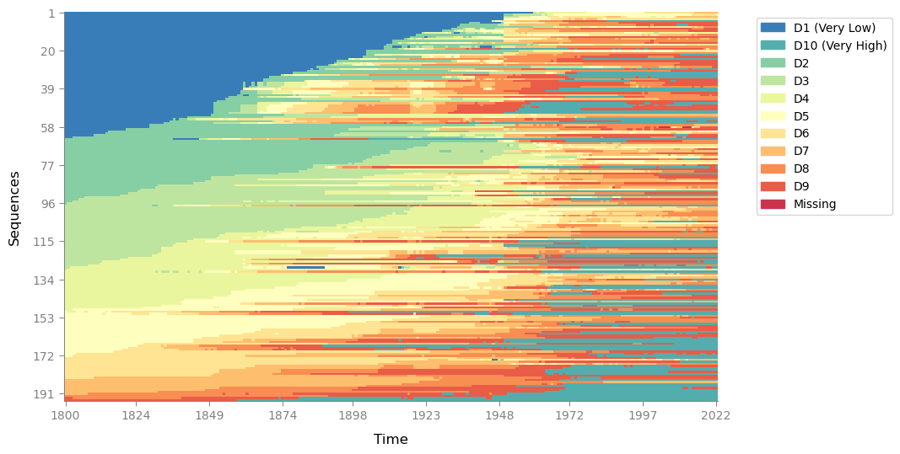

    <Figure size 640x480 with 0 Axes>


还想挖掘更多信息？状态分布图来啦！


```python
sequence_data.plot_legend(save_as="legend_plot")
```


    
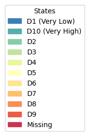
    


```python
plot_most_frequent_sequences(sequence_data, save_as='test', top_n=5)hh
```


    
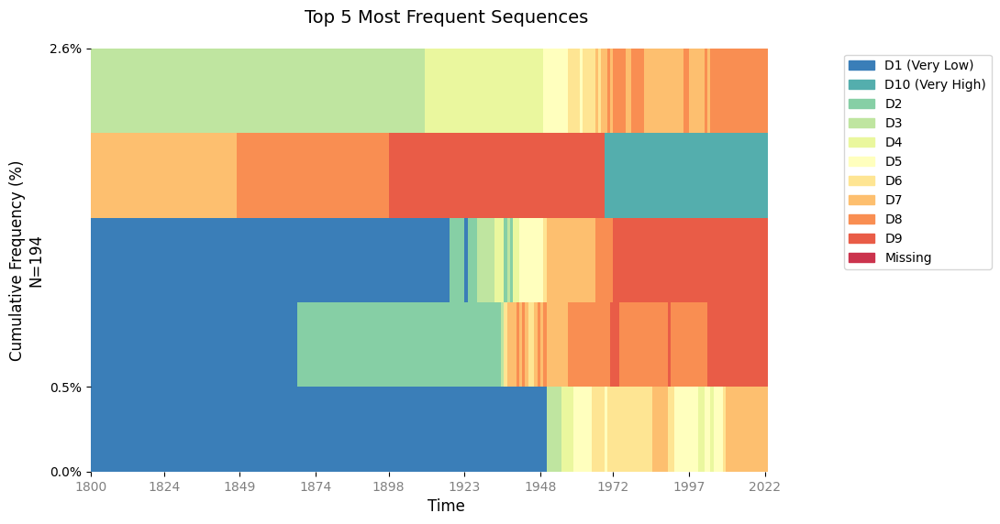
    


    <Figure size 640x480 with 0 Axes>


```python
plot_mean_time(sequence_data, save_as='mean_time')
```


    
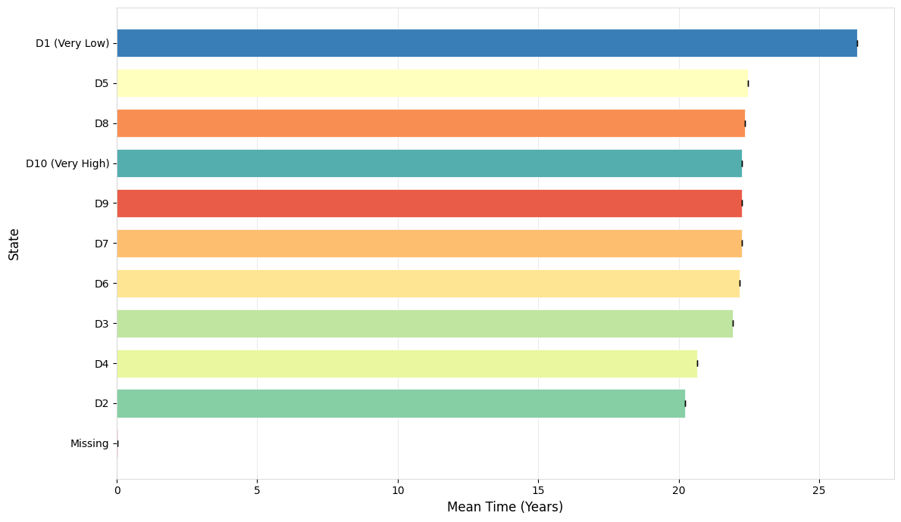
    


    <Figure size 640x480 with 0 Axes>


```python
plot_transition_matrix(sequence_data, save_as='transition_matrix')
```


    
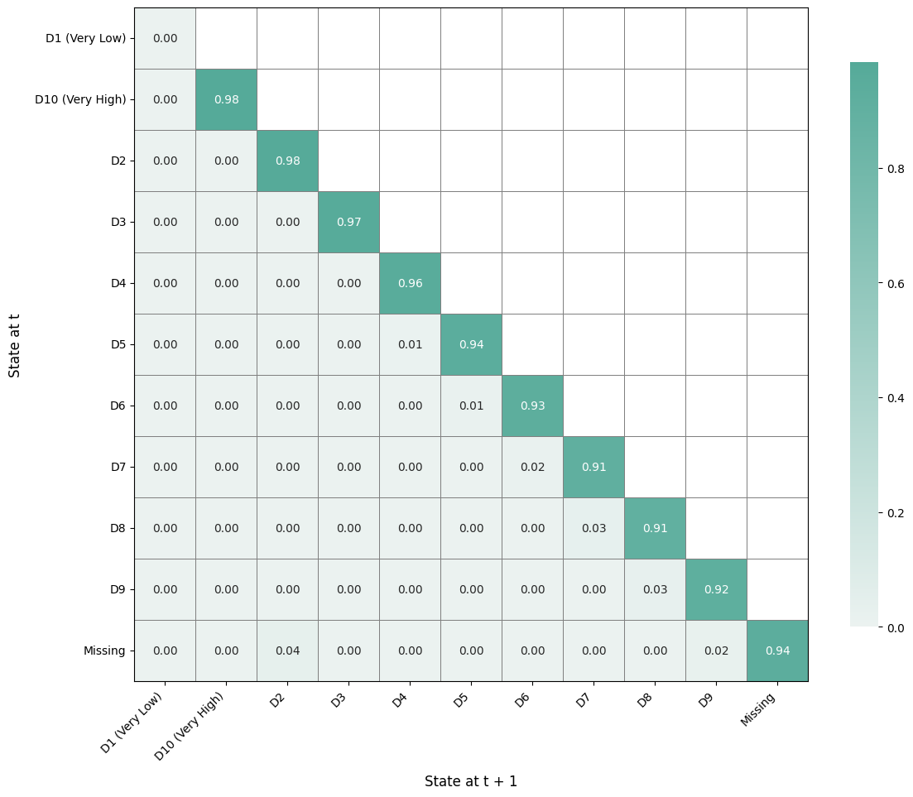
    


    <Figure size 640x480 with 0 Axes>


```python
plot_state_distribution(sequence_data, save_as='state_distribution')
```


    
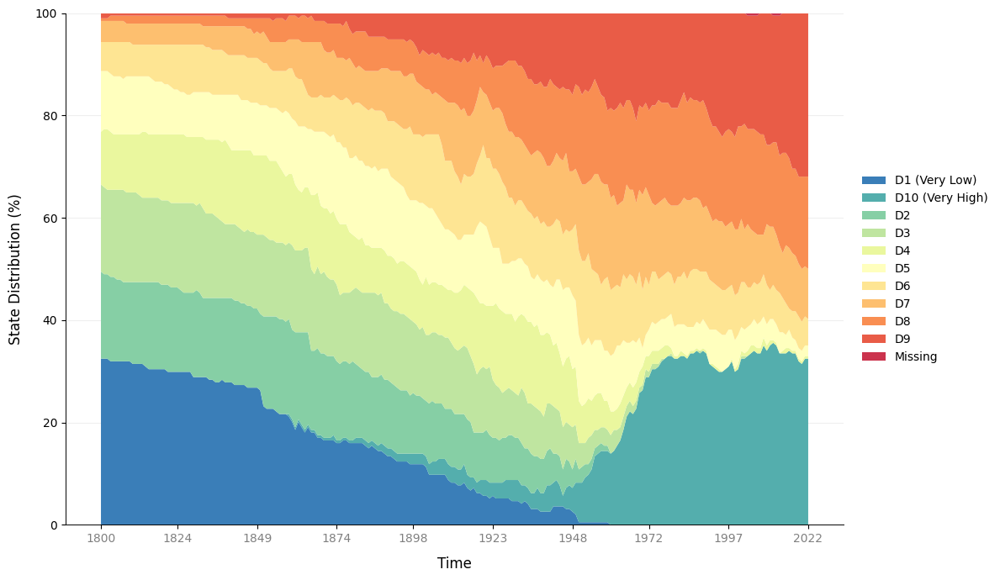
    


    <Figure size 640x480 with 0 Axes>


```python
plot_modal_state(sequence_data, save_as='modal_state')
```


    
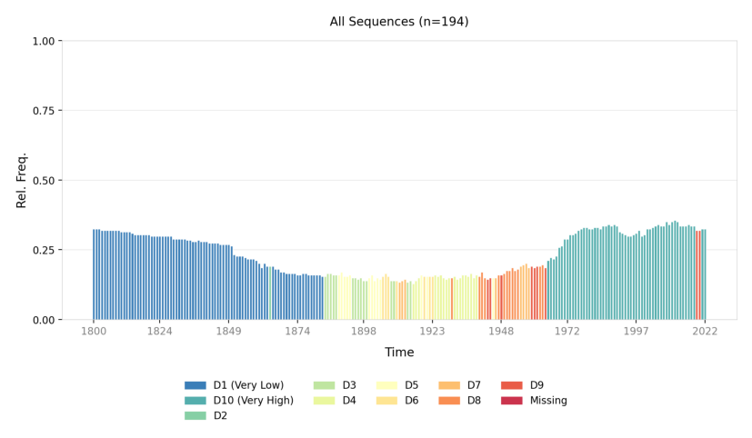
    


## 差异性度量


```python
# 参数替换选项：用"OM/DHD/HAM"代替"OMspell"，用"CONSTANT"代替"TRATE"
om = get_distance_matrix(seqdata=sequence_data,
                         method='OM',
                         sm="TRATE",
                         indel="auto")
om
```

    [>] Processing 194 sequences with 11 unique states.
    [>] Transition-based substitution-cost matrix (TRATE) initiated...
      - Computing transition probabilities for: [D1 (Very Low), D10 (Very High), D2, D3, D4, D5, D6, D7, D8, D9, Missing]
    [>] Indel cost generated.
    
    [>] Identified 194 unique sequences.
    [>] Starting Optimal Matching(OM)...
    [>] Computing all pairwise distances...
    [>] Computed Successfully.
    


<div>
<style scoped>
    .dataframe tbody tr th:only-of-type {
        vertical-align: middle;
    }

    .dataframe tbody tr th {
        vertical-align: top;
    }

    .dataframe thead th {
        text-align: right;
    }
</style>
<table border="1" class="dataframe">
  <thead>
    <tr style="text-align: right;">
      <th></th>
      <th>Afghanistan</th>
      <th>Albania</th>
      <th>Algeria</th>
      <th>Andorra</th>
      <th>Angola</th>
      <th>Antigua and Barbuda</th>
      <th>Argentina</th>
      <th>Armenia</th>
      <th>Australia</th>
      <th>Austria</th>
      <th>...</th>
      <th>Uganda</th>
      <th>Ukraine</th>
      <th>Uruguay</th>
      <th>Uzbekistan</th>
      <th>Vanuatu</th>
      <th>Venezuela</th>
      <th>Vietnam</th>
      <th>Yemen</th>
      <th>Zambia</th>
      <th>Zimbabwe</th>
    </tr>
  </thead>
  <tbody>
    <tr>
      <th>Afghanistan</th>
      <td>0.000000</td>
      <td>272.363879</td>
      <td>141.530885</td>
      <td>405.839693</td>
      <td>357.116339</td>
      <td>352.452702</td>
      <td>369.202821</td>
      <td>199.747566</td>
      <td>363.605396</td>
      <td>367.308098</td>
      <td>...</td>
      <td>356.188303</td>
      <td>251.681276</td>
      <td>391.564474</td>
      <td>253.570661</td>
      <td>333.417093</td>
      <td>193.512323</td>
      <td>339.495876</td>
      <td>337.004372</td>
      <td>405.784131</td>
      <td>389.419165</td>
    </tr>
    <tr>
      <th>Albania</th>
      <td>272.363879</td>
      <td>0.000000</td>
      <td>196.640891</td>
      <td>293.042386</td>
      <td>360.848766</td>
      <td>357.623372</td>
      <td>291.258820</td>
      <td>190.293293</td>
      <td>330.065835</td>
      <td>318.787795</td>
      <td>...</td>
      <td>301.974406</td>
      <td>207.816080</td>
      <td>269.205424</td>
      <td>205.916577</td>
      <td>385.871215</td>
      <td>217.202167</td>
      <td>355.905637</td>
      <td>150.343476</td>
      <td>331.733788</td>
      <td>324.072412</td>
    </tr>
    <tr>
      <th>Algeria</th>
      <td>141.530885</td>
      <td>196.640891</td>
      <td>0.000000</td>
      <td>299.876169</td>
      <td>360.346243</td>
      <td>329.826237</td>
      <td>297.445339</td>
      <td>131.698913</td>
      <td>285.521108</td>
      <td>291.201892</td>
      <td>...</td>
      <td>386.745755</td>
      <td>173.060640</td>
      <td>276.896587</td>
      <td>145.923477</td>
      <td>361.337985</td>
      <td>75.716405</td>
      <td>348.517376</td>
      <td>309.997189</td>
      <td>397.970384</td>
      <td>368.047516</td>
    </tr>
    <tr>
      <th>Andorra</th>
      <td>405.839693</td>
      <td>293.042386</td>
      <td>299.876169</td>
      <td>0.000000</td>
      <td>356.053656</td>
      <td>317.797407</td>
      <td>119.351333</td>
      <td>288.455080</td>
      <td>161.034886</td>
      <td>143.550606</td>
      <td>...</td>
      <td>442.272407</td>
      <td>231.894801</td>
      <td>323.007193</td>
      <td>256.673631</td>
      <td>337.870059</td>
      <td>320.299300</td>
      <td>305.637267</td>
      <td>338.668802</td>
      <td>248.972441</td>
      <td>316.165089</td>
    </tr>
    <tr>
      <th>Angola</th>
      <td>357.116339</td>
      <td>360.848766</td>
      <td>360.346243</td>
      <td>356.053656</td>
      <td>0.000000</td>
      <td>291.024809</td>
      <td>338.252215</td>
      <td>304.404207</td>
      <td>333.524614</td>
      <td>343.035738</td>
      <td>...</td>
      <td>299.756320</td>
      <td>323.190476</td>
      <td>213.309453</td>
      <td>329.042700</td>
      <td>223.247060</td>
      <td>388.304116</td>
      <td>126.257652</td>
      <td>324.332208</td>
      <td>355.987397</td>
      <td>347.278292</td>
    </tr>
    <tr>
      <th>...</th>
      <td>...</td>
      <td>...</td>
      <td>...</td>
      <td>...</td>
      <td>...</td>
      <td>...</td>
      <td>...</td>
      <td>...</td>
      <td>...</td>
      <td>...</td>
      <td>...</td>
      <td>...</td>
      <td>...</td>
      <td>...</td>
      <td>...</td>
      <td>...</td>
      <td>...</td>
      <td>...</td>
      <td>...</td>
      <td>...</td>
      <td>...</td>
    </tr>
    <tr>
      <th>Venezuela</th>
      <td>193.512323</td>
      <td>217.202167</td>
      <td>75.716405</td>
      <td>320.299300</td>
      <td>388.304116</td>
      <td>332.208197</td>
      <td>314.154419</td>
      <td>167.770756</td>
      <td>307.697612</td>
      <td>294.576219</td>
      <td>...</td>
      <td>407.898441</td>
      <td>178.451252</td>
      <td>299.052292</td>
      <td>159.381580</td>
      <td>393.463182</td>
      <td>0.000000</td>
      <td>386.746863</td>
      <td>338.328445</td>
      <td>409.781349</td>
      <td>363.126942</td>
    </tr>
    <tr>
      <th>Vietnam</th>
      <td>339.495876</td>
      <td>355.905637</td>
      <td>348.517376</td>
      <td>305.637267</td>
      <td>126.257652</td>
      <td>277.169745</td>
      <td>281.862722</td>
      <td>262.901696</td>
      <td>284.480681</td>
      <td>296.840967</td>
      <td>...</td>
      <td>250.273278</td>
      <td>313.199712</td>
      <td>224.199999</td>
      <td>317.111338</td>
      <td>171.558720</td>
      <td>386.746863</td>
      <td>0.000000</td>
      <td>332.362799</td>
      <td>311.052135</td>
      <td>313.268987</td>
    </tr>
    <tr>
      <th>Yemen</th>
      <td>337.004372</td>
      <td>150.343476</td>
      <td>309.997189</td>
      <td>338.668802</td>
      <td>324.332208</td>
      <td>402.822666</td>
      <td>338.626193</td>
      <td>287.908848</td>
      <td>368.726059</td>
      <td>362.779293</td>
      <td>...</td>
      <td>210.976531</td>
      <td>287.655467</td>
      <td>289.098219</td>
      <td>284.491015</td>
      <td>338.798635</td>
      <td>338.328445</td>
      <td>332.362799</td>
      <td>0.000000</td>
      <td>323.373702</td>
      <td>353.783341</td>
    </tr>
    <tr>
      <th>Zambia</th>
      <td>405.784131</td>
      <td>331.733788</td>
      <td>397.970384</td>
      <td>248.972441</td>
      <td>355.987397</td>
      <td>400.131845</td>
      <td>247.433419</td>
      <td>362.309280</td>
      <td>364.953012</td>
      <td>359.363387</td>
      <td>...</td>
      <td>442.218057</td>
      <td>373.720811</td>
      <td>406.480220</td>
      <td>371.778073</td>
      <td>255.268940</td>
      <td>409.781349</td>
      <td>311.052135</td>
      <td>323.373702</td>
      <td>0.000000</td>
      <td>304.666582</td>
    </tr>
    <tr>
      <th>Zimbabwe</th>
      <td>389.419165</td>
      <td>324.072412</td>
      <td>368.047516</td>
      <td>316.165089</td>
      <td>347.278292</td>
      <td>279.071995</td>
      <td>315.245317</td>
      <td>292.686113</td>
      <td>257.977877</td>
      <td>282.863190</td>
      <td>...</td>
      <td>372.870754</td>
      <td>325.264179</td>
      <td>340.907764</td>
      <td>320.059748</td>
      <td>347.484712</td>
      <td>363.126942</td>
      <td>313.268987</td>
      <td>353.783341</td>
      <td>304.666582</td>
      <td>0.000000</td>
    </tr>
  </tbody>
</table>
<p>194 rows × 194 columns</p>
</div>


```python
plot_relative_frequency(seqdata=sequence_data,
                        distance_matrix=om,
                        num_groups=12,
                        dpi=200,
                        # save_as='relative_frequency_plot'
                        )

# 可视化主要问题
# 1. 当把横坐标从“严格的分类标签”变成“数值（年份/年龄）”时，刻度有可能跑偏，得手动把 xticks／布局调回来。
# 2. 状态（分类）多了以后，默认 legend 效果会很糟，得自己选位置或分列、扩增画布空间，才能让图例和主体同时都好看、好读。
```


    
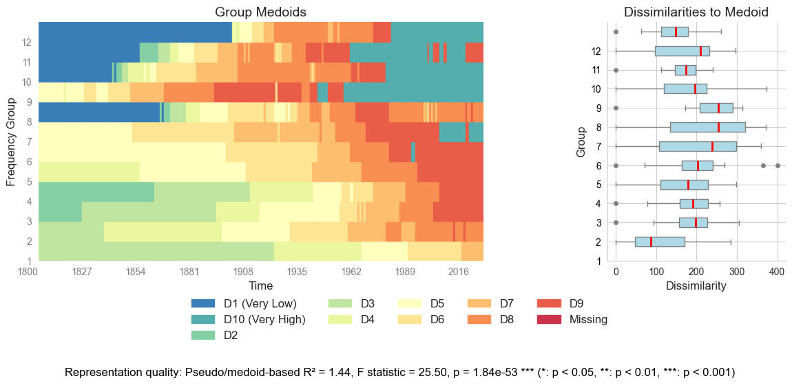
    


    <Figure size 640x480 with 0 Axes>


## 聚类分析


```python
cluster = Cluster(om, sequence_data.ids, clustering_method='ward')
cluster.plot_dendrogram(xlabel="Countries", ylabel="Distance")

```

    [>] Converting DataFrame to NumPy array...
    


    
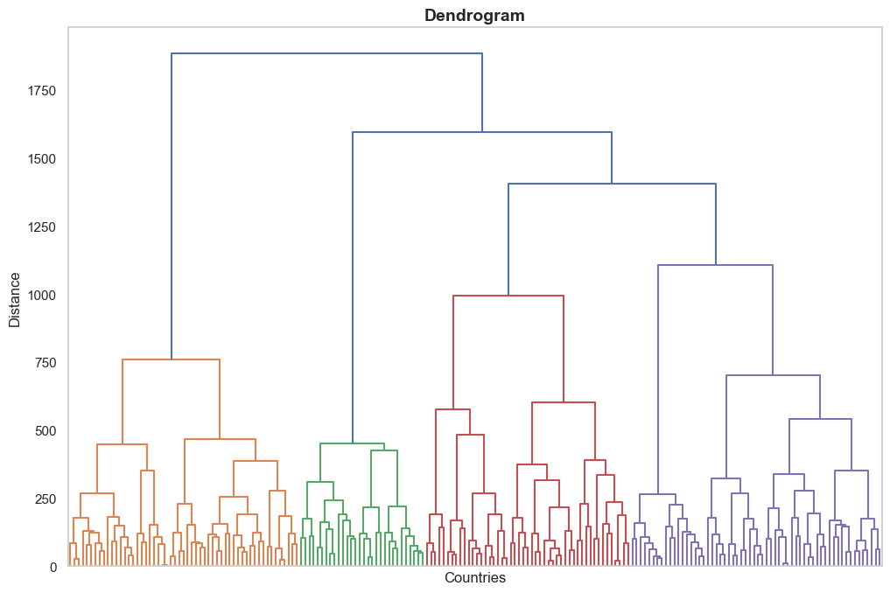
    


    <Figure size 640x480 with 0 Axes>


```python
# Create a ClusterQuality object to evaluate clustering quality创建一个 ClusterQuality 对象，用于评估聚类质量。
cluster_quality = ClusterQuality(cluster)
cluster_quality.compute_cluster_quality_scores()
cluster_quality.plot_combined_scores(norm='zscore', save_as='combined_scores')
summary_table = cluster_quality.get_metrics_table()
print(summary_table)
```


    

    


      Metric  Opt. Clusters  Opt. Value  Z-Score Norm.  Min-Max Norm.
    0    ASW              6    1.922696       1.922696            1.0
    1   ASWw              6    1.922696       1.922696            1.0
    2     HG              2    3.235991       3.235991            1.0
    3    PBC             20    1.028963       1.028963            1.0
    4     CH              8    0.613044       0.613044            1.0
    5     R2             20    1.297366       1.297366            1.0
    6     HC             20    1.228937       1.228937            1.0
    


    <Figure size 640x480 with 0 Axes>


```python
cluster_results = ClusterResults(cluster)
membership_table = cluster_results.get_cluster_memberships(num_clusters=5)
print(membership_table)
distribution = cluster_results.get_cluster_distribution(num_clusters=5)
print(distribution)
cluster_results.plot_cluster_distribution(num_clusters=5, save_as="distribution.png", title=None)

```

           Entity ID  Cluster
    0    Afghanistan        1
    1        Albania        1
    2        Algeria        1
    3        Andorra        3
    4         Angola        4
    ..           ...      ...
    189    Venezuela        1
    190      Vietnam        4
    191        Yemen        2
    192       Zambia        3
    193     Zimbabwe        5
    
    [194 rows x 2 columns]
       Cluster  Count  Percentage
    0        1     55       28.35
    1        2     30       15.46
    2        3     49       25.26
    3        4     18        9.28
    4        5     42       21.65
    

    /Users/lei/Documents/Sequenzo_all_folders/Sequenzo-main/sequenzo/clustering/hierarchical_clustering.py:598: FutureWarning: 
    
    Passing `palette` without assigning `hue` is deprecated and will be removed in v0.14.0. Assign the `x` variable to `hue` and set `legend=False` for the same effect.
    
      ax = sns.barplot(x='Cluster', y='Count', data=distribution, palette='pastel')
    


    
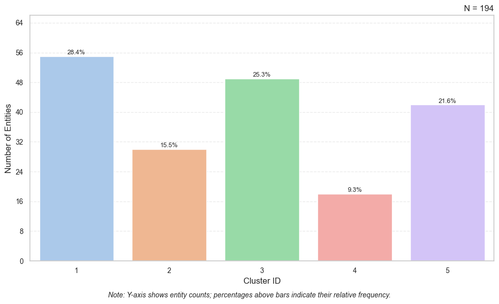
    


    <Figure size 640x480 with 0 Axes>


```python
mapping_dict = {
    1: 'xxx',
    2: 'Test',
    3: 'The name of the cluster',
    4: 'xxxxx',
    5: 'whsiaa',
}

membership_table = replace_cluster_id_by_labels(membership_table,
                                                mapping=mapping_dict,
                                                new_cluster_column_name='Cluster',
                                                new_id_column_name='ID')

membership_table
```


<div>
<style scoped>
    .dataframe tbody tr th:only-of-type {
        vertical-align: middle;
    }

    .dataframe tbody tr th {
        vertical-align: top;
    }

    .dataframe thead th {
        text-align: right;
    }
</style>
<table border="1" class="dataframe">
  <thead>
    <tr style="text-align: right;">
      <th></th>
      <th>ID</th>
      <th>Cluster</th>
    </tr>
  </thead>
  <tbody>
    <tr>
      <th>0</th>
      <td>Afghanistan</td>
      <td>xxx</td>
    </tr>
    <tr>
      <th>1</th>
      <td>Albania</td>
      <td>xxx</td>
    </tr>
    <tr>
      <th>2</th>
      <td>Algeria</td>
      <td>xxx</td>
    </tr>
    <tr>
      <th>3</th>
      <td>Andorra</td>
      <td>The name of the cluster</td>
    </tr>
    <tr>
      <th>4</th>
      <td>Angola</td>
      <td>xxxxx</td>
    </tr>
    <tr>
      <th>...</th>
      <td>...</td>
      <td>...</td>
    </tr>
    <tr>
      <th>189</th>
      <td>Venezuela</td>
      <td>xxx</td>
    </tr>
    <tr>
      <th>190</th>
      <td>Vietnam</td>
      <td>xxxxx</td>
    </tr>
    <tr>
      <th>191</th>
      <td>Yemen</td>
      <td>Test</td>
    </tr>
    <tr>
      <th>192</th>
      <td>Zambia</td>
      <td>The name of the cluster</td>
    </tr>
    <tr>
      <th>193</th>
      <td>Zimbabwe</td>
      <td>whsiaa</td>
    </tr>
  </tbody>
</table>
<p>194 rows × 2 columns</p>
</div>


```python
plot_sequence_index(seqdata=sequence_data,
                    id_group_df=membership_table,
                    categories='Cluster',
                    # save_as='cluster_index_plot'
                    )
```


    
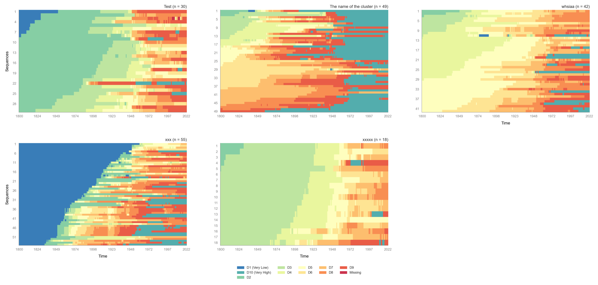
    


```python
plot_state_distribution(seqdata=sequence_data,
                            id_group_df=membership_table,
                            categories='Cluster',
                            # save_as='cluster_state_distribution_plot'
                        )
```


    
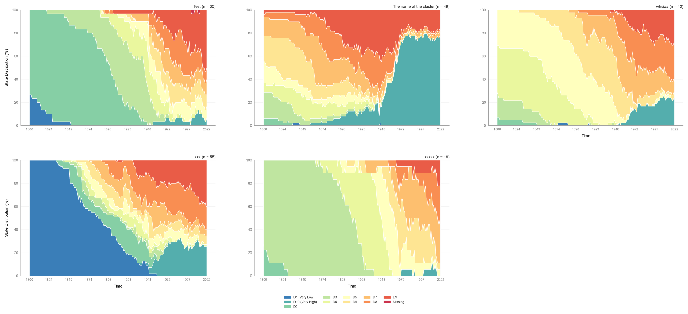
    


## Regression


```python

```


```python

```

## Conclusions


```python

```
