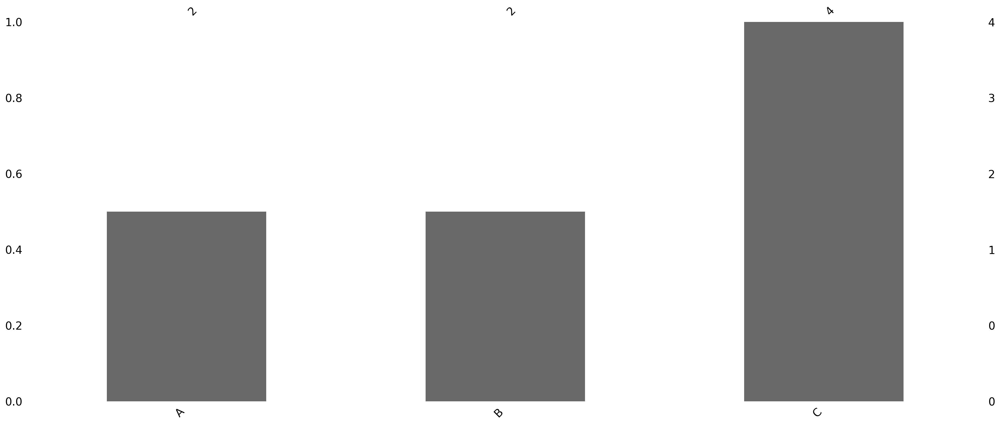

# `summarize_missing_values()`：总结并可视化 DataFrame 中的缺失值

## 描述

此函数提供 DataFrame 中缺失数据的快速摘要，并可选择将其可视化。它报告每列和每行的缺失值，并提供两种可视化模式：矩阵视图和条形图。这有助于在序列分析之前诊断数据质量问题。

## 用法

```python
summarize_missing_values(
    df,
    plot=True,
    top_n=5,
    columns=None,
    mode='matrix',
    figsize=(10, 5),
    save_as=None,
    show=True
)
```

> **小记:**
> 以上显示的值是**默认设置**。你可以根据需要进行更改。
> 举例:
>
> * 仅分析某些列：设置`columns=['col1', 'col2']`
> * 要切换到条形图：设置`mode ='bar'`
> * 要将图保存为 PNG 图像：设置 `save_as='my_plot.png'`
> * 要抑制绘图显示（例如，在脚本中）：设置`show=False`

以下是自定义的简单示例：

```python
summarize_missing_values(
    df,
    plot=True,
    mode='bar',
    columns=['Age', 'Income'],
    save_as='missing_summary.png',
    show=False
)
```

这将：

* 仅关注`Age`和`Income`列
* 使用条形图代替默认矩阵
* 将图表保存为`missing_summary.png`
* 避免弹出绘图窗口（例如，在自动化脚本中）

## Entry Parameters

|参数 | 类型                    | 描述                                                 |
| --------- |-----------------------|----------------------------------------------------|
| `df`      | `pd.DataFrame`        | 要分析的输入 DataFrame。                                  |
| `plot`    | `bool`                | 是否生成缺失值的可视化图表。默认值为`True`。                          |
| `top_n`   | `int`                 | 要显示的缺失值最多的行数。默认值为`5`。                              |
| `columns` | `list` or `None`      | 可选的要包含在分析中的列列表。如果为`None`，则使用所有列。                   |
| `mode`    | `'matrix'` or `'bar'` | 要显示的图表类型： `"matrix"` （默认）表示时间类布局，或 `"bar"` 表示每列摘要。 |
| `figsize` | `tuple`               | 绘图尺寸（英寸）。默认值为 `(10, 5)`。                           |
| `save_as` | `str` or `None`       | 保存图形的文件路径。如果为 `None`， 则不保存图形。                      |
| `show`    | `bool`                | 是否显示图表。如果为 `False`，则将创建图形但不显示。                     |

## 具体来说

该函数执行三项任务：

1. **列摘要**：列出每列缺失值的数量及其百分比。
2. **行摘要**：标识缺失值最多的行。
3. **可视化**：

   * `"matrix"` 视图（默认）显示各行缺失的模式，适用于序列形状的数据。
   * `"bar"` 视图显示每列缺失的值数。

用户可以选择将分析限制在选定的列，将图表保存到磁盘，并抑制批处理的显示。

## 值

此函数打印摘要并可选地生成可视化图表。它**不**返回任何值（即返回`None`）。

## 例子

```python
import pandas as pd
from sequenzo.data_preprocessing.helpers import summarize_missing_values

df = pd.DataFrame({
    'A': [1, None, 3, None],
    'B': [None, 2, None, 4],
    'C': [5, 6, 7, 8]
})
```
```python
# 1. 带有默认矩阵图的基本摘要
summarize_missing_values(df)
```
```python
# 2. 仅汇总特定列
summarize_missing_values(df, columns=['A', 'B'])
```
```python
# 3. 保存绘图并使用条形模式
summarize_missing_values(df, mode='bar', save_as='missing_bar.png', show=False)
```
```python
# 4. 仅打印缺失值的文本摘要
summarize_missing_values(df, plot=False)
```
```python
# 5. 改变图形大小
summarize_missing_values(df, figsize=(12, 6))
```
```python
# 6. 关注选定的列
summarize_missing_values(df, columns=['A'], show=False)
```

### 输出

1. `summarize_missing_values(df)`:
```python
🔍 Missing Value Summary
----------------------------------------
[Columns with Missing Values]
   Missing Count  Missing (%)
A              2         50.0
B              2         50.0

[Top 5 Rows with Most Missing Values]
   Missing Count
0              1
1              1
2              1
3              1
<Figure size 1000x500 with 0 Axes>
```


2. `summarize_missing_values(df, columns=['A', 'B'])`:
```python
🔍 Missing Value Summary
----------------------------------------
[Columns with Missing Values]
Missing Count  Missing (%)
A              2         50.0
B              2         50.0

[Top 5 Rows with Most Missing Values]
Missing Count
0              1
1              1
2              1
3              1

<Figure size 1000x500 with 0 Axes>
```


3. `summarize_missing_values(df, mode='bar', save_as='missing_bar.png', show=False)`:
```python
🔍 Missing Value Summary
----------------------------------------
[Columns with Missing Values]
Missing Count  Missing (%)
A              2         50.0
B              2         50.0

[Top 5 Rows with Most Missing Values]
Missing Count
0              1
1              1
2              1
3              1

```
* Because `show=False`, the plot is not displayed.
* Because `save_as='missing_bar.png'`, the plot is saved to disk instead of shown on screen.

The plot image is saved in the file as follow:


4. `summarize_missing_values(df, plot=False)`

```python
🔍 Missing Value Summary
----------------------------------------
[Columns with Missing Values]
   Missing Count  Missing (%)
A              2         50.0
B              2         50.0

[Top 5 Rows with Most Missing Values]
   Missing Count
0              1
1              1
2              1
3              1

```
Also since `show=False`, the plot is not displayed.

5. `summarize_missing_values(df, figsize=(12, 6))`

```python
🔍 Missing Value Summary
----------------------------------------
[Columns with Missing Values]
   Missing Count  Missing (%)
A              2         50.0
B              2         50.0

[Top 5 Rows with Most Missing Values]
   Missing Count
0              1
1              1
2              1
3              1

<Figure size 1200x600 with 0 Axes>
```


6. `summarize_missing_values(df, columns=['A'])`
```python
🔍 Missing Value Summary
----------------------------------------
[Columns with Missing Values]
Missing Count  Missing (%)
A              2         50.0

[Top 5 Rows with Most Missing Values]
Missing Count
1              1
3              1
0              0
2              0

<Figure size 1000x500 with 0 Axes>
```


## 作者

代码: 梁彧祺

文档: 梁彧祺

编辑: 梁彧祺

翻译、测试：曲思竹