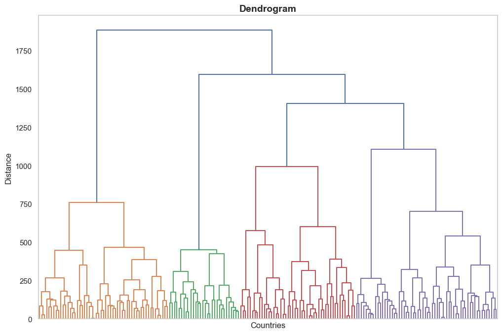

# `Cluster()`：层次聚类的第一步

当你用 `get_distance_matrix()` 得到一个已经计算好的的距离矩阵（`n×n` 方形的矩阵）后，就可以开始做聚类了。这是序列分析里很常见的一步。

层次聚类（hierarchical clustering）是一种无监督机器学习算法（unsupervised machine learning algorithm），简单直接、上手容易，能帮你看出数据中典型的轨迹模式。

## 层次聚类的常见流程

1. 我们可以用 `get_distance_matrix()` 准备一个距离矩阵 `D`（形状 `n×n`），同时准备一份实体 ID 列表／数组 `entity_ids`（长度为 `n`，全部非重复）。

2. 我们可以创建一个 `Cluster()` 实例，必要时你也可以画一张树状图（dendrogram）。

3. 我们可以选定簇数 `k`（clusters 的数量），拿到聚类标签。

4. 我们可以用 `ClusterQuality()` 对不同的 `k` 做比较，查看聚类质量指标（cluster quality indicators，CQI）。

5. 我们可以用 `ClusterResults()` 导出成员表（cluster membership table，每个实体分别属于哪个簇），并绘制各簇占比图。

我们做完上述步骤后，接下来可以常见的下游分析：  
1）用[状态分布图](https://sequenzo.yuqi-liang.tech/zh/visualization/state-distribution-plot)或[索引图](https://sequenzo.yuqi-liang.tech/zh/visualization/index-plot)分别可视化各个簇；  
2）在回归模型里使用每个个体的簇标签，既可以作为自变量，也可以作为因变量。

下面是把 `Cluster()`、`ClusterQuality()` 和 `ClusterResults()` 组合起来做层次聚类的一个示例。

```python
from sequenzo.clustering.hierarchical_clustering import Cluster, ClusterQuality, ClusterResults

# ---------------------
# distance_matrix: 距离矩阵 (n x n)
# ids: 长度为 n 的非重复 ID 列表/数组
# 一般推荐 "ward"
cluster = Cluster(
    matrix=distance_matrix, 
    entity_ids=ids, 
    clustering_method="ward"
)  

# 可选：画树状图（n 很大时会自动隐藏标签）
# 新手建议先试一下，帮助你直观看到层次结构
cluster.plot_dendrogram(
    # 不想保存就删掉这个参数
    save_as="dendrogram.png",  
    # 图标题
    title="Dendrogram" 
)

# ---------------------
# 用聚类质量指标（CQI）来帮助选择 k
cluster_quality = ClusterQuality(cluster, max_clusters=20)
cluster_quality.compute_cluster_quality_scores()

# 打印CQI表格信息，包含着每个CQI指标下计算得出的最优簇数 k 是什么
print(cluster_quality.get_cqi_table())     

# 想改保存文件名也可以
cluster_quality.plot_cqi_scores(save_as="quality.png") 

# ---------------------
# 导出结果
cluster_results = ClusterResults(cluster)

# 假设 CQI 图建议 k=6
# 取出簇成员表，表中包含两列：实体 ID 与 Cluster
members = cluster_results.get_cluster_memberships(num_clusters=6)     

# 查看每个簇的样本数与占比
distribution = cluster_results.get_cluster_distribution(num_clusters=6)   

cluster_results.plot_cluster_distribution(num_clusters=6, 
                                          save_as="cluster_sizes.png")
```
接下来，我们在这个函数文档里重点介绍 `Cluster()`。在实现层面，它使用了 Python 包 `fastcluster`，相较于 `SciPy` 的标准做法，它通常更快、更省内存，对大数据集尤其友好。

## `Cluster()` 的用法
```python
from sequenzo.clustering.hierarchical_clustering import Cluster

cluster = Cluster(
    matrix=distance_matrix,     # n×n 的对称方形矩阵
    entity_ids=ids,             # 长度为 n（n 是数据里的实体数，也就是样本数），全部非重复
    clustering_method="ward"    # 可以选择"ward" | "single" | "complete" | "average" | "centroid" | "median"
)
```
## 参数（Entry Parameters）
| 参数                  | 必填 | 类型              | 说明                                                                                               |
| ------------------- | -- | --------------- |--------------------------------------------------------------------------------------------------|
| `matrix`            | ✓  | array/DataFrame | 已经计算好的完整距离矩阵，形状 `n×n`。                                                                           |
| `entity_ids`        | ✓  | array-like      | 长度为 `n` 的非重复 ID 列表／数组，顺序需与 `matrix` 的行／列一致。                                                      |
| `clustering_method` | ✗  | str             | 链接方法（linkage method）。默认 `"ward"`。可选 `"single"`、`"complete"`、`"average"`、`"centroid"`、`"median"`。 |

## 这个函数做了什么

* 校验输入：检查是否为矩阵、`entity_ids` 的长度是否匹配、ID 是否非重复。
* 处理矩阵里的“小毛病”：

  * 如果有 `NaN`／`Inf`，用矩阵里最大的有限值进行替换。

  * 在容差范围内，做对称化：`(D + D.T) / 2`。

* 把方阵转换成压缩形式（condensed），再用高效的层次聚类程序计算链接矩阵（linkage matrix）。

* 保存链接矩阵，便于后续画树状图（dendrograms）或剪树（cut the tree）

## 返回对象（Returned Object）

返回一个 `Cluster` 实例，主要属性：

* `entity_ids`：你的 ID（`numpy 数组`，长度 `n`）。

* `full_matrix`：校验过的 n×n 距离矩阵（`numpy 数组`）。

* `condensed_matrix`：供链接算法使用的压缩向量。

* `linkage_matrix`：层次聚类得到的链接矩阵。

主要算法：

* `plot_dendrogram(...)`：渲染或保存树状图。

* `get_cluster_labels(num_clusters)`：返回长度为 `n` 的簇标签数组。

## 函数方法一：`plot_dendrogram()`

渲染或保存已拟合层次聚类的树状图。

### 用法

```python
cluster.plot_dendrogram(
    save_as=None,         # 例如 "dendrogram.png"；为 None 则只显示，不保存
    style="whitegrid",    # seaborn 的风格
    title="Dendrogram",
    xlabel="Entities",    # 可以根据你的数据属性来更改名字，比如"Individuals"，"Countries"
    ylabel="Distance",
    grid=False,
    dpi=200,
    figsize=(12, 8)
)
```

### 参数（Entry parameters）
| 参数        | 必填 | 类型                  | 说明                                                                       |
| --------- | -- | ------------------- | ------------------------------------------------------------------------ |
| `save_as` | ✗  | str 或 None          | 图像保存路径（如 `"dendrogram.png"`）。为 `None` 则只显示不保存。                           |
| `style`   | ✗  | str                 | seaborn 风格名。常用有 `"whitegrid"`、`"darkgrid"`、`"white"`、`"dark"`、`"ticks"`。 |
| `title`   | ✗  | str                 | 图标题，默认 `"Dendrogram"`。                                                   |
| `xlabel`  | ✗  | str                 | X 轴标题，默认 `"Entities"`。                                                   |
| `ylabel`  | ✗  | str                 | Y 轴标题，默认 `"Distance"`。                                                   |
| `grid`    | ✗  | bool                | 是否显示网格线，默认 `False`。                                                      |
| `dpi`     | ✗  | int                 | 保存图像时的分辨率，默认 `200`。                                                      |
| `figsize` | ✗  | tuple(float, float) | 图像尺寸（英寸），默认 `(12, 8)`。                                                   |

> **关于 `style` 与 `grid`：**
>
>`style`（如 `"whitegrid"`、`"darkgrid"`）会设定整体主题，可能包含背景、字体、网格线等。
>`grid` 是显式覆盖项：`grid=False` 会关闭网格线，即使所选风格默认带网格。
>`grid` 的开关优先于风格的默认网格设置。在我们实际使用中，你可以多尝试几个组合，选你喜欢的就可以。

### 这个`Cluster（）`做了什么

* 用已有的 `linkage_matrix` 绘制树状图。

* 当数据的样本量 n 很大时，叶子标签会被隐藏，避免图面拥挤。如果需要小规模标注，建议用 `scipy.cluster.hierarchy.dendrogram` 自行绘制。

* 如果你提供了 `save_as` 这个参数，则意味着你想要保存图片，函数会根据另一个参数 `dpi` 看保存到图片高清度需要多少（默认 200）；如果没传 `save_as`，这张图默认会显示出来，不会保存。

### 返回值

* 无（显示和／或保存图片）。

注意：如果你的距离矩阵曾含有 `NaN`／`Inf` 或轻微不对称，`Cluster()` 在计算链接前会进行修复，并可能给出警告。但这不是错误提示。

### 例子
```python
cluster.plot_dendrogram(xlabel="Countries", ylabel="Distance")
```
输出：
[](./img.png)

## 函数方法二：`get_cluster_labels(num_clusters)`

我们把树状图在 `k` 个簇处切开，给每个实体返回一个整数标签（与 `entity_ids` 对齐）。一般来说，我们画出树状图就够用了；只有在特定研究需要标签的时候再用这个函数。

### 用法

```python
# 比如选择 6 个簇
labels = cluster.get_cluster_labels(num_clusters=6)
```

### 参数（Entry parameters）
| 参数             | 必填 | 类型  | 说明                                                                |
| -------------- | -- | --- | ----------------------------------------------------------------- |
| `num_clusters` | ✓  | int | 目标簇数 `k`。内部调用 `SciPy` 的 `fcluster(..., t=k, criterion="maxclust")`。 |

### 返回值（Returns）
* 形状为 `(n,)` 的 `numpy.ndarray`，元素为 `1...k` 的整数簇标签。

### 说明
* **结果是确定性的（deterministic），只要给同一套距离矩阵和同一种算法，结果通常可以复现。**

  层次聚类本身不引入随机性（不同于 [K-Medoids](../function-library/k-medoids.md)）。只有在出现完全相等的距离时，可能因为实现细节或行列顺序不同，合并顺序会不一样，树状图形状也会略有区别，但整体的聚类质量基本不受影响。

* **当 k 很大（≥ n）时，单例（singleton）会很多；当 k=1 时，所有观测都会被放进同一个簇。**
    
  单例就是只包含一个实体的簇。k 越接近 n，单例越多，通常可解释性越差；反过来，`k=1` 则所有实体都在同一簇里。

* **簇标签只是编号，不代表大小或重要程度。**

  比如 Cluster 1 和 Cluster 2 就是个编号，不代表谁更大、更重要。这里的数字只是用来标识不同的簇。

### 例子

```python
# 基本用法：假设我们认为 k=6 也就是六个簇比较合适
labels_k6 = cluster.get_cluster_labels(num_clusters=6)

# 合并成整洁表格
import pandas as pd
members = pd.DataFrame({
    "Entity ID": cluster.entity_ids,
    "Cluster": labels_k6
})

# 多个 k 快速查看规模分布
for k in [3, 4, 5, 6, 8]:
    labels = cluster.get_cluster_labels(num_clusters=k)
    print(k, pd.Series(labels).value_counts().sort_index().to_dict())
```

### 错误与警告
* 如果未生成链接矩阵（Linkage matrix），会报 `ValueError: Linkage matrix is not computed.`

* `num_clusters` 需为正整数，否则 `SciPy` 的 `fcluster` 会报错；请使用 ≥ 1 的整数。

## 例子

### 1) 基础流程：拟合、画树、取标签

```python
cluster = Cluster(distance_matrix, ids, clustering_method="ward")
cluster.plot_dendrogram(save_as="dendrogram.png", title="My Dendrogram")
labels_k6 = cluster.get_cluster_labels(num_clusters=6)
```

### 2) 迷你流水线：质量评估与结果导出

```python
from sequenzo.clustering.hierarchical_clustering import ClusterQuality, ClusterResults

cluster = Cluster(distance_matrix, ids, "ward")

# 用 CQI 比较不同的 k
cq = ClusterQuality(cluster, max_clusters=20)
cq.compute_cluster_quality_scores()
print(cq.get_cqi_table())
cq.plot_cqi_scores(save_as="quality.png")

# 导出 k=6 的结果
cr = ClusterResults(cluster)
members = cr.get_cluster_memberships(num_clusters=6)      # 两列：实体 ID 与簇标签
dist    = cr.get_cluster_distribution(num_clusters=6)     # 统计每个簇的数量与占比
cr.plot_cluster_distribution(num_clusters=6, save_as="cluster_sizes.png")
```
### 3) 距离矩阵排障措施

```python
# 若矩阵含 NaN/Inf 或轻微不对称，Cluster() 会自动修复。
# 如果你想显式地处理：
D = np.asarray(distance_matrix)
D[~np.isfinite(D)] = np.nanmax(D[np.isfinite(D)])
D = (D + D.T) / 2
cluster = Cluster(D, ids, "average")
```

## 备注与提示

* 距离矩阵必须是 `n×n`，且行列顺序要与 `entity_ids` 对齐。如果做了子集或重排，请保持一致。

* 从理论上讲，Ward 更偏好近似平方欧氏距离（approximately squared Euclidean distances）的相异度；实践中，用在很多序列距离上也表现不错，但建议每次都做一下合理性检查（sanity check）。

* 复杂度：链接计算（computing linkage）在时间与内存上大致为 O(n²)。 

  这意味着 n 越大，代价按平方增长。例如：

  * n=1,000：约 100 万对距离，轻松搞定；

  * n=10,000：约 1 亿对距离，需要几个 GB 内存，可能比较慢；

  * n=50,000：约 25 亿对距离，一般个人电脑可能难以承受，配置比较高的个人电脑或许能跑下来，但需要比较久的时间。

  如果数据非常大（比如超过 50,000 个实体），可以考虑：

  * **推荐使用 CLARA 算法**：详见[《CLARA 函数文档》](../zh/big-data/clara.md) 。

  * **去重（Deduplication）：** 如果在数据集中有大量相同序列，只保留一份并加权，缩小矩阵规模。

  * **抽样（Sampling）：** 随机抽取一部分实体。

## 接下来做什么

1. 我们用 `ClusterQuality()` 配合多个 CQI 选择合适的 `k`。

2. 我们用 `ClusterResults()` 导出并可视化簇规模，然后：

    * 展示各簇的[状态分布图](https://sequenzo.yuqi-liang.tech/zh/visualization/state-distribution-plot)或[索引图](https://sequenzo.yuqi-liang.tech/zh/visualization/index-plot)；
    * 把标签合并到数据表（`pandas DataFrame`)，在回归中把簇成员身份作为因变量或自变量。

更多关于 `ClusterQuality()` 与 `ClusterResults()` 的细节，请参考接下来的两篇函数文档。

## 
_代码：梁彧祺_

_文档：梁彧祺_

_编辑：梁彧祺_

_翻译：明煜坤_