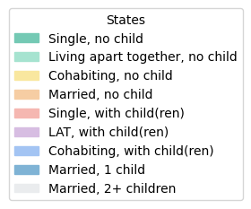
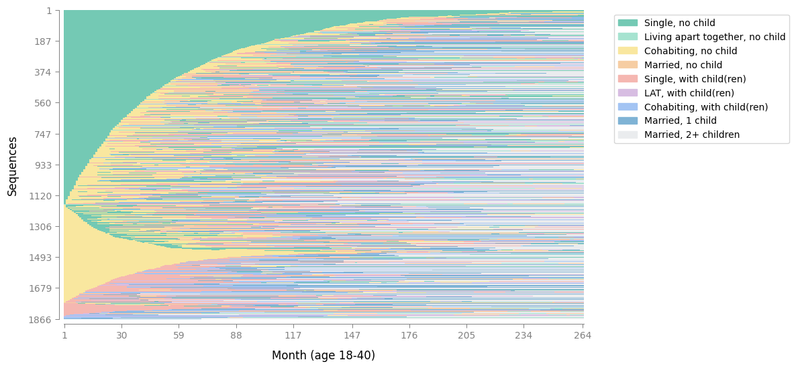

# 推荐的配色方案以及如何自定义它们

处理序列数据时，清晰一致的颜色非常重要：它们可以帮助读者快速区分状态，并在不同图表之间进行比较。在 Sequenzo 中，这种逻辑直接内置于 `SequenceData` 类中。我们不需要将颜色选择分散到不同的可视化函数中，而是在工作流程的初始阶段就将控制权集中化。

具体来说，在创建 `SequenceData` 对象的那一刻，每个状态都会被分配一种独特的颜色。这意味着无需调整各个绘图函数；一旦设置了映射，每个图表都会自动继承该颜色。要自定义方案，只需定义您的 `states`、其易于理解的 `labels`，以及（可以根据自己的意愿选择）一个 `custom_colors` 列表即可。这样，`SequenceData` 便可作为颜色处理的唯一来源，确保所有分析的一致性。

这种设计有两个优点：

* 它能够使代码保持简洁：只需声明一次状态及其颜色。
* 它保证了可重复性：无论生成哪种可视化，相同的状态在不同的可视化中始终会通过相同的颜色显示。

因此，即使在复杂的项目中，序列图仍然能够保持直观和连贯。

## 默认颜色

如果未指定`custom_colors`，Sequenzo 会根据数据中的状态数自动分配颜色：

- **≤20 个状态**：使用**Spectral**调色板（反转显示以提高可读性）
- **21-40 个状态**：使用**viridis**调色板（色彩丰富且感知均匀）
- **>40 个状态**：使用**组合调色板**（viridis + Set3 + tab20，以实现最大多样性）

调色板会**一次性应用于所有状态**，而不是分段应用。例如，如果您有 30 个状态，则所有 30 个状态都会使用 viridis 调色板，而不是前 20 个使用 Spectral，其余 10 个使用 viridis。

**⚠ 实用建议**：我们强烈建议不要使用超过 15 种状态，因为 10 种状态就已经让可视化变得非常拥挤，并且难以解读。如果状态过多，即使是最好的调色板也无法确保不同序列模式之间清晰的视觉区分。

以下是默认调色板的外观，它们（光谱、绿色、组合）对色盲用户友好：

### 光谱调色板（≤20 个状态，反转）

<div style="display: flex; gap: 8px; margin: 10px 0; flex-wrap: wrap;">
  <div style="width: 40px; height: 40px; background-color: #9e0142; border: 1px solid #ccc; border-radius: 4px;" title="#9e0142"></div>
  <div style="width: 40px; height: 40px; background-color: #d53e4f; border: 1px solid #ccc; border-radius: 4px;" title="#d53e4f"></div>
  <div style="width: 40px; height: 40px; background-color: #f46d43; border: 1px solid #ccc; border-radius: 4px;" title="#f46d43"></div>
  <div style="width: 40px; height: 40px; background-color: #fdae61; border: 1px solid #ccc; border-radius: 4px;" title="#fdae61"></div>
  <div style="width: 40px; height: 40px; background-color: #fee08b; border: 1px solid #ccc; border-radius: 4px;" title="#fee08b"></div>
  <div style="width: 40px; height: 40px; background-color: #ffffbf; border: 1px solid #ccc; border-radius: 4px;" title="#ffffbf"></div>
  <div style="width: 40px; height: 40px; background-color: #e6f598; border: 1px solid #ccc; border-radius: 4px;" title="#e6f598"></div>
  <div style="width: 40px; height: 40px; background-color: #abdda4; border: 1px solid #ccc; border-radius: 4px;" title="#abdda4"></div>
  <div style="width: 40px; height: 40px; background-color: #66c2a5; border: 1px solid #ccc; border-radius: 4px;" title="#66c2a5"></div>
  <div style="width: 40px; height: 40px; background-color: #3288bd; border: 1px solid #ccc; border-radius: 4px;" title="#3288bd"></div>
  <div style="width: 40px; height: 40px; background-color: #5e4fa2; border: 1px solid #ccc; border-radius: 4px;" title="#5e4fa2"></div>
</div>

### Viridis 调色板（21-40 个状态）

<div style="display: flex; gap: 8px; margin: 10px 0; flex-wrap: wrap;">
  <div style="width: 40px; height: 40px; background-color: #440154; border: 1px solid #ccc; border-radius: 4px;" title="#440154"></div>
  <div style="width: 40px; height: 40px; background-color: #482777; border: 1px solid #ccc; border-radius: 4px;" title="#482777"></div>
  <div style="width: 40px; height: 40px; background-color: #3f4a8a; border: 1px solid #ccc; border-radius: 4px;" title="#3f4a8a"></div>
  <div style="width: 40px; height: 40px; background-color: #31678e; border: 1px solid #ccc; border-radius: 4px;" title="#31678e"></div>
  <div style="width: 40px; height: 40px; background-color: #26838f; border: 1px solid #ccc; border-radius: 4px;" title="#26838f"></div>
  <div style="width: 40px; height: 40px; background-color: #1f9d8a; border: 1px solid #ccc; border-radius: 4px;" title="#1f9d8a"></div>
  <div style="width: 40px; height: 40px; background-color: #6cce5a; border: 1px solid #ccc; border-radius: 4px;" title="#6cce5a"></div>
  <div style="width: 40px; height: 40px; background-color: #b6de2b; border: 1px solid #ccc; border-radius: 4px;" title="#b6de2b"></div>
  <div style="width: 40px; height: 40px; background-color: #fee825; border: 1px solid #ccc; border-radius: 4px;" title="#fee825"></div>
  <div style="width: 40px; height: 40px; background-color: #f0f921; border: 1px solid #ccc; border-radius: 4px;" title="#f0f921"></div>
  <div style="width: 40px; height: 40px; background-color: #f7f7f7; border: 1px solid #ccc; border-radius: 4px;" title="#f7f7f7"></div>
</div>

### 组合调色板 (>40 状态)

<div style="display: flex; gap: 8px; margin: 10px 0; flex-wrap: wrap;">
  <div style="width: 40px; height: 40px; background-color: #440154; border: 1px solid #ccc; border-radius: 4px;" title="#440154 (viridis)"></div>
  <div style="width: 40px; height: 40px; background-color: #31678e; border: 1px solid #ccc; border-radius: 4px;" title="#31678e (viridis)"></div>
  <div style="width: 40px; height: 40px; background-color: #1f9d8a; border: 1px solid #ccc; border-radius: 4px;" title="#1f9d8a (viridis)"></div>
  <div style="width: 40px; height: 40px; background-color: #6cce5a; border: 1px solid #ccc; border-radius: 4px;" title="#6cce5a (viridis)"></div>
  <div style="width: 40px; height: 40px; background-color: #fee825; border: 1px solid #ccc; border-radius: 4px;" title="#fee825 (viridis)"></div>
  <div style="width: 40px; height: 40px; background-color: #8dd3c7; border: 1px solid #ccc; border-radius: 4px;" title="#8dd3c7 (Set3)"></div>
  <div style="width: 40px; height: 40px; background-color: #ffffb3; border: 1px solid #ccc; border-radius: 4px;" title="#ffffb3 (Set3)"></div>
  <div style="width: 40px; height: 40px; background-color: #bebada; border: 1px solid #ccc; border-radius: 4px;" title="#bebada (Set3)"></div>
  <div style="width: 40px; height: 40px; background-color: #fb8072; border: 1px solid #ccc; border-radius: 4px;" title="#fb8072 (Set3)"></div>
  <div style="width: 40px; height: 40px; background-color: #80b1d3; border: 1px solid #ccc; border-radius: 4px;" title="#80b1d3 (Set3)"></div>
  <div style="width: 40px; height: 40px; background-color: #fdb462; border: 1px solid #ccc; border-radius: 4px;" title="#fdb462 (Set3)"></div>
  <div style="width: 40px; height: 40px; background-color: #b3de69; border: 1px solid #ccc; border-radius: 4px;" title="#b3de69 (Set3)"></div>
  <div style="width: 40px; height: 40px; background-color: #fccde5; border: 1px solid #ccc; border-radius: 4px;" title="#fccde5 (Set3)"></div>
  <div style="width: 40px; height: 40px; background-color: #d9d9d9; border: 1px solid #ccc; border-radius: 4px;" title="#d9d9d9 (Set3)"></div>
  <div style="width: 40px; height: 40px; background-color: #bc80bd; border: 1px solid #ccc; border-radius: 4px;" title="#bc80bd (Set3)"></div>
  <div style="width: 40px; height: 40px; background-color: #ccebc5; border: 1px solid #ccc; border-radius: 4px;" title="#ccebc5 (Set3)"></div>
  <div style="width: 40px; height: 40px; background-color: #ffed6f; border: 1px solid #ccc; border-radius: 4px;" title="#ffed6f (Set3)"></div>
  <div style="width: 40px; height: 40px; background-color: #1f77b4; border: 1px solid #ccc; border-radius: 4px;" title="#1f77b4 (tab20)"></div>
  <div style="width: 40px; height: 40px; background-color: #ff7f0e; border: 1px solid #ccc; border-radius: 4px;" title="#ff7f0e (tab20)"></div>
  <div style="width: 40px; height: 40px; background-color: #2ca02c; border: 1px solid #ccc; border-radius: 4px;" title="#2ca02c (tab20)"></div>
  <div style="width: 40px; height: 40px; background-color: #d62728; border: 1px solid #ccc; border-radius: 4px;" title="#d62728 (tab20)"></div>
  <div style="width: 40px; height: 40px; background-color: #9467bd; border: 1px solid #ccc; border-radius: 4px;" title="#9467bd (tab20)"></div>
  <div style="width: 40px; height: 40px; background-color: #8c564b; border: 1px solid #ccc; border-radius: 4px;" title="#8c564b (tab20)"></div>
  <div style="width: 40px; height: 40px; background-color: #e377c2; border: 1px solid #ccc; border-radius: 4px;" title="#e377c2 (tab20)"></div>
  <div style="width: 40px; height: 40px; background-color: #7f7f7f; border: 1px solid #ccc; border-radius: 4px;" title="#7f7f7f (tab20)"></div>
  <div style="width: 40px; height: 40px; background-color: #bcbd22; border: 1px solid #ccc; border-radius: 4px;" title="#bcbd22 (tab20)"></div>
  <div style="width: 40px; height: 40px; background-color: #17becf; border: 1px solid #ccc; border-radius: 4px;" title="#17becf (tab20)"></div>
</div>

### 缺失值

缺失值总是自动获得固定的浅灰色：

<div style="display: flex; gap: 8px; margin: 10px 0; flex-wrap: wrap;">
  <div style="width: 40px; height: 40px; background-color: #cfcccc; border: 1px solid #ccc; border-radius: 4px;" title="#cfcccc"></div>
</div>
一般来说，在创建 `SequenceData()` 对象时，可以定义状态，而无需明确考虑“缺失”。

这是因为，如果检测到缺失单元格，Sequenzo 的 `SequenceData()` 会附加一个缺失状态并添加灰色。例如，默认颜色或 `custom_colors` 对于非缺失状态的长度为 9，那么 `SequenceData()` 会自动为缺失状态附加灰色。

如果想自定义“丢失”状态的颜色，请参阅 [本教程的这一部分](#how-to-include-a-custom-missing-color).

## 具有自定义颜色的最小工作示例

我们使用内置的 [pairfam-family 数据集](../datasets/pairfam-family.md) 其色调柔和清新。

```python

# 导入必要的库
# 您的调用代码（例如，在脚本或笔记本中）

from sequenzo import * # 导入包，并给它一个简短的别名
import pandas as pd # 数据操作

df = load_dataset("pairfam_family")

# 1）定义时间和状态（顺序很重要！）
time_list = [f"{i}" for i in range(1, 265)]  # 264个月
states = list(range(1, 10))                  # 1..9

# 2）人类可读的标签（字符串）
labels = [
    "Single, no child",
    "LAT, no child",
    "Cohabiting, no child",
    "Married, no child",
    "Single, with child(ren)",
    "LAT, with child(ren)",
    "Cohabiting, with child(ren)",
    "Married, 1 child",
    "Married, 2+ children"
]

# 3) 全新调色板（9 种颜色，顺序与“州”相同）
colors_list = [
    "#74C9B4",  # 清新绿色
    "#A6E3D0",  # 水薄荷
    "#F9E79F",  # 淡杏色
    "#F6CDA3",  # 暖光橙色
    "#F5B7B1",  # 柔和玫瑰色
    "#D7BDE2",  # 淡薰衣草色
    "#A3C4F3",  # 瓷蓝色
    "#7FB3D5",  # 湖蓝色
    "#EAECEE"   # 云白色
]

sequence_data = SequenceData(
    df,
    time=time_list,
    id_col="id",
    states=states,
    labels=labels,
    # 如果你的数据不包含权重，则不需要包含以下参数
    weights=df["weight40"].values, 
    custom_colors=colors_list
)

# 可选：预览使用这些颜色的图例
sequence_data.plot_legend()
```

输出：

```python
[>] SequenceData initialized successfully! Here's a summary:
[>] Number of sequences: 1866
[>] Number of time points: 264
[>] Min/Max sequence length: 264 / 264
[>] States: [1, 2, 3, 4, 5, 6, 7, 8, 9]
[>] Labels: ['Single, no child', 'Living apart together, no child', 'Cohabiting, no child', 'Married, no child', 'Single, with child(ren)', 'LAT, with child(ren)', 'Cohabiting, with child(ren)', 'Married, 1 child', 'Married, 2+ children']
[>] Weights: Provided (total weight=2346.268, mean=1.257, std=1.046)
```



使用`SequenceData`中定义的颜色，可以继续生成可视化效果，并且图表现在将使用选择的自定义调色板显示：

```python
plot_sequence_index(sequence_data, 
                    xlabel="Month (age 18-40)")
```



## 即用型调色板
以下可以直接复制到 `custom_colors` 中的精选调色板。小方块显示的是实际颜色。下面的自定义调色板设计得柔和，视觉上美观，适合一般用途。

在示例中，我们提供了九种颜色，因为我们的演示数据集有九种状态，这已经相当多了。自己的数据集的状态可能更多或更少，这完全没问题。如果状态较少，只需选择调色板的一个子集并测试其在可视化中的外观（例如，通过调用 `plot_sequence_index(sequence_data)`）。

如果状态更多，您可以通过两种方式扩展调色板：

1. 使用颜色选择器工具(e.g., [htmlcolorcodes.com](https://htmlcolorcodes.com/)) 从喜欢的图像中选择其他色调。

2. 让人工智能生成与你已选颜色相协调的互补色。

在实践中，定义你喜欢的调色板通常是一个反复的过程：尝试一组颜色，将你的序列可视化，并不断调整，直到结果既清晰又美观。

格式说明：所有颜色均以**十六进制 (hex) 代码**指定，例如 `#74C9B4`。十六进制代码是以 16 为基数的红、绿、蓝值 (RGB) 的六位数字表示。这是在 Web 和绘图库（例如 `Matplotlib`）中编写颜色的标准方式，便于在不同工具之间复制和重用。

**清新春日（9色，温柔清新）**

<div style="display: flex; gap: 8px; margin: 10px 0; flex-wrap: wrap;">
  <div style="width: 40px; height: 40px; background-color: #74C9B4; border: 1px solid #ccc; border-radius: 4px;" title="#74C9B4"></div>
  <div style="width: 40px; height: 40px; background-color: #A6E3D0; border: 1px solid #ccc; border-radius: 4px;" title="#A6E3D0"></div>
  <div style="width: 40px; height: 40px; background-color: #F9E79F; border: 1px solid #ccc; border-radius: 4px;" title="#F9E79F"></div>
  <div style="width: 40px; height: 40px; background-color: #F6CDA3; border: 1px solid #ccc; border-radius: 4px;" title="#F6CDA3"></div>
  <div style="width: 40px; height: 40px; background-color: #F5B7B1; border: 1px solid #ccc; border-radius: 4px;" title="#F5B7B1"></div>
  <div style="width: 40px; height: 40px; background-color: #D7BDE2; border: 1px solid #ccc; border-radius: 4px;" title="#D7BDE2"></div>
  <div style="width: 40px; height: 40px; background-color: #A3C4F3; border: 1px solid #ccc; border-radius: 4px;" title="#A3C4F3"></div>
  <div style="width: 40px; height: 40px; background-color: #7FB3D5; border: 1px solid #ccc; border-radius: 4px;" title="#7FB3D5"></div>
  <div style="width: 40px; height: 40px; background-color: #EAECEE; border: 1px solid #ccc; border-radius: 4px;" title="#EAECEE"></div>
</div>

十六进制列表：
```python
["#74C9B4","#A6E3D0","#F9E79F","#F6CDA3","#F5B7B1","#D7BDE2","#A3C4F3","#7FB3D5","#EAECEE"]
```

**水墨粉彩（9 种颜色，如中国传统绘画般轻盈的粉彩）**

<div style="display: flex; gap: 8px; margin: 10px 0; flex-wrap: wrap;">
  <div style="width: 40px; height: 40px; background-color: #A3C9A8; border: 1px solid #ccc; border-radius: 4px;" title="#A3C9A8"></div>
  <div style="width: 40px; height: 40px; background-color: #CFE8CF; border: 1px solid #ccc; border-radius: 4px;" title="#CFE8CF"></div>
  <div style="width: 40px; height: 40px; background-color: #F2E6C2; border: 1px solid #ccc; border-radius: 4px;" title="#F2E6C2"></div>
  <div style="width: 40px; height: 40px; background-color: #F6D5C3; border: 1px solid #ccc; border-radius: 4px;" title="#F6D5C3"></div>
  <div style="width: 40px; height: 40px; background-color: #E8B4B8; border: 1px solid #ccc; border-radius: 4px;" title="#E8B4B8"></div>
  <div style="width: 40px; height: 40px; background-color: #D8C7E8; border: 1px solid #ccc; border-radius: 4px;" title="#D8C7E8"></div>
  <div style="width: 40px; height: 40px; background-color: #BBD3F2; border: 1px solid #ccc; border-radius: 4px;" title="#BBD3F2"></div>
  <div style="width: 40px; height: 40px; background-color: #9EC5E6; border: 1px solid #ccc; border-radius: 4px;" title="#9EC5E6"></div>
  <div style="width: 40px; height: 40px; background-color: #EDEDED; border: 1px solid #ccc; border-radius: 4px;" title="#EDEDED"></div>
</div>

十六进制列表：
```python
["#A3C9A8","#CFE8CF","#F2E6C2","#F6D5C3","#E8B4B8","#D8C7E8","#BBD3F2","#9EC5E6","#EDEDED"]
```

**薄荷薰衣草（9 种颜色，新鲜薄荷和柔和薰衣草色调）**

<div style="display: flex; gap: 8px; margin: 10px 0; flex-wrap: wrap;">
  <div style="width: 40px; height: 40px; background-color: #A8E6CF; border: 1px solid #ccc; border-radius: 4px;" title="#A8E6CF"></div>
  <div style="width: 40px; height: 40px; background-color: #B8F2E6; border: 1px solid #ccc; border-radius: 4px;" title="#B8F2E6"></div>
  <div style="width: 40px; height: 40px; background-color: #C7F0DB; border: 1px solid #ccc; border-radius: 4px;" title="#C7F0DB"></div>
  <div style="width: 40px; height: 40px; background-color: #D6F0E8; border: 1px solid #ccc; border-radius: 4px;" title="#D6F0E8"></div>
  <div style="width: 40px; height: 40px; background-color: #E5F0F0; border: 1px solid #ccc; border-radius: 4px;" title="#E5F0F0"></div>
  <div style="width: 40px; height: 40px; background-color: #F0E5F0; border: 1px solid #ccc; border-radius: 4px;" title="#F0E5F0"></div>
  <div style="width: 40px; height: 40px; background-color: #E8D6F0; border: 1px solid #ccc; border-radius: 4px;" title="#E8D6F0"></div>
  <div style="width: 40px; height: 40px; background-color: #D6C7F0; border: 1px solid #ccc; border-radius: 4px;" title="#D6C7F0"></div>
  <div style="width: 40px; height: 40px; background-color: #C7B8F0; border: 1px solid #ccc; border-radius: 4px;" title="#C7B8F0"></div>
</div>

十六进制列表：
```python
["#A8E6CF","#B8F2E6","#C7F0DB","#D6F0E8","#E5F0F0","#F0E5F0","#E8D6F0","#D6C7F0","#C7B8F0"]
```

### 顺序（序数）单色渐变（9 种颜色，用于有序状态）

选择一个渐变色，并在你的状态自然排序（例如，低→高）时使用它。这些渐变色颜色单调明亮，易于打印。如果您喜欢其他颜色，请尝试 [这个网页](https://htmlcolorcodes.com/color-wheel/).

**蓝色渐变**

<div style="display: flex; gap: 8px; margin: 10px 0; flex-wrap: wrap;">
  <div style="width: 40px; height: 40px; background-color: #EAF2FB; border: 1px solid #ccc; border-radius: 4px;" title="#EAF2FB"></div>
  <div style="width: 40px; height: 40px; background-color: #D3E4F7; border: 1px solid #ccc; border-radius: 4px;" title="#D3E4F7"></div>
  <div style="width: 40px; height: 40px; background-color: #BDD6F2; border: 1px solid #ccc; border-radius: 4px;" title="#BDD6F2"></div>
  <div style="width: 40px; height: 40px; background-color: #A6C7EE; border: 1px solid #ccc; border-radius: 4px;" title="#A6C7EE"></div>
  <div style="width: 40px; height: 40px; background-color: #90B9E9; border: 1px solid #ccc; border-radius: 4px;" title="#90B9E9"></div>
  <div style="width: 40px; height: 40px; background-color: #79AAE5; border: 1px solid #ccc; border-radius: 4px;" title="#79AAE5"></div>
  <div style="width: 40px; height: 40px; background-color: #639CE0; border: 1px solid #ccc; border-radius: 4px;" title="#639CE0"></div>
  <div style="width: 40px; height: 40px; background-color: #4C8EDC; border: 1px solid #ccc; border-radius: 4px;" title="#4C8EDC"></div>
  <div style="width: 40px; height: 40px; background-color: #3680D7; border: 1px solid #ccc; border-radius: 4px;" title="#3680D7"></div>
</div>

十六进制列表：
```python
["#EAF2FB","#D3E4F7","#BDD6F2","#A6C7EE","#90B9E9","#79AAE5","#639CE0","#4C8EDC","#3680D7"]
```

**青色渐变**

<div style="display: flex; gap: 8px; margin: 10px 0; flex-wrap: wrap;">
  <div style="width: 40px; height: 40px; background-color: #EAF6F3; border: 1px solid #ccc; border-radius: 4px;" title="#EAF6F3"></div>
  <div style="width: 40px; height: 40px; background-color: #D1EEE7; border: 1px solid #ccc; border-radius: 4px;" title="#D1EEE7"></div>
  <div style="width: 40px; height: 40px; background-color: #B9E6DC; border: 1px solid #ccc; border-radius: 4px;" title="#B9E6DC"></div>
  <div style="width: 40px; height: 40px; background-color: #A1DED0; border: 1px solid #ccc; border-radius: 4px;" title="#A1DED0"></div>
  <div style="width: 40px; height: 40px; background-color: #89D6C5; border: 1px solid #ccc; border-radius: 4px;" title="#89D6C5"></div>
  <div style="width: 40px; height: 40px; background-color: #71CEB9; border: 1px solid #ccc; border-radius: 4px;" title="#71CEB9"></div>
  <div style="width: 40px; height: 40px; background-color: #59C6AE; border: 1px solid #ccc; border-radius: 4px;" title="#59C6AE"></div>
  <div style="width: 40px; height: 40px; background-color: #41BEA2; border: 1px solid #ccc; border-radius: 4px;" title="#41BEA2"></div>
  <div style="width: 40px; height: 40px; background-color: #29B697; border: 1px solid #ccc; border-radius: 4px;" title="#29B697"></div>
</div>

十六进制列表：
```python
["#EAF6F3","#D1EEE7","#B9E6DC","#A1DED0","#89D6C5","#71CEB9","#59C6AE","#41BEA2","#29B697"]
```

## 想要更有创意吗？

如果你想超越内置调色板，你可以

* 参考颜色组合集合 [colorhunt.co](https://colorhunt.co/)
* 或者直接从图像中选择自定义颜色。一个简单的工具，例如 [imagecolorpicker.com](https://imagecolorpicker.com/) 让您上传任何图片（比如一幅画、一张照片，甚至是您项目的标志）并提取您想要的精确十六进制代码。

## 如何包含自定义缺失颜色

如果你希望 Missing 状态使用其他颜色（例如，比默认颜色稍暗），则需要按以下方式将 Missing 明确添加到 `states` 和 `labels` 参数中：

```python
# 下面这行代码供大家参考：
colors_no_missing = ["#74C9B4","#A6E3D0","#F9E79F","#F6CDA3","#F5B7B1",
                     "#D7BDE2","#A3C4F3","#7FB3D5","#EAECEE"]

# 如果你想明确包含自定义缺失颜色
colors_with_missing = colors_no_missing + ["#C4C4C4"]   # 自定义缺失

sequence_data = SequenceData(
    df, time=time_list, id_col="id",
    states=states + ["Missing"],             
    labels=labels + ["Missing"],
    custom_colors=colors_with_missing
)
```

## 故障排除问答

您可能会遇到以下错误消息：

**“以下提供的‘状态’在数据中未找到……”**

仔细检查每个状态值是否确实出现在 df[time] 中（完全相等）。如果使用字符串，请检查空格和大小写。

**“custom_colors 的长度必须与状态数匹配。”**

在处理缺失值后统计状态数。如果自动添加缺失值，请传递一个 len = 非缺失状态的调色板（Sequenzo 会添加灰色），或者传递包含缺失值颜色的完整长度。

**“我的标签是数字，可以吗？”**

请将标签作为字符串传递（例如，“低”、“高”）。否则，验证器会发出警告。

---
*作者：梁彧祺*

*翻译：曲思竹*